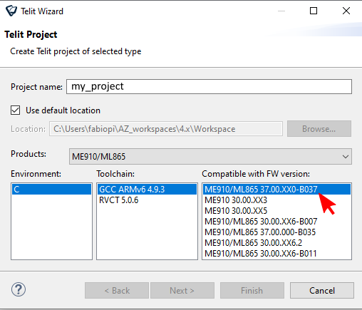
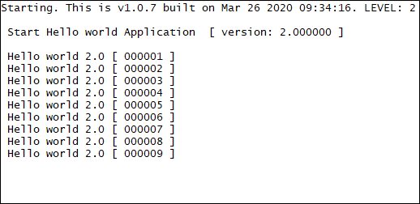
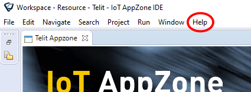
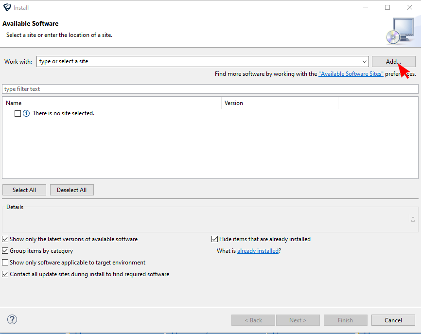
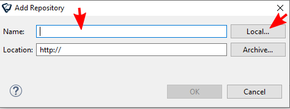
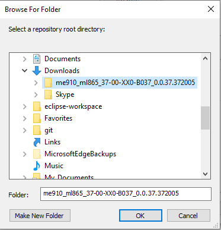
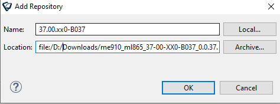
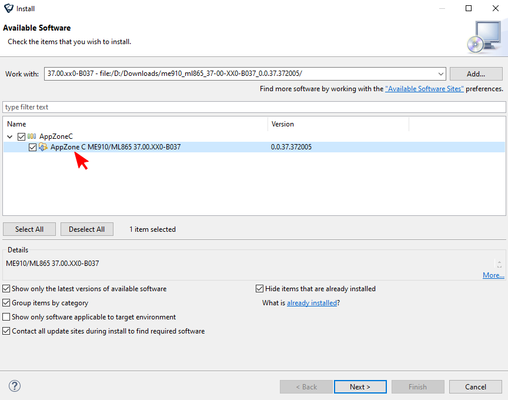
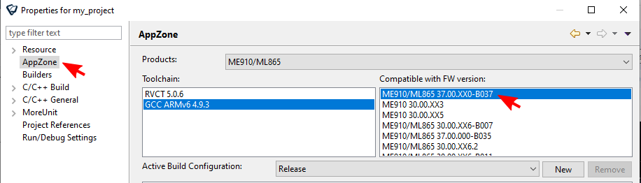

# AppZone m2mb Sample Apps


Package Version: **1.1.23-CxL217**

Minimum Firmware Version: **25.21.005.0**


## Features

This package goal is to provide sample source code for common activities kickstart.


# Quick start

## Deployment Instructions


To manually deploy the Sample application on the devices perform the following steps:

1. Have **25.21.005.0** FW version flashed (`AT#SWPKGV` will give you the FW version)

1. Copy _m2mapz.bin_ to _/data/azc/mod/_
	```
	AT#M2MWRITE="/data/azc/mod/m2mapz.bin",<size>,1
	```
  where  \<size\> is in bytes
1. Configure the module to run the downloaded binary as default app: `AT#M2MRUN=2,m2mapz.bin`
1. Restart the module and if no AT commands are sent within **10** seconds, start the app: `AT+M2M=4,10`

## References

More info on

* [Getting started with ME910C1](https://y1cj3stn5fbwhv73k0ipk1eg-wpengine.netdna-ssl.com/wp-content/uploads/2018/11/Telit_ME910C1_Quick_Start_guide_r2.pdf) (doc ID 80529NT11661A)

* [How to run applications with AppZone](https://s3.amazonaws.com/site_support/Telit/AppZone-SDK/User+Guides+AppZone+2.0/az-c-m2mb-ug-r1/index.html#!Documents/appendixaatsyntax.htm)


## Known Issues

None

## Contact Information, Support

For general contact, technical support services, technical questions and report documentation errors contact Telit Technical Support at: [TS-EMEA@telit.com](TS-EMEA@telit.com).

For detailed information about where you can buy the Telit modules or for recommendations on accessories and components visit:

[http://www.telit.com](http://www.telit.com)

Our aim is to make this guide as helpful as possible. Keep us informed of your comments and suggestions for improvements.

Telit appreciates feedback from the users of our information.


## Troubleshooting

* Application does not work/start:
	+ Delete application binary and retry
    ```
    AT#M2MDEL="/data/azc/mod/m2mapz.bin"
    ```
	+ Delete everything, reflash and retry
    ```
    AT#M2MDEL="/data/azc/mod/m2mapz.bin"
    AT#M2MDEL="/data/azc/mod/appcfg.ini"
    ```

* Application project does not compile
	+ Right click on project name
	+ Select Properties
	+ Select AppZone tab
	+ Select the right plugin (firmware) version
	+ Press "Restore Defaults", then "Apply", then "OK"
	+ Build project again

* Application project shows missing symbols on IDE
	+ Right click on project name
	+ Select Index
	+ Select Rebuild. This will regenerate the symbols index.

---

## Making source code changes

### Folder structure

The applications code follow the structure below:

* `hdr`: header files used by the application
    * `app_cfg.h`: the main configuration file for the application
* `src`: source code specific to the application
* `azx`: helpful utilities used by the application (for GPIOs, LOGGING etc)
    * `hdr`: generic utilities' header files
    * `src`: generic utilities' source files
* `Makefile.in`: customization of the Make process


## Import a Sample App into an IDE project

Consider that the app HelloWorld that prints on Main UART is a good starting point. To import it in a project, please follow the steps below:


On IDE, create a new project: "File"-> "New" -> "Telit Project"



Select the preferred firmware version (e.g. 30.00.xx7) and create an empty project.

in the samples package, go in the HelloWorld folder (e.g. `AppZoneSampleApps-MAIN_UART\HelloWorld` ), copy all the files and folders in it (as `src`, `hdr`, `azx` ) and paste them in the root of the newly created IDE project. You are now ready tyo build and try the sample app on your device.

## Heap and starting address

By default, every application defines a memory HEAP size and its start address in memory. 

They are usually provided by the linking phase of the build process:

```
"[...]arm-none-eabi-ld" --defsym __ROM=0x40000000 --defsym __HEAP_PUB_SIZE=0x40000 --defsym 
```

`__ROM` is the default starting address, `__HEAP_PUB_SIZE` is the default HEAP size in bytes. Both are expressed  in hexadecimal format.

These values can be customized through makefile variables:

```
HEAP=<new size in bytes>
```

```
ROM_START=<new address>
```

**IMPORTANT** allowed address range is 0x40000000 - 0x4FFFF000. 


## Main contents

[MAIN UART](#main-uart)

[USB0](#usb0)

[Installing beta version libraries Plug-in](#installing-beta-version-libraries-plug-in)


# Applications

## USB0 
*Applications that provide usage examples for various functionalities, log output on USB0*


### Hello World

The application prints "Hello World!" over selected output every two seconds. Debug prints on **USB0**, <ins>using AZX log example functions</ins>


**Features**


- How to open an output channel using AZX LOG sample functions
- How to print logging information on the channel using AZX LOG sample functions


#### Application workflow

**`M2MB_main.c`**

- Open USB/UART/UART_AUX
- Print "Hello World!" every 2 seconds in a while loop



---------------------


## MAIN UART 
*Applications that provide usage examples for various functionalities, log output on MAIN UART*


### Hello World

The application prints "Hello World!" over selected output every two seconds. Debug prints on **MAIN UART**, <ins>using AZX log example functions</ins>


**Features**


- How to open an output channel using AZX LOG sample functions
- How to print logging information on the channel using AZX LOG sample functions


#### Application workflow

**`M2MB_main.c`**

- Open USB/UART/UART_AUX
- Print "Hello World!" every 2 seconds in a while loop


---------------------


# Installing beta version libraries Plug-in

## New beta plug-in installation

To install a new plug-in for a beta firmware into the IDE, first receive plug-in ".zip" packet, then unzip the file in a local folder and open the SDK IDE.

**PLEASE DO NOT USE BETA PLUGINS FOR PRODUCTION DEPLOYMENTS, SOFTWARE IS PROVIDED AS IS AND CUSTOMER ACKNOWLEDGES THAT IT IS POSSIBLE THE DEVICE MAY MISFUNCTION. PLEASE REFER TO Contact Information, Support section**




Click on "Help" tag and choose "Install New Software...". This window will appear:




Click on "Add..." button and then in the following window click on "Local..." to select the unzipped folder with the plug-in content.

 
 
 


Once selected the plug-in folder, the "Location:" form will present the selected path. Now in "Name:" write a name for the new libraries (for example 37.00.xx0_B037) and click on "OK" button.




The new packet is now ready to be installed: select it and click on "Next >" button until "Review Licenses" window will appear.




Accept the licenses when required and click on "Finish" button to complete the installation.


## Change existing project libraries

To align an old project to the new libraries, right click on the project and choose "Properties".



Now select "AppZone" on the left side of the window, and on the right choose the packet with the same name as the firmware version to be used. Then click on "OK" (or "Apply") button. 

## Create a project with the new plug-in

To use the new libraries, create a new project: "File"-> "New" -> "Telit Project"


Select the new firmware version (37.00.xx0-B037) and create an empty project.

