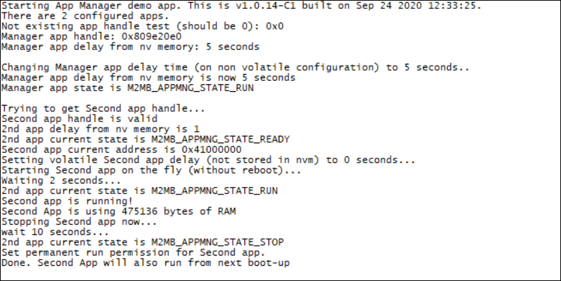

### App Manager

Sample application showing how to manage AppZone apps from m2mb code. Debug prints on **AUX UART**

**Features**

- How to get how many configured apps are available
- How to get the handle to manage the running app (change start delay, enable/disable)
- How to create the handle for a new binary app, enable it and set its parameters
- How to start the new app without rebooting the device, then stop it after a while.

#### Prerequisites

This app will try to manage another app called "second.bin", which already exists in the module filesystem and can be anything (e.g. another sample app as GPIO toggle).
the app must be built using the flag ROM_START=<address> in the Makefile to set a different starting address than the main app (by default, 0x40000000). For example, 0x41000000.

#### Application workflow

**`M2MB_main.c`**

- Open USB/UART/UART_AUX
- get a non existing app handle and verify it is NULL
- get the current app handle, then get the start delay **set in the INI file (so persistent)**
- change the current app delay value **in the INI file**
- verify that the change has been stored
- get current app state
- create an handle for a second application binary. 
- add it to the INI file
- set its execution flag to 0
- get the delay time and the state from INI file for the new app
- get the current set address for the new app
- set the app delay **in RAM, INI will not be affected**.
- start the new app without reboot, using the right set delay
- wait some time, then get the app state and the used RAM amount
- wait 10 seconds, then stop the second app.
- set its execution flag to 1 so it will run at next boot.

---------------------

