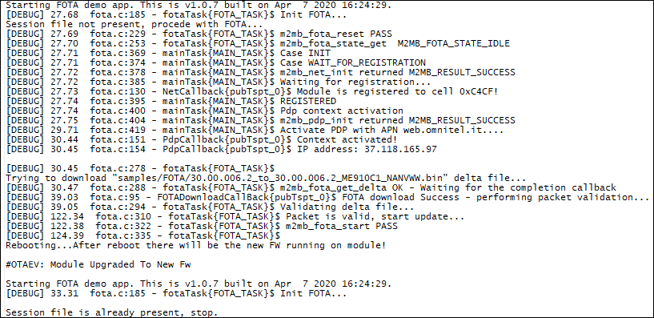

### FOTA example

Sample application showcasing FOTA usage with M2MB API. Debug prints on **AUX UART**

**Features**

- How download a delta file from a remote server
- How to apply the delta and update the module firmware

**Application workflow**

**`M2MB_main.c`**

- Open USB/UART/UART_AUX

- Print welcome message

- Create a main task to manage connectivity.
- create a fota task to manage FOTA and start it with INIT option

**`fota.c`**

**fotaTask()**

- Initialize FOTA system then reset parameters.
- Check current FOTA state, if not in IDLE, return error.
- Send a message to mainTask so networking is initialized.
- after PdPCallback() notifies the correct context activation, configure the fota client parameters such as FTP server URL, username and password
- get delta file from server. when it is completed, FOTADownloadCallback is called.
- If delta download went fine, check it.
- If delta file is correct, apply it. Once complete, restart the module.

**mainTask()**

- Initialize Network structure and check registration
- Initialize PDP structure and start PDP context. Event will be received on **PdPCallback** function
- Disable PDP context when required to stop the app

**PdpCallback()**

- When PDP context is enabled, send a message to fotaTask to start the download

---------------------

