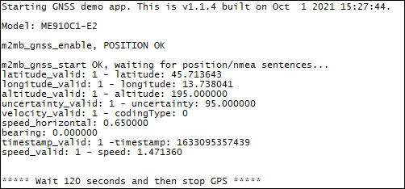

### GNSS example 

Sample application showing how to use GNSS functionality. Debug prints on **AUX UART**

**Features**

- How to enable GNSS receiver on module
- How to collect location information from receiver

**Note:** on MEx10G1 product family both M2MB_GNSS_SERVICE_NMEA_REPORT and M2MB_GNSS_SERVICE_POSITION_REPORT services are available, while on ME910C1 product family only M2MB_GNSS_SERVICE_POSITION_REPORT is available 

#### Application workflow

**`M2MB_main.c`**

- Open USB/UART/UART_AUX
- Print a welcome message
- Create GNSS task and send a message to it

**`gps_task.c`**
- Init Info feature and get module type
- Init gnss, enable position/NMEA report and start it.
- When a fix or a NMEA sentence is available, a message will be printed by the GNSS callback function

---------------------

