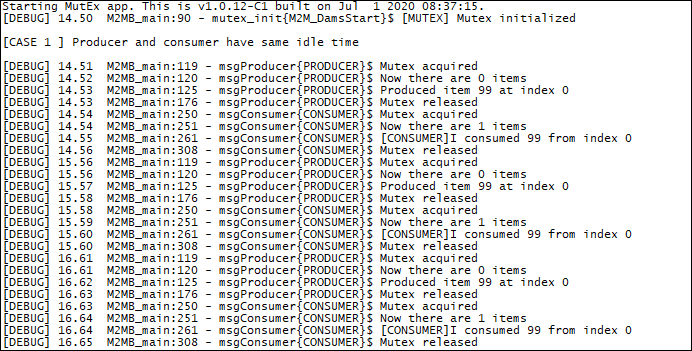
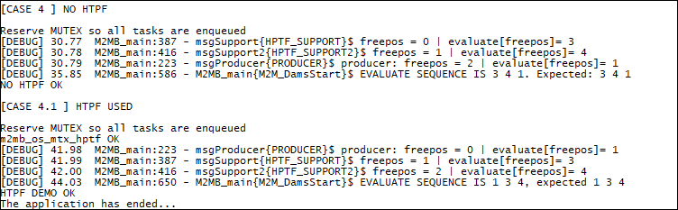

### MutEx

Sample application showing mutex usage, with ownership and prioritization usage. Debug prints on **AUX UART**

**Features**

- How to create a mutex 
- How to use the mutex with tasks having different priorities
- how to reorder the pending tasks queue for the mutex

#### Application workflow

**`M2MB_main.c`**

- Open USB/UART/UART_AUX
- Print welcome message
- Create four tasks with the provided utility (this calls public m2mb APIs). The first task is a "producer", putting data on a shared buffer. The second is a "consumer" of said data, the other two are used for prioritization demo
- run producer and consumer tasks at the same pace. the shared buffer will stay empty, because the resource is consumed right after creation
- run producer twice as fast as consumer. The buffer is slowly filled
- run consumer twice as fast as publisher. The buffer is always empty.
- reserve the mutex in the main task and run producer, support and support2 tasks (in this order). Then release the mutex and check the execution order. It should be by arrival.
- reserve the mutex in the main task and run the same three task, but before releasing the mutex, call the prioritization API. the task with highest priority \(producer\) is put as first in the queue.

---------------------

