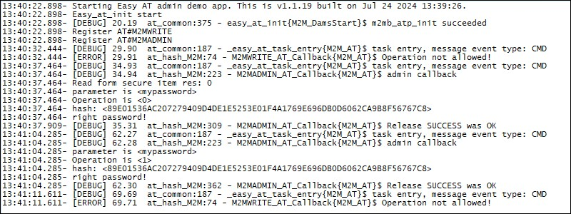

### Protect and AT command with a pwd using EastyAT functionality example 

Sample application showing how to protect an AT command with a pwd using EasyAT functionality. Debug prints on **MAIN UART**

**Features**

- Shows how to register a new custom command  and overwrite an existing one 

- AT#M2MADMIN (new command)
- AT#M2MWRITE (existing one)

**Application workflow**

**`M2MB_main.c`**

- Entry point that calls EasyAT initialization function

#### AT#M2MADMIN
This command allows to enter a pwd to lock/unlock #M2MWRITE command. In the example app the new pwd is saved in the trustzone

AT#M2MADMIN="pwd",<mode>[,"newpwd"]

where mode:
0 - unlock command #m2mwrite
1 - lock command #m2mwrite
2 - change pwd

---------------------

