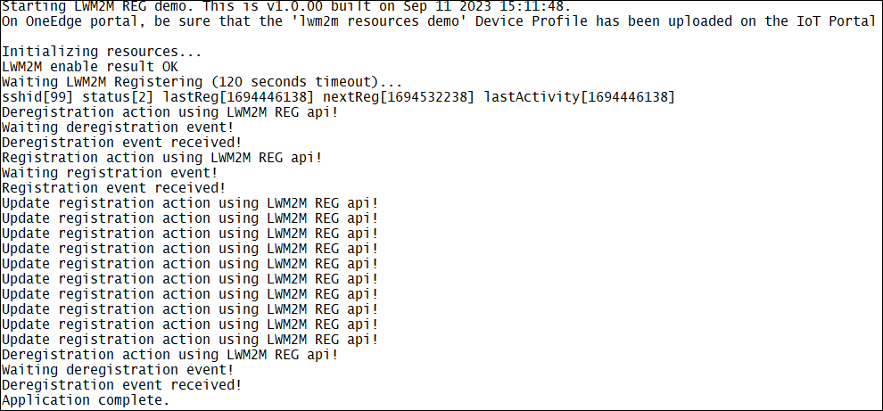
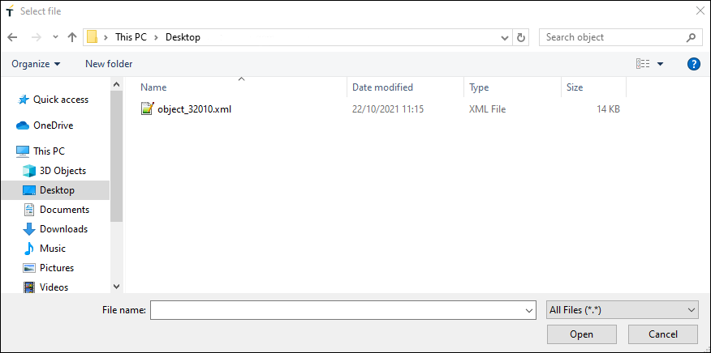
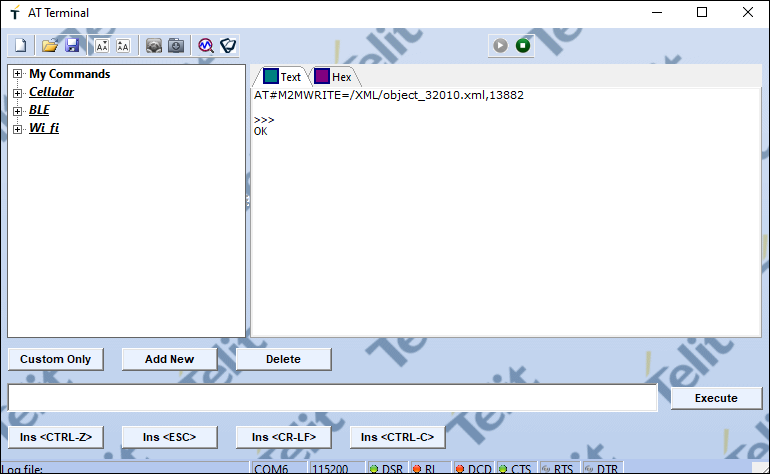
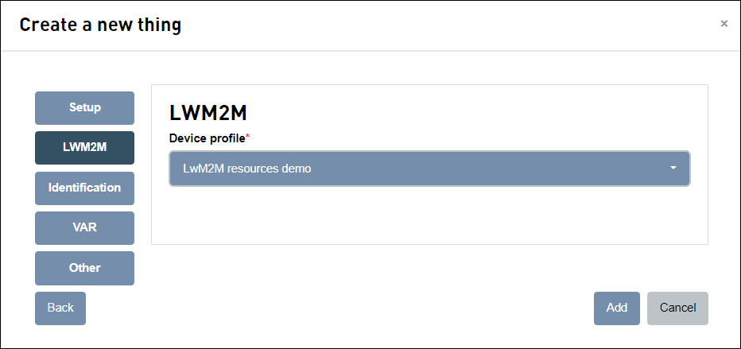

### LWM2M REG

Sample application showcasing LWM2M client registration management using M2MB API. Debug prints on **MAIN UART**

**Features**

- Configure LWM2M client and enable it

- Get LWM2M server information using REG apis

- Deregister from LWM2M server using REG apis

- Register to the LWM2M server usign REG apis

**Requirements**

This application expects the user to configure the PDP context ID 1 with the proper APN.
it can be done with the following AT command:

`AT+CGDCONT=1,"IPV4V6","<user apn>"`

Depending on the Mobiler Network Operator and Access Technology, the APN might be automatically set by the network itself. In this case, nothing must be done by the user.

#### Application workflow

**`M2MB_main.c`**

- Open USB/UART/UART_AUX

- Create a task to manage the LWM2M client and start it

**`lwm2m_demo.c`**

**`msgLWM2MTask`**
- Check registration status

- Initialize LWM2M client, 

  - Check for XML file fo custom object
  
  - Enable LwM2M client
  
  - Wait for client to register to Portal
  
  - Get the LWM2M server information

  - Performs client portal deregistration
  
  - Performs client portal registration

**`lwm2mIndicationCB`**

- Manage events arriving from client \(operations completion status and unsolicited events\)

#### Application execution example

#### Device Profile upload

**LWM2M resources demo** device profile must be imported to have a real-time update of resources values on the LWM2M browser. 

To do so, import the file `json/lwm2m_resources_demo.json` (provided with the sample files) on section `Developer` > `Device profiles` of OneEdge IoT portal:

#### Custom Object configuration

The XML file content must be loaded on the Telit IoT Portal for the demo application to be fully executed.

First, enter Developer section from the top menu

Choose Object Registry

Create a New Object

Copy the xml file content and paste it in the new Object form

Also, the application requires the XML file `xml/object_32010.xml` (provided with the sample files) to be stored in module's `/XML/` folder. 
It can be done with 

`AT#M2MWRITE=/XML/object_32010.xml,<size_in_bytes>`

To load the XML file in the module, Telit AT Controller (TATC) can be used. Once the command above is issued, press the load content button:

Select the file from your computer

The file is successfully loaded on the module

#### Onboard the device

**Get the Telit ID**

To retrieve the Telit ID data, issue `AT#TID` to get the Telit ID. The command response will be similar to

\#TID: **xxxxxxxxxxxxxxxxxxxxxxxxxxx**,1
OK

Take note of the Telit ID highlighted in **bold** above (or copy it on a text editor): this ID it will be needed for the onboarding process.

**Create a new Thing**

From the OneEdge portal, on **"Things"** section, click **"New Thing"** button in the top right corner.

In the Create a new thing dialog, select "Telit Module"

A dialog appears: select “Default� thing definition

In the following screen, provide the Telit ID as “Identifier�
Click on “Find� and make sure that model, firmware and the other details are properly
populated.

Click on lwm2m tab and set the device profile previously imported as shown in the screenshot below

Click **"Add"** to complete the new thing creation procedure.

**If the Thing already exists, its device profile can be changed by following the steps shown in the picture below**

---------------------

