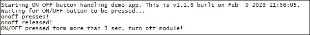

### ON OFF button management example 

Sample application on how to handle ON/OFF button. Debug prints on **MAIN UART**

**Features**

- How to enable ON/OFF button handling
- How to turn off module after ON/OFF button press/release

**Application workflow**

**`M2MB_main.c`**

- Open gpio_ON_OFF
- Configure the interrupt and the callback
- Init power functionality
- Wait for on/off button to be pressed
- If button has been pressed for more than 3 seconds (and then released) then module is turned off.

---------------------

