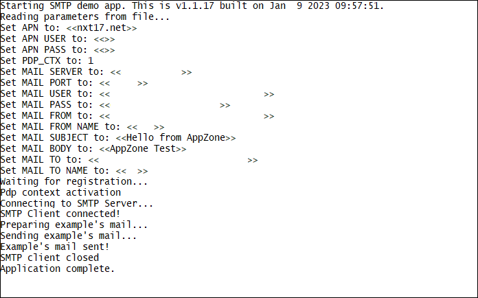

### SMTP Client 

Sample application showing SMTP echo demo with M2MB API. Debug prints on **MAIN UART**

**Features**

- How to check module registration and activate PDP context
- How to open a SMTP client
- How to send a mail

**Application workflow**

**`M2MB_main.c`**

- Open USB/UART/UART_AUX

- Print welcome message

- Create a task to manage SMTP client and start it

**`M2MB_main.c`**

- Initialize Network structure and check registration

- Initialize PDP structure and start PDP context

- Initialize SMTP client and connect to SMTP server

- Prepare email and send it

- Close SMTP client

- Disable PDP context

---------------------

