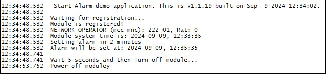

### Alarm example 

Sample application that shows how to set an alarm to wake-up module. Debug prints on **USB0**

**Features**

- How to set an alarm
- How to use it to turn on module

**Application workflow**

**`M2MB_main.c`**

- Init RTC
- Wait for registration
- Get current date and time
- Call function set_alarm
- Init Power and turn off module

---------------------

