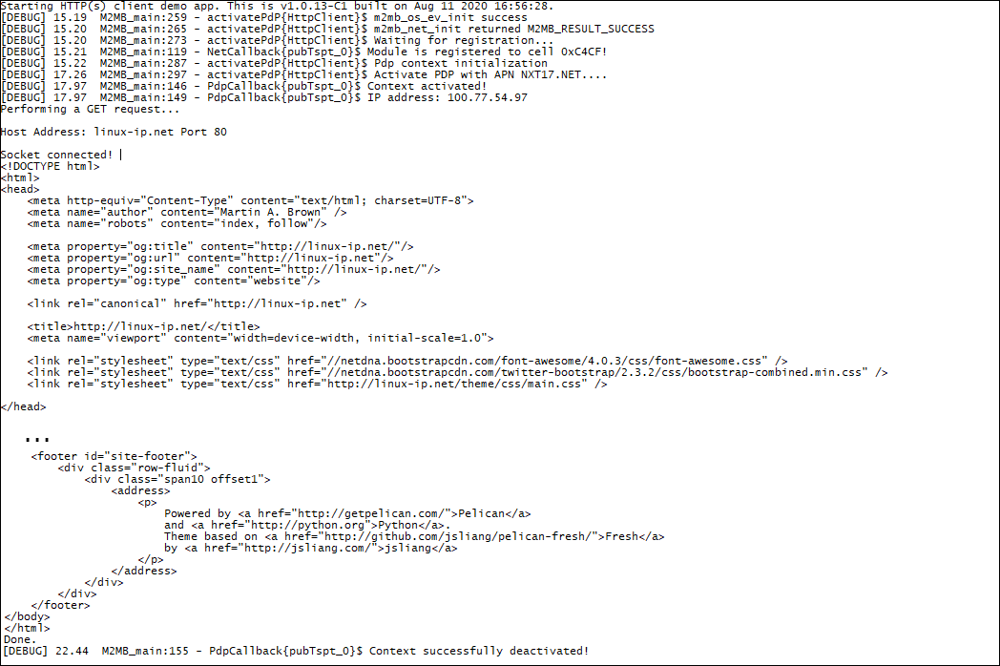

### HTTP Client

Sample application showing how to use HTTPs client functionalities. Debug prints on **USB0**

**Features**

- How to check module registration and activate PDP context
- How to initialize the http client, set the debug hook function and the data callback to manage incoming data
- How to perform GET, HEAD or POST operations

NOTE: the sample app has an optional dependency on azx_base64.h if basic authentication is required (refer to `HTTP_BASIC_AUTH_GET` define in `M2MB_main.c` for further details)

**Application workflow**

**`M2MB_main.c`**

- Open USB/UART/UART_AUX

- Print welcome message

- Create a task to manage HTTP client and start it

**`httpTaskCB`**

- Initialize Network structure and check registration
- Initialize PDP structure and start PDP context
- Create HTTP client options and initialize its functionality
- Create HTTP SSL config and initialize the SSL options
- Configure data management options for HTTP client
- Appy all configurations to HTTP client
- Perform a GET request to a server
- Disable PDP context

**`DATA_CB`**

- Print incoming data
- Set the abort flag to 0 to keep going.

---------------------

