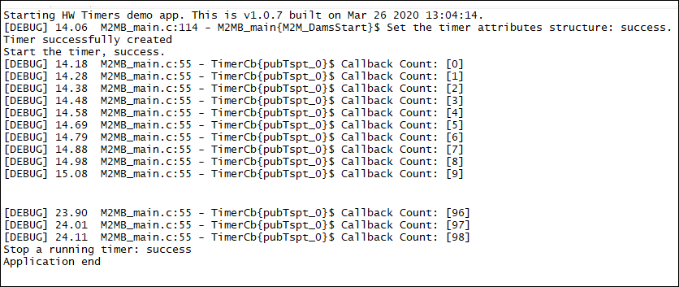

### HW Timer (Hardware Timer)

The sample application shows how to use HW Timers M2MB API. Debug prints on **AUX UART**

**Features**

- How to open configure a HW timer
- How to use the timer to manage recurring events

#### Application workflow

**`M2MB_main.c`**

- Open USB/UART/UART_AUX

- Print welcome message

- Create hw timer structure

- Configure it with 100 ms timeout, periodic timer (auto fires when expires) and autostart

- Init the timer with the parameters

- Wait 10 seconds

- Stop the timer

**`TimerCb`**

- Print a message with an increasing counter

---------------------

