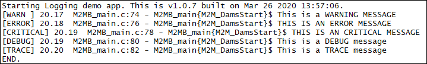

###Logging Demo

Sample application showing how to print on one of the available output interfaces. Debug prints on **AUX UART**

**Features**

- How to open a logging channel
- How to set a logging level 
- How to use different logging macros

**Application workflow**

**`M2MB_main.c`**

- Open USB/UART/UART_AUX

- Print welcome message

- Print a message with every log level

---------------------

