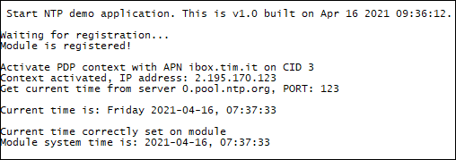

### NTP example 

The application connects to an NTP server, gets current date and time and updates module's internal clock. Debug prints on **AUX UART**

**Features**

- How to get current date and time from an NTP server
- How to set current date and time on module

#### Application workflow

**`M2MB_main.c`**

- Open USB/UART/UART_AUX
- Print welcome message
- Send message to ntpTask

**`ntp_task.c`**

*NTP_task()*
- Waits module registration
- When module is registered, initializes ntp setting CID, server url and timeout
- When PDP context is correctly opened, a query to NTP server is done to get current date and time
- On SET_MODULE_RTC message type reception, module RTC is set with date time value got from NTP server.

*m2mb_ntp_ind_callback()*
- As soon as M2MB_NTP_VALID_TIME event is received, current date and time is printend and a message (with SET_MODULE_RTC type) is sent to NTP_task

---------------------

