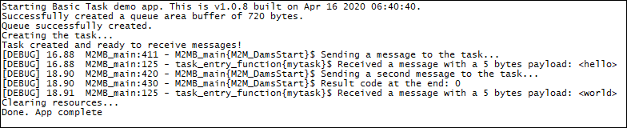

### Basic Task 

The application shows how to create and manage tasks with m2mb APIs. Debug prints on MAIN UART (can be changed in M2MB_Main function)

**Features**

- How to create a new task using m2mb APIs
- How to start the task and send messages to it
- how to destroy the task

**Application workflow**

**`M2MB_main.c`**

- Open UART
- Print welcome message
- Configure and create message queue for task
- Configure and create task
- Send 2 messages to the task queue

**`task_entry_function`**

- Receive messages from the task queue in a loop
- Print the message data when one arrives

---------------------

