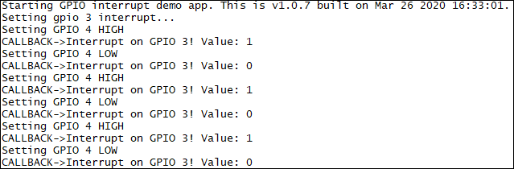

### GPIO interrupt example 

Sample application showing how to use GPIOs and interrupts. Debug prints on **MAIN UART**

**Features**

- How to open a GPIO in input mode with interrupt
- How to open a second GPIO in output mode to trigger the first one

**Application workflow**

**`M2MB_main.c`**

- Open USB/UART/UART_AUX

- Open *GPIO 4* as output

- Open *GPIO 3* as input and set interrupt for any edge (rising and falling). **A jumper must be used to short GPIO 3 and 4 pins.**

- Toggle *GPIO 4* status high and low every second

- An interrupt is generated on *GPIO 3*

---------------------

