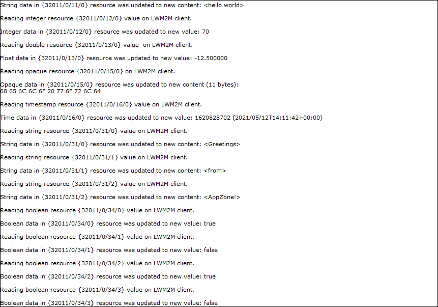
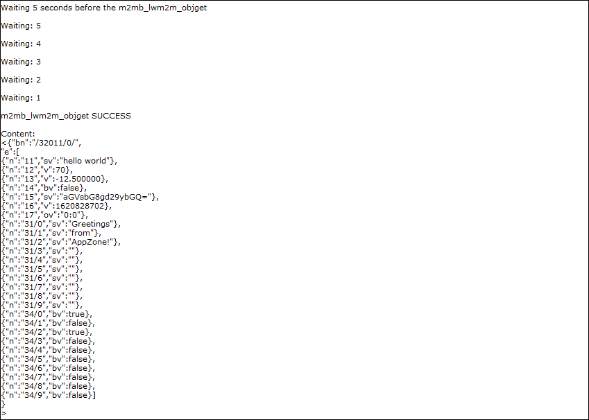
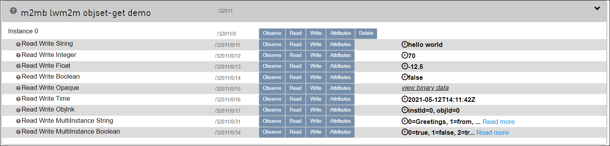

### LWM2M OBJ_GET AND OBJ_SET

Sample application showcasing LWM2M client m2mb_lwm2m_objget and m2mb_lwm2m_objset M2MB APIs usage. Debug prints on **MAIN UART**

**Features**

- Configure LWM2M client and enable it

- Create an instance of a custom object

- Create a Json string

- Set string, integer, float, boolean, timestamp and opaque values with `m2mb_lwm2m_objset`

- Get all resources values with `m2mb_lwm2m_objget`

- Manage write, read and monitoring resources changed from the portal

**Requirements**

This application expects the user to configure the PDP context ID 1 with the proper APN.
it can be done with the following AT command:

`AT+CGDCONT=1,"IPV4V6","<user apn>"`

Depending on the Mobiler Network Operator and Access Technology, the APN might be automatically set by the network itself. In this case, nothing must be done by the user.

**Application workflow**

**`M2MB_main.c`**

- Open USB/UART/UART_AUX

- Create a task to manage the LWM2M client and start it

**`lwm2m_demo.c`**

**`msgLWM2MTask`**
- Check registration status

- Initialize LWM2M client,

  - Check for XML file fo custom object

  - Enable unsolicited messages from client

  - Create a task \(lwm2m_taskCB is its callback function \)to manage events from Portal

  - Enable LwM2M client

  - Create a new instance for the custom object

  - Wait for client to register to Portal

  - Performs obj_set and obj_get operations on the related resources

  - Wait for events from server

**`lwm2mIndicationCB`**

- Manage events arriving from client \(operations completion status and unsolicited events\)
- Run lwm2m_taskCB when a monitored resource changes, to manage the action to be done

#### Device Profile upload

**LWM2M resources demo** device profile must be imported to have a real-time update of resources values on the LWM2M browser.

To do so, import the file `lwm2m_resources_demo.json` on section `Developer` > `Device profiles` of OneEdge IoT portal:

#### Custom Object configuration

The XML file content must be loaded on the Telit IoT Portal for the demo application to be fully executed.

First, enter Developer section from the top menu

Choose Object Registry

Create a New Object

Copy the xml file content and paste it in the new Object form

Also, the application requires the XML file `/xml/object_32011.xml` (provided with the sample files) to be stored in module's `/XML/` folder.
It can be done with

`AT#M2MWRITE=/XML/object_32011.xml,<size_in_bytes>`

To load the XML file in the module, Telit AT Controller (TATC) can be used. Once the command above is issued, press the load content button:

Select the file from your computer

The file is successfully loaded on the module

#### Application execution example

After the Demo completes the initialization, it is possible to access the object resources from the Portal Object Browser

An instance of the object will be present and the resources can be modified.

---------------------

