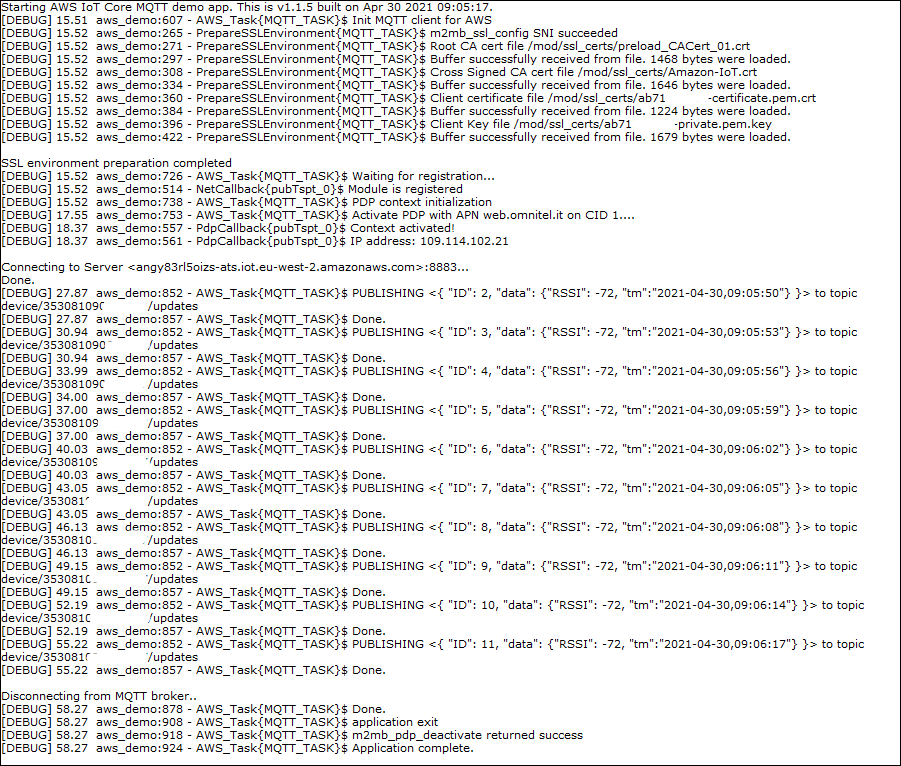

### AWS demo

Sample application showcasing AWS Iot Core MQTT communication. Debug prints on **USB0**


**Features**


- How to check module registration and enable PDP context
- How to load certificates into device SSL session storage
- How to configure MQTT client parameters
- How to connect to AWS server with SSL and exchange data over a topic


**Application workflow**

**`M2MB_main.c`**

- Open USB/UART/UART_AUX

- Print welcome message

- Create a task to manage MQTT client and start it


**`aws_demo.c`**

- Initialize Network structure and check registration

- Initialize PDP structure and start PDP context

- Init MQTT client

- Configure it with all parameters (Client ID, PDP context ID, keepalive timeout...)

- Initialize the TLS parameters (TLS1.2) andh auth mode (server+client auth in the example)

- Create SSL context

- Read certificates files and store them

- Connect MQTT client to broker
- Subscribe to topic
- Publish 10 messages with increasing counter
- Print received message in mqtt_topc_cb function
- Disconnect MQTT client and deinit it 

- Disable PDP context


### How to get started with AWS IoT

- Go to [AWS console](https://aws.amazon.com/console/) and create an account if one is not available yet.
- Go to **`IoT Core`** section
- Go to **`Secure`** > **`Policies`** section
- Create a new policy, which describes what the device will be allowed to do (e.g. subscribe, publish)
- Give it a name, then configure it using the configuration below (it is possible to copy/paste by clicking on **`Add statements`** section, then **`Advanced mode`** ) :
```json
{
  "Version": "2012-10-17",
  "Statement": [
  {
    "Action": [
      "iot:Publish",
      "iot:Subscribe",
      "iot:Connect",
      "iot:Receive"
    ],
    "Effect": "Allow",
    "Resource": [
      "*"
    ]
  }
  ]
}
```

- Click on create to complete the policy creation.
- Go to **`Manage`** section
- Press **`Create`**, then **`Create a single thing`**
- Give the new thing a name, then click on `Next`
- Select **`One-click certificate creation (recommended)`** by clicking on **`Create certificate`**
- Once presented with the **`Certificate created`** page, download all certificates and keys
- Click on the **`Activate`** button to enable the certificate authentication of the newly created device
- Click on **`Attach a policy`** and select the policy created in a previous step

For further information, please refer to the full [AWS IoT documentation](https://docs.aws.amazon.com/iot/latest/developerguide/iot-console-signin.html)

### Application setup

- Set **`CLIENTCERTFILE`** and **`CLIENTKEYFILE`** defines in **`aws_demo.c file`** in order to match the certificate and key created in the previous section.
- Set **`AWS_BROKER_ADDRESS`** to the correct AWS URL. It can be retrieved from AWS IoT **`Manage`** > **`Things`** > **`Interact`** in the HTTPS **`Rest API Endpoint`** URL. 
- Set **`CLIENT_ID`** to the desired Client ID for your AWS device
- (Optional) if required, change **`CACERTFILE`** to match the one to be used.

### Device setup

The application requires the certificates (provided in sample app **`certs`** subfolder ) to be stored in **`/mod/ssl_certs/`** folder. It can be created with 

`AT#M2MMKDIR=/mod/ssl_certs`

Certificates can then be loaded with

`AT#M2MWRITE="/mod/ssl_certs/preload_CACert_01.crt",1468`
`AT#M2MWRITE="/mod/ssl_certs/Amazon-IoT.crt",1646`

providing the file content in RAW mode (for example using the "Transfer Data" button in Telit AT Controller)

For client certificates, the commands will be

```
AT#M2MWRITE="/mod/ssl_certs/xxxxx.crt",yyyy
AT#M2MWRITE="/mod/ssl_certs/xxxxx.key",zzzz
```

PLEASE NOTE: always verify the file sizes to be used in the commands above as they might change



Data received from a subscriber:


---------------------

