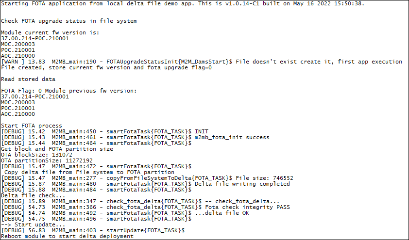

### FOTA from Local File example 

Sample application that shows how perform FOTA upgrade using a delta file stored into file system. Debug prints on **USB0**

**Features**

- How to store and get FOTA upgrade information to/from a file
- How to get delta file from module file system
- How to apply the delta and update module firmware

**Application workflow**

**`M2MB_main.c`**

- Open USB/UART/UART_AUX

- Print welcome message

- Check if module has been already upgraded or needs to be upgraded reading FOTA upgrade status from a file
- Create a fota task to manage FOTA and start it with INIT option

**smartFotaTask()**
- Initialize FOTA system then reset parameters.
- Get FOTA partiton size and block size
- Copy delta file from file system to FOTA paartition. when it is completed, FOTADownloadCallback is called.
- If delta file is correct, apply it. Once complete, write FOTA status flag and current fw version to a file, restart the module.

---------------------

