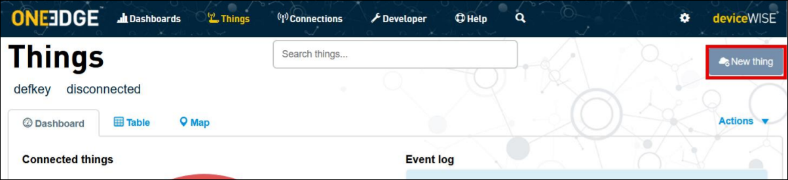
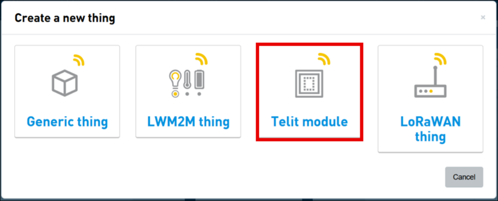
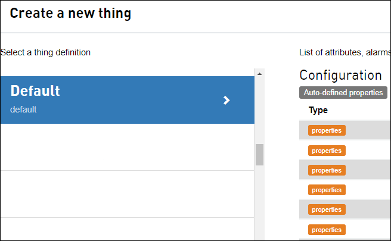
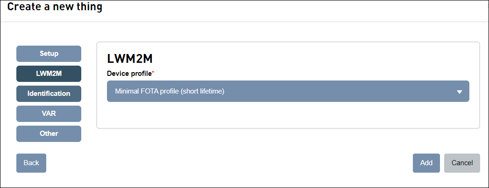
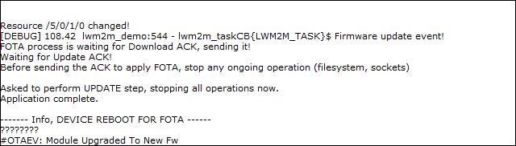

### LWM2M FOTA ACK management

Sample application showcasing LWM2M client FOTA events and ACKs management via APIs. Debug prints on **USB0**

**Features**

- Configure LWM2M client and enable it _(if not already running)_

- Enable monitoring on object 5 (Firmware Update)

- Configure lwm2m FOTA parameters to enable ACK requirement for each operation (Download, Update)

- Wait for an externally generated FOTA request to handle the steps by sending the acknoledgements when needed

Please refer to "80654NT11889A OneEdge Firmware Management Application Note" for further details about FOTA workflow. Get in touch with TS-OneEdge support to receive the document.

**Requirements**

This application expects the user to configure the PDP context ID 1 with the proper APN.
it can be done with the following AT command:

`AT+CGDCONT=1,"IPV4V6","<user apn>"`

Depending on the Mobile Network Operator and Access Technology, the APN might be automatically set by the network itself. In this case, nothing must be done by the user.

#### Device Profile upload

**Minimal FOTA profile (short lifetime)** device profile must be imported and selected to improve the responsiveness of the FOTA operations

To do so, import the file `json/lwm2m_fota_profile_short.json` (provided with the sample files) on section `Developer` > `Device profiles` of OneEdge IoT portal:

#### Onboard the device

**Get the Telit ID**

To retrieve the Telit ID data, issue `AT#TID` to get the Telit ID. The command response will be similar to

\#TID: **xxxxxxxxxxxxxxxxxxxxxxxxxxx**,1
OK

Take note of the Telit ID highlighted in **bold** above (or copy it on a text editor): this ID it will be needed for the onboarding process.

**Create a new Thing**

From the OneEdge portal, on **"Things"** section, click **"New Thing"** button in the top right corner.

In the Create a new thing dialog, select "Telit Module"

A dialog appears: select “Default” thing definition

In the following screen, provide the Telit ID as “Identifier”
Click on “Find” and make sure that model, firmware and the other details are properly
populated.

Click on lwm2m tab and set the device profile previously imported as shown in the screenshot below

Click **"Add"** to complete the new thing creation procedure.

#### Application workflow

**`M2MB_main.c`**

- Open USB/UART/UART_AUX

- Create a task to manage the LWM2M client and start it

**`lwm2m_demo.c`**

**`msgLWM2MTask`**

- Initialize LWM2M client,

  - Enable unsolicited messages from client

  - Enable FOTA ACK configuration

  - Create a task \(lwm2m_taskCB is its callback function \)to manage events from Portal

  - Check if LwM2M client is running, if not, enable it

  - Wait for client to register to Portal

  - Wait for FOTA events to arrive, and when the Update request arrives, notify the user that everything must stop before sending the last ACK (as the module will start updating and then reboot)

**`lwm2mIndicationCB`**

- Manage events arriving from client \(operations completion status and unsolicited events\)
- Run lwm2m_taskCB when a monitored resource changes, to manage the action to be done

#### Application execution example

FOTA request arrives from server, ACK is sent for Download and Update. Device restarts with the new firmware version

Application restarts and is ready for a new FOTA operation

---------------------

