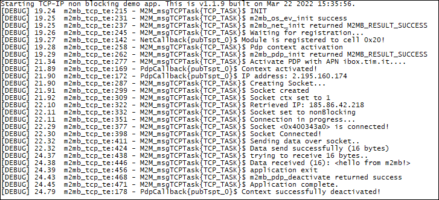

### TCP non blocking example 

Sample application that shows how to configure and connect a TCP-IP non blocking socket. Debug prints on **USB0**

**Features**

- How to check module registration and activate PDP context
- How to open a TCP client non Blocking socket 
- How to communicate over the socket

**Application workflow**

**`M2MB_main.c`**

- Open USB/UART/UART_AUX

- Print welcome message

- Create a task to manage socket and start it

**`m2m_tcp_test.c`**

- Initialize Network structure and check registration

- Initialize PDP structure and start PDP context

- Create socket and link it to the PDP context id

- Set the socket as non Blocking and connect to server. Uses m2mb_socket_bsd_select, m2mb_socket_bsd_fd_isset_func to check when socket is connected.

- Send data and receive response

- Close socket

- Disable PDP context

---------------------

