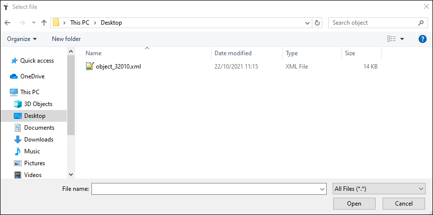
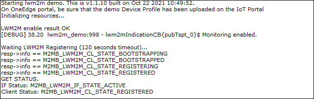
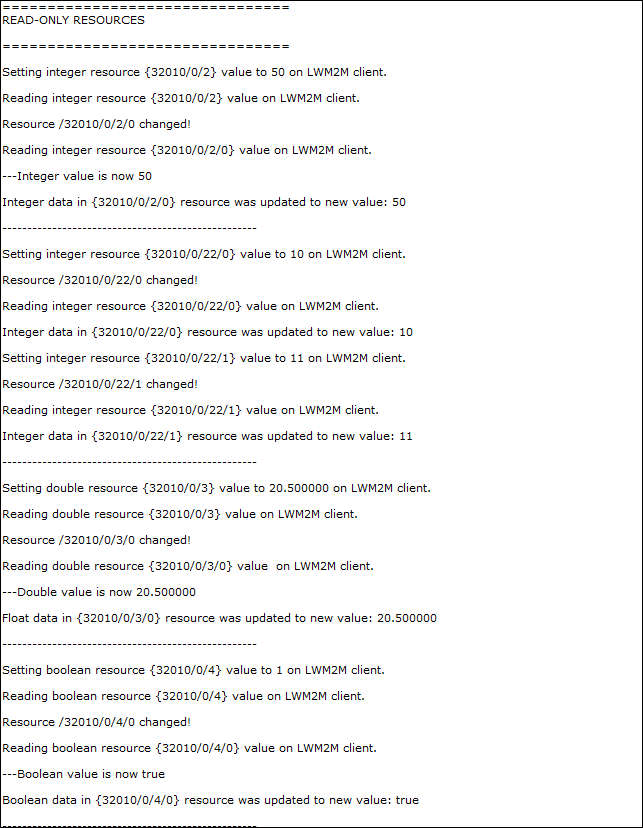
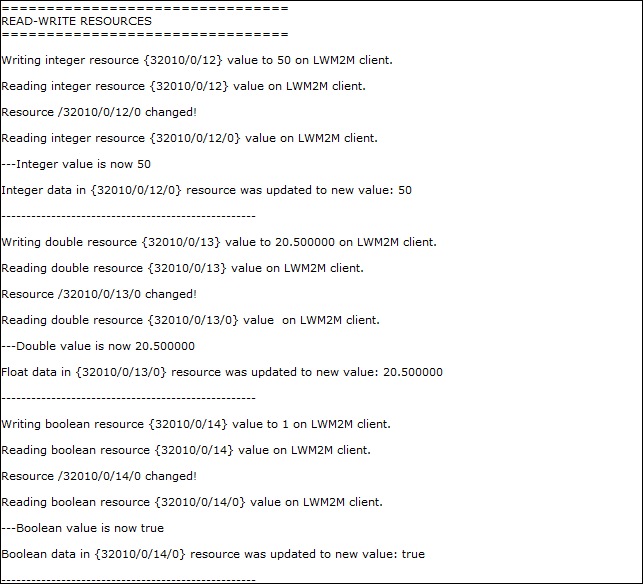
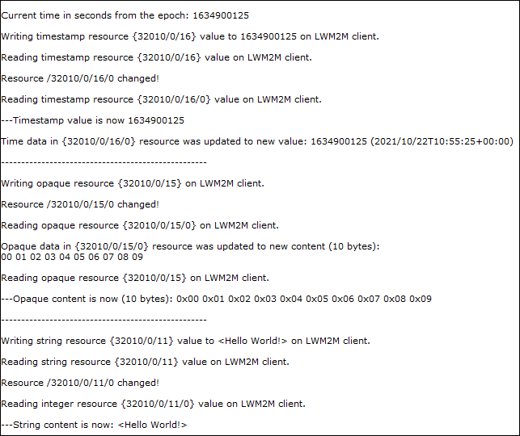
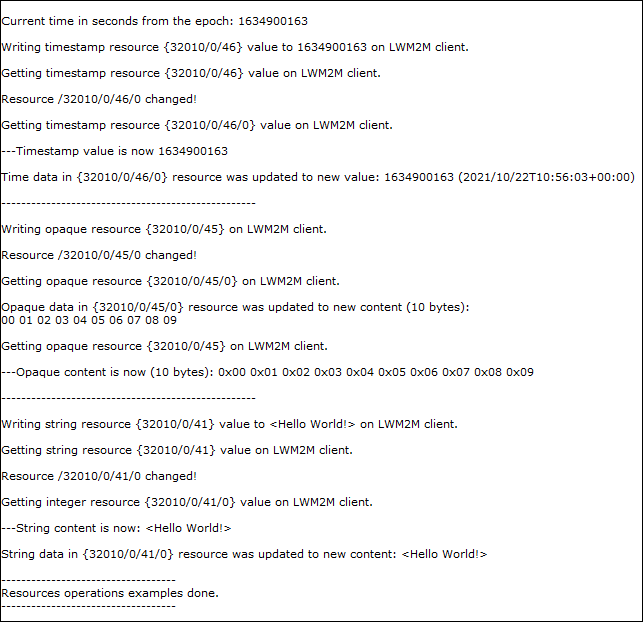
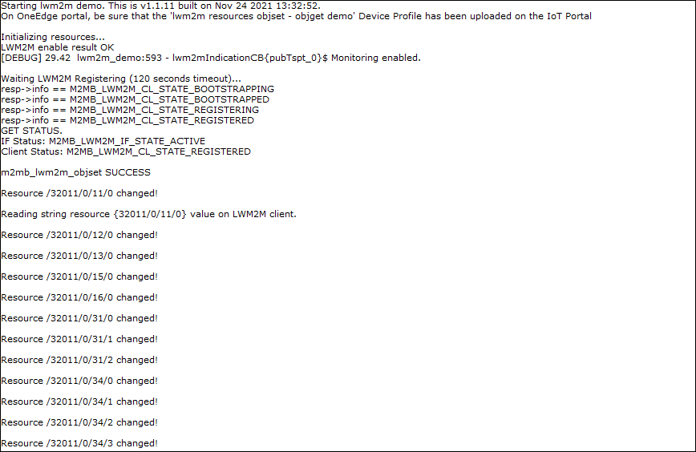
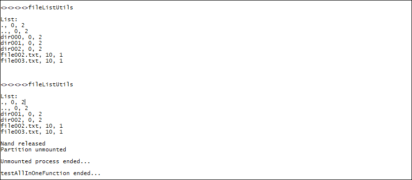

# AppZone m2mb Sample Apps


Package Version: **1.1.15-G1**

Minimum Firmware Version: **37.00.004.1**


## Features

This package goal is to provide sample source code for common activities kickstart.


# Quick start

## Deployment Instructions


To manually deploy the Sample application on the devices perform the following steps:

1. Have **37.00.004.1** FW version flashed (`AT#SWPKGV` will give you the FW version)

1. Copy _m2mapz.bin_ to _/mod/_
	```
	AT#M2MWRITE="/mod/m2mapz.bin",<size>,1
	```
  where  \<size\> is in bytes
1. Configure the module to run the downloaded binary as default app: `AT#M2MRUN=2,m2mapz.bin`
1. Restart the module and if no AT commands are sent within **10** seconds, start the app: `AT+M2M=4,10`

## References

More info on

* [Getting started with ME910C1](https://y1cj3stn5fbwhv73k0ipk1eg-wpengine.netdna-ssl.com/wp-content/uploads/2018/11/Telit_ME910C1_Quick_Start_guide_r2.pdf) (doc ID 80529NT11661A)

* [How to run applications with AppZone](https://s3.amazonaws.com/site_support/Telit/AppZone-SDK/User+Guides+AppZone+2.0/az-c-m2mb-ug-r1/index.html#!Documents/appendixaatsyntax.htm)


## Known Issues

None

## Contact Information, Support

For general contact, technical support services, technical questions and report documentation errors contact Telit Technical Support at: [TS-EMEA@telit.com](TS-EMEA@telit.com).

For detailed information about where you can buy the Telit modules or for recommendations on accessories and components visit:

[http://www.telit.com](http://www.telit.com)

Our aim is to make this guide as helpful as possible. Keep us informed of your comments and suggestions for improvements.

Telit appreciates feedback from the users of our information.


## Troubleshooting

* Application does not work/start:
	+ Delete application binary and retry
    ```
    AT#M2MDEL="/mod/m2mapz.bin"
    ```
	+ Delete everything, reflash and retry
    ```
    AT#M2MDEL="/mod/m2mapz.bin"
    AT#M2MDEL="/mod/appcfg.ini"
    ```

* Application project does not compile
	+ Right click on project name
	+ Select Properties
	+ Select AppZone tab
	+ Select the right plugin (firmware) version
	+ Press "Restore Defaults", then "Apply", then "OK"
	+ Build project again

* Application project shows missing symbols on IDE
	+ Right click on project name
	+ Select Index
	+ Select Rebuild. This will regenerate the symbols index.

---

## Making source code changes

### Folder structure

The applications code follow the structure below:

* `hdr`: header files used by the application
    * `app_cfg.h`: the main configuration file for the application
* `src`: source code specific to the application
* `azx`: helpful utilities used by the application (for GPIOs, LOGGING etc)
    * `hdr`: generic utilities' header files
    * `src`: generic utilities' source files
* `Makefile.in`: customization of the Make process


## Import a Sample App into an IDE project

Consider that the app HelloWorld that prints on Main UART is a good starting point. To import it in a project, please follow the steps below:


On IDE, create a new project: "File"-> "New" -> "Telit Project"


Select the preferred firmware version (e.g. 30.00.xx7) and create an empty project.

in the samples package, go in the HelloWorld folder (e.g. `AppZoneSampleApps-MAIN_UART\HelloWorld` ), copy all the files and folders in it (as `src`, `hdr`, `azx` ) and paste them in the root of the newly created IDE project. You are now ready tyo build and try the sample app on your device.


## Main contents

[AUX UART](#aux-uart)

[MAIN UART](#main-uart)

[USB0](#usb0)

[BASIC](#basic)

[C++](#c++)

[MISC](#misc)

[Installing beta version libraries Plug-in](#installing-beta-version-libraries-plug-in)


# Applications

## MISC 
*Applications that provide usage examples for various functionalities, without prints*


### GPIO toggle example 

Sample application showcasing GPIO usage with M2MB API


**Features**


- How to open a gpio in output mode and change its status


## BASIC 
*Basic applications showing simple operations with minimum code overhead*


### Basic Hello World (Aux UART)

The application prints "Hello World!" on Auxiliary UART every 2 seconds using


**Features**


- How to open Auxiliary UART as an output channel
- How to print messages out of the channel


#### Application workflow

**`M2MB_main.c`**

- Open Auxiliary UART with **`m2mb_uart_open`** function
- write a welcome message using **`m2mb_uart_write`**
- write "Hello World!" every 2 seconds in a while loop, using **`m2mb_uart_write`**


---------------------


### Basic Hello World (Main UART)

The application prints "Hello World!" on Main UART every 2 seconds using


**Features**


- How to open Main UART as an output channel
- How to print messages out of the channel


#### Application workflow

**`M2MB_main.c`**

- Open Main UART with **`m2mb_uart_open`** function
- write a welcome message using **`m2mb_uart_write`**
- write "Hello World!" every 2 seconds in a while loop, using **`m2mb_uart_write`**


---------------------


### Basic Hello World (USB0)

The application prints "Hello World!" on USB 0 every 2 seconds using


**Features**


- How to open USB 0 as an output channel
- How to print messages out of the channel


#### Application workflow

**`M2MB_main.c`**

- Open USB 0 with **`m2mb_usb_open`** function
- write a welcome message using **`m2mb_usb_write`**
- write "Hello World!" every 2 seconds in a while loop, using **`m2mb_usb_write`**


---------------------


### Basic Task 

The application shows how to create and manage tasks with m2mb APIs. Debug prints on MAIN UART (can be changed in M2MB_Main function)


**Features**


- How to create a new task using m2mb APIs
- How to start the task and send messages to it
- how to destroy the task

#### Application workflow

**`M2MB_main.c`**

- Open UART
- Print welcome message
- Configure and create message queue for task
- Configure and create task
- Send 2 messages to the task queue

**`task_entry_function`**

- Receive messages from the task queue in a loop
- Print the message data when one arrives


---------------------


### UART USB tunnel example 

Sample application that opens a tunnel between main UART and USB0 port.


**Features**


- Opens `Main UART` port with a callback function
- Opens `USB0` port with a callback function
- Creates a simple task to manage data exchange between ports


#### Application workflow

**`M2MB_main function`**

- Create `Main UART` handle and configure its parameters
- Create `USB0` handle and configure its parameters
- Create the data management task
- Write **`READY`** on both ports when the tunneling is ready

**`USB_Cb`**

- When data are received on the `USB0` port, retrieve the available amount and send the value to the data management task with the proper command

**`UART_Cb`**

- When data are received on the `Main UART` port, retrieve the available amount and send the value to the data management task with the proper command


**`dataTask_Cb`**

- if command is `TASK_UART_READ_AND_USB_WRITE`, read the requested amount from the `Main UART` port and write it on `USB0`
- if command is `TASK_USB_READ_AND_UART_WRITE`, read the requested amount from the `USB0` port and write it on `Main UART`


UART output received from USB0 (in RED, the user input data from UART )


USB0 output received from UART (in RED, the user input data from USB0 )


---------------------


## C++ 
*Applications that provide usage examples with C++*


### Logging C++ 

Sample application showcasing how to create a C++ OO code, providing a logging class (equivalent to the one in Logging demo)


**Features**


- how to define a class object
- how to instantiate and call the class from a C++ main
- how to configure makefile flags to build the application


#### Application workflow

**`M2MB_main.c`**

- Call C++ main function

**`main.cpp`**

- Create a Logger class instance and set it to USB/UART/UART_AUX
- Print one message for every log level


---------------------


### C++  method to function pointer

Sample application showing how to manage class methods as function pointers. Debug prints on MAIN_UART


**Features**


- how to define a class object with a generic method with the same prototype as a m2mb callback function (in this case, a hw timer callback)
- how to use a single static function in the class workspace to call multiple class instances method by using "this" as argument in the timer creation
- how to configure the static function to convert the input parameter with a static cast and call the input class instance method


#### Application workflow

**`M2MB_main.c`**

- Call C++ main function

**`main.cpp`**

- Create two HwTimer class instance with different timeouts
- Start both timers.
- Each will expire at a different time, and both m2mb timers will call the static function, which will run the appropriate class instance method as callback.


---------------------


## AUX UART 
*Applications that provide usage examples for various functionalities, log output on Auxiliary UART*


### ATI (AT Instance)

Sample application showing how to use AT Instance functionality (sending AT commands from code). The example supports both sync and async (using a callback) modes. Debug prints on **AUX UART**


**Features**


- How to open an AT interface from the application
- How to send AT commands and receive responses on the AT interface


#### Application workflow, sync mode

**`M2MB_main.c`**

- Open USB/UART/UART_AUX
- Init AT0 (first AT instance)
- Send AT+CGMR command
- Print response.
- Release AT0

**`at_sync.c`**

- Init ati functionality and take AT0
- Send AT+CGMR command, then read response after 2 seconds, then return it
- Deinit ati, releasing AT0


#### Application workflow, async mode

**`M2MB_main.c`**

- Open USB/UART/UART_AUX
- Init AT0 (first AT instance)
- Send AT+CGMR command
- Print response.
- Release AT0

**`at_async.c`**

- Init ati functionality and take AT0, register AT events callback
- Send AT+CGMR command, wait for response semaphore (released in callback), then read it and return it
- Deinit ati, releasing AT0


---------------------


### AWS demo

Sample application showcasing AWS Iot Core MQTT communication. Debug prints on **AUX UART**


**Features**


- How to check module registration and enable PDP context
- How to load certificates into device SSL session storage
- How to configure MQTT client parameters
- How to connect to AWS server with SSL and exchange data over a topic


#### Application workflow

**`M2MB_main.c`**

- Open USB/UART/UART_AUX

- Print welcome message

- Create a task to manage MQTT client and start it


**`aws_demo.c`**

- Initialize Network structure and check registration

- Initialize PDP structure and start PDP context

- Init MQTT client

- Configure it with all parameters (Client ID, PDP context ID, keepalive timeout...)

- Initialize the TLS parameters (TLS1.2) andh auth mode (server+client auth in the example)

- Create SSL context

- Read certificates files and store them

- Connect MQTT client to broker
- Subscribe to topic
- Publish 10 messages with increasing counter
- Print received message in mqtt_topc_cb function
- Disconnect MQTT client and deinit it 

- Disable PDP context


#### How to get started with AWS IoT

- Go to [AWS console](https://aws.amazon.com/console/) and create an account if one is not available yet.
- Go to **`IoT Core`** section
- Go to **`Secure`** > **`Policies`** section
- Create a new policy, which describes what the device will be allowed to do (e.g. subscribe, publish)
- Give it a name, then configure it using the configuration below (it is possible to copy/paste by clicking on **`Add statements`** section, then **`Advanced mode`** ) :
```json
{
  "Version": "2012-10-17",
  "Statement": [
  {
    "Action": [
      "iot:Publish",
      "iot:Subscribe",
      "iot:Connect",
      "iot:Receive"
    ],
    "Effect": "Allow",
    "Resource": [
      "*"
    ]
  }
  ]
}
```

- Click on create to complete the policy creation.
- Go to **`Manage`** section
- Press **`Create`**, then **`Create a single thing`**
- Give the new thing a name, then click on `Next`
- Select **`One-click certificate creation (recommended)`** by clicking on **`Create certificate`**
- Once presented with the **`Certificate created`** page, download all certificates and keys
- Click on the **`Activate`** button to enable the certificate authentication of the newly created device
- Click on **`Attach a policy`** and select the policy created in a previous step

For further information, please refer to the full [AWS IoT documentation](https://docs.aws.amazon.com/iot/latest/developerguide/iot-console-signin.html)

#### Application setup

- Set **`CLIENTCERTFILE`** and **`CLIENTKEYFILE`** defines in **`aws_demo.c file`** in order to match the certificate and key created in the previous section.
- Set **`AWS_BROKER_ADDRESS`** to the correct AWS URL. It can be retrieved from AWS IoT **`Manage`** > **`Things`** > **`Interact`** in the HTTPS **`Rest API Endpoint`** URL. 
- Set **`CLIENT_ID`** to the desired Client ID for your AWS device
- (Optional) if required, change **`CACERTFILE`** to match the one to be used.

#### Device setup

The application requires the certificates (provided in sample app **`certs`** subfolder ) to be stored in **`/mod/ssl_certs/`** folder. It can be created with 

`AT#M2MMKDIR=/mod/ssl_certs`

Certificates can then be loaded with

`AT#M2MWRITE="/mod/ssl_certs/preload_CACert_01.crt",1468`
`AT#M2MWRITE="/mod/ssl_certs/Amazon-IoT.crt",1646`

providing the file content in RAW mode (for example using the "Transfer Data" button in Telit AT Controller)

For client certificates, the commands will be

```
AT#M2MWRITE="/mod/ssl_certs/xxxxx.crt",yyyy
AT#M2MWRITE="/mod/ssl_certs/xxxxx.key",zzzz
```

PLEASE NOTE: always verify the file sizes to be used in the commands above as they might change


Data received from a subscriber:


---------------------


### App Manager

Sample application showing how to manage AppZone apps from m2mb code. Debug prints on **AUX UART**


**Features**


- How to get how many configured apps are available
- How to get the handle to manage the running app (change start delay, enable/disable)
- How to create the handle for a new binary app, enable it and set its parameters
- How to start the new app without rebooting the device, then stop it after a while.

#### Prerequisites

This app will try to manage another app called "second.bin", which already exists in the module filesystem and can be anything (e.g. another sample app as GPIO toggle).
the app must be built using the flag ROM_START=<address> in the Makefile to set a different starting address than the main app (by default, 0x40000000). For example, 0x41000000.


#### Application workflow

**`M2MB_main.c`**

- Open USB/UART/UART_AUX
- get a non existing app handle and verify it is NULL
- get the current app handle, then get the start delay **set in the INI file (so persistent)**
- change the current app delay value **in the INI file**
- verify that the change has been stored
- get current app state
- create an handle for a second application binary. 
- add it to the INI file
- set its execution flag to 0
- get the delay time and the state from INI file for the new app
- get the current set address for the new app
- set the app delay **in RAM, INI will not be affected**.
- start the new app without reboot, using the right set delay
- wait some time, then get the app state and the used RAM amount
- wait 10 seconds, then stop the second app.
- set its execution flag to 1 so it will run at next boot.


---------------------


### App update OTA via FTP

Sample application showcasing Application OTA over FTP with AZX FTP. Debug prints on **AUX UART**


**Features**


- How to check module registration and activate PDP context
- How to connect to a FTP server 
- How to download an application binary and update the local version

The app uses a predefined set of parameters. To load custom parameters, upload the `ota_config.txt` file (provided in project's `/src` folder) in module's `/mod` folder, for example with 

```
AT#M2MWRITE="/mod/ota_config.txt",<filesize>

```


#### Application workflow

**`M2MB_main.c`**

- Open USB/UART/UART_AUX

- Print welcome message

- Create a task to manage app OTA and start it


**`ftp_utils.c`**

- Set parameters to default
- Try to load parameters from `ota_config.txt` file
- Initialize Network structure and check registration

- Initialize PDP structure and start PDP context

- Initialize FTP client
- Connect to FTP server and log in
- Get new App binary file size on remote server
- Download the file in `/mod` folder, with the provided name
- Close FTP connection
- Disable PDP context
- Update applications configuration in **app_utils.c**

**`app_utils.c`**

- Set new application as default
- Delete old app binary
- Restart module


---------------------


### CJSON example: 

Sample application showcasing how to manage JSON objects. Debug prints on **AUX UART**


**Features**


- How to read a JSON using cJSON library
- How to write a JSON
- How to manipulate JSON objects


#### Application workflow

**`M2MB_main.c`**

- Open USB/UART/UART_AUX
- Parse an example string into a JSON object and print the result in a formatted string
- Print some test outcomes (e.g. non existing item correctly not found)
- Retrieve single elements from the parsed JSON object and use them to format a descriptive string
- Delete the JSON object
- Create a new JSON object appending elements to it
- Print the result JSON string from the object


---------------------


### Crypto Elliptic Curve Cryptography (ECC) example 

Sample application showcasing how to manage Elliptic Curve Cryptography functionalities. Debug prints on **AUX UART**


**Features**


- How to initialize ECC contexts A (Alice) and B (Bob). Alice is emulating a remote host, from which a public key is known.
- How to generate keypairs for contexts and export public keys
- how to export keyblobs from a context (a keyblob is encrypted with hw specific keys, and can only be used on the module where it was created)
- How to save a keyblob in secured TrustZone. 
- How to reload a keyblob from the TrustZone into an initialized context
- How to sign a message with ECDSA from context B (Bob) and verify it from another context A (Alice) with the signature and public key of Bob.
- How to make Bob and Alice derive a shared session keys using each other's public key.
- How to make Bob and Alice create an AES context with the newly created shared keys, encode data and decode it on the other side


#### Application workflow

**`M2MB_main.c`**

- Create Bob ECC context, create a keypair and export it in a keyblob
- Open a file in secured Trust Zone, then store the keyblob in it.
- Destroy Bob ECC context
- Recreate Bob ECC context, open the file from Trust Zone and read the keyblob. 
- Import the keyblob in Bob context.
- Export Bob public key
- Create Alice ECC context, to simulate an external host. Generate a keypair and export the public key.
- Sign a message with Bob context, generating a signature.
- Use Alice to verify the signed message using Bob's signature and public key
- Derive a shared key for Bob, using Alice's public key
- Create an AES context for Bob
- Import the shared key into the AES context
- Encrypt a message using Bob's AES context.

- Derive a shared key for Alice, using Bob's public key
- Create an AES context for Alice
- Import the shared key into the AES context
- Decrypt the message using Alice's AES context.
- Check the decrypted message and the original one match
- Clear all resources


---------------------


### EEPROM 24AA256

Sample application showing how to communicate with a MicroChip 24AA256T I2C EEPROM chip using azx eeprom utility APIs. Debug prints on **AUX UART**

**Setup**

This demo application requires that:
- A0, A1, and A2 pins (1,2,3 chip pins) are connected to ground (pin 4) for device address 0xA0
- Pin 7 (WP) is connected to ground
- Pin 6 (SCL) is connected to module GPIO 3
- Pin 5 (SDA) is connected to module GPIO 2
- Pin 4 is connected to one of the ground pins of the module
- Pin 8 is connected to 1v8 supply (e.g. VPWRMON pin on the module)

**Features**


- Initialize the logs on the output channel
- configure the EEPROM utility, setting the slave address and the memory parameters (page size, memory size)
- Write single bytes on a random address
- Read written bytes as a page
- Write data using pages
- Read the new data using pages
- Read again using sequential reading
- Read a single byte from a specific address
- Read next byte using read from current address
- Erase the EEPROM
- Deinit EEPROM utility


#### Application workflow

**`M2MB_main.c`**

- call azx_eeprom_init() to set the utility parameters (SDA and SCL pins, page and memory sizes)
- call azx_eeprom_writeByte() to store a single byte with value '5' at the address 0x0213
- call azx_eeprom_writeByte() to store a single byte with value '6' at the address 0x0214
- call azx_eeprom_readPages() from address 0x0213 to retrieve the 2 bytes from the EEPROM
- call azx_eeprom_writePages to write 1024 bytes from a buffer, starting from address 0x00
- call azx_eeprom_readPages() again, to read 256 bytes from address 0x00
- call azx_eeprom_readSequentially() to read 256 bytes from 0x00 by without pages (less overhead on I2C protocol)
- call azx_eeprom_readByte() to get a single byte from address 0x00
- call azx_eeprom_readByteFromCurrentAddress() to get a byte from next address (0x01)
- call azx_eeprom_eraseAll() to completely erase the EEPROM memory (this writes 0xFF in each byte)
- call azx_eeprom_readPages from address 0x0213 to get 2 bytes and verify the values have been written to 0xFF
- call azx_eeprom_deinit to close the eeprom handler and the I2C channel


---------------------


### Easy AT example 

Sample application showcasing Easy AT functionalities. Debug prints on **AUX UART**


**Features**


- Shows how to register custom commands


### Events

Sample application showcasing events setup and usage. Debug prints on **AUX UART**


**Features**


- How to setup OS events with a custom bitmask
- How to wait for events and generate them in callback functions to synchronize blocks of code


#### Application workflow

**`M2MB_main.c`**

- Open USB/UART/UART_AUX
- Create an event handler
- Create a timer to generate an event, with a 2 seconds expiration time
- Wait for a specific event bit on the event handler
- At timer expiration, set the same event bit and verify that the code flow went through after the event.


---------------------


### Events - Barrier (multi events)

Sample application showcasing how to setup and use multiple events to create a barrier. Debug prints on **AUX UART**


**Features**


- How to setup OS events to be used as a barrier
- How to wait for multiple events in the same point, and generate them in callback functions to synchronize blocks of code


#### Application workflow

**`M2MB_main.c`**

- Open USB/UART/UART_AUX
- Create an event handler
- Create a timer to generate an event, with a 3 seconds expiration time
- Create another timer to generate an event, with a 6 seconds expiration time
- Start both timers
- Wait for both event bits on the event handler (each one will be set by one of the timers)
- At first timer expiration, set the first event bit and verify that the code flow does not procede.
- At second timer expiration, set the second event bit and verify that the code flow went through after the event (implementing a barrier).


---------------------


### FOTA example

Sample application showcasing FOTA usage with M2MB API. Debug prints on **AUX UART**


**Features**


- How download a delta file from a remote server
- How to apply the delta and update the module firmware


#### Application workflow

**`M2MB_main.c`**

- Open USB/UART/UART_AUX

- Print welcome message

- Create a main task to manage connectivity.
- create a fota task to manage FOTA and start it with INIT option


**`fota.c`**

**fotaTask()**

- Initialize FOTA system then reset parameters.
- Check current FOTA state, if not in IDLE, return error.
- Send a message to mainTask so networking is initialized.
- after PdPCallback() notifies the correct context activation, configure the fota client parameters such as FTP server URL, username and password
- get delta file from server. when it is completed, FOTADownloadCallback is called.
- If delta download went fine, check it.
- If delta file is correct, apply it. Once complete, restart the module.


**mainTask()**

- Initialize Network structure and check registration
- Initialize PDP structure and start PDP context. Event will be received on **PdPCallback** function
- Disable PDP context when required to stop the app

**PdpCallback()**

- When PDP context is enabled, send a message to fotaTask to start the download


---------------------


### FTP

Sample application showcasing FTP client demo with AZX FTP. Debug prints on **AUX UART**


**Features**


- How to check module registration and activate PDP context
- How to connect to a FTP server 
- How to exchange data with the server


#### Application workflow

**`M2MB_main.c`**

- Open USB/UART/UART_AUX

- Print welcome message

- Create a task to manage FTP client and start it


**`ftp_test.c`**

- Initialize Network structure and check registration

- Initialize PDP structure and start PDP context

- Init FTP client and set the debug function for it
- Connect to the server
- Perform log in
- Check remote file size and last modification time
- Download file from server to local filesystem. A data callback is set to report periodic info about the download status
- Upload the same file to the server with a different name. A data callback is set to report periodic info about the upload status
- Download another file content in a buffer instead of a file. A data callback is set to report periodic info about the download status
- Close the connection with FTP server
- Disable PDP context


---------------------


### File System example 

Sample application showcasing M2MB File system API usage. Debug prints on **AUX UART**


**Features**


- How to open a file in write mode and write data in it
- How to reopen the file in read mode and read data from it


#### Application workflow

**`M2MB_main.c`**

- Open USB/UART/UART_AUX

- Print welcome message

- Open file in write mode

- Write data in file

- Close file

- Reopen file in read mode

- Read data from file and print it

- Close file and delete it


---------------------


### GNSS example 

Sample application showing how to use GNSS functionality. Debug prints on **AUX UART**


**Features**


- How to enable GNSS receiver on module
- How to collect location information from receiver

**Note:** on MEx10G1 product family both M2MB_GNSS_SERVICE_NMEA_REPORT and M2MB_GNSS_SERVICE_POSITION_REPORT services are available, while on ME910C1 product family only M2MB_GNSS_SERVICE_POSITION_REPORT is available 

#### Application workflow

**`M2MB_main.c`**

- Open USB/UART/UART_AUX
- Print a welcome message
- Create GNSS task and send a message to it

**`gps_task.c`**
- Init Info feature and get module type
- Init gnss, enable position/NMEA report and start it.
- When a fix or a NMEA sentence is available, a message will be printed by the GNSS callback function


---------------------


### GPIO interrupt example 

Sample application showing how to use GPIOs and interrupts. Debug prints on **AUX UART**


**Features**


- How to open a GPIO in input mode with interrupt
- How to open a second GPIO in output mode to trigger the first one


#### Application workflow

**`M2MB_main.c`**

- Open USB/UART/UART_AUX

- Open *GPIO 4* as output

- Open *GPIO 3* as input and set interrupt for any edge (rising and falling). **A jumper must be used to short GPIO 3 and 4 pins.**

- Toggle *GPIO 4* status high and low every second

- An interrupt is generated on *GPIO 3*


---------------------


### General_INFO example 

Sample application prints some Module/SIM information as IMEI, fw version, IMSI and so on; it prints also some information about registration. Debug prints on **AUX UART**


**Features**


- How to print some Module information as IMEI, FW version etc
- How to print some SIM information as IMSI, ICCID
- How to get and print some informatio about Module registration as Netowrk Operator, AcT, RSSI, etc


#### Application workflow

**`M2MB_main.c`**

- Open USB/UART/UART_AUX
- Print welcome message
- Init NET functionality
- Init INFO functionality
- Get and print Module and SIM info
- Wait form module to register to network
- Get and print registration INFO


---------------------


### HTTP Client

Sample application showing how to use HTTPs client functionalities. Debug prints on **AUX UART**


**Features**


- How to check module registration and activate PDP context
- How to initialize the http client, set the debug hook function and the data callback to manage incoming data
- How to perform GET, HEAD or POST operations

NOTE: the sample app has an optional dependency on azx_base64.h if basic authentication is required (refer to `HTTP_BASIC_AUTH_GET` define in `M2MB_main.c` for further details)

#### Application workflow

**`M2MB_main.c`**

- Open USB/UART/UART_AUX

- Print welcome message

- Create a task to manage HTTP client and start it

**`httpTaskCB`**

- Initialize Network structure and check registration
- Initialize PDP structure and start PDP context
- Create HTTP client options and initialize its functionality
- Create HTTP SSL config and initialize the SSL options
- Configure data management options for HTTP client
- Appy all configurations to HTTP client
- Perform a GET request to a server
- Disable PDP context


**`DATA_CB`**

- Print incoming data
- Set the abort flag to 0 to keep going.


---------------------


### HW Timer (Hardware Timer)

The sample application shows how to use HW Timers M2MB API. Debug prints on **AUX UART**


**Features**


- How to open configure a HW timer
- How to use the timer to manage recurring events


#### Application workflow

**`M2MB_main.c`**

- Open USB/UART/UART_AUX

- Print welcome message

- Create hw timer structure

- Configure it with 100 ms timeout, periodic timer (auto fires when expires) and autostart

- Init the timer with the parameters

- Wait 10 seconds

- Stop the timer

**`TimerCb`**

- Print a message with an increasing counter


---------------------


### Hello World

The application prints "Hello World!" over selected output every two seconds. Debug prints on **AUX UART**, <ins>using AZX log example functions</ins>


**Features**


- How to open an output channel using AZX LOG sample functions
- How to print logging information on the channel using AZX LOG sample functions


#### Application workflow

**`M2MB_main.c`**

- Open USB/UART/UART_AUX
- Print "Hello World!" every 2 seconds in a while loop


---------------------


### I2C example 

Sample application showing how to communicate with an I2C slave device. Debug prints on **AUX UART**


**Features**


- How to open a communication channel with an I2C slave device
- How to send and receive data to/from the slave device


#### Application workflow

**`M2MB_main.c`**

- Open USB/UART/UART_AUX
- Open I2C bus, setting SDA an SCL pins as 2 and 3 respectively
- Set registers to configure accelerometer
-Read in a loop the 6 registers carrying the 3 axes values and show the g value for each of them


---------------------


### I2C Combined

Sample application showing how to communicate with an I2C slave device with I2C raw mode. Debug prints on MAIN UART


**Features**


- How to open a communication channel with an I2C slave device
- How to send and receive data to/from the slave device using raw mode API


#### Application workflow

**`M2MB_main.c`**

- Open USB/UART/UART_AUX
- Open I2C bus, setting SDA an SCL pins as 2 and 3 respectively
- Set registers to configure accelerometer
-Read in a loop the 6 registers carrying the 3 axes values and show the g value for each of them


---------------------


### LWM2M

Sample application showcasing LWM2M client usage with M2MB API. Debug prints on **AUX UART**


**Features**


- Configure LWM2M client and enable it

- Create an instance of a custom object

- Set an integer value on a read only resource

- Set two integer values on a multi-instance read only resource

- write a string on a read/write resource

- Manage exec requests from the portal

- Manage write, read and monitoring resources changed from the portal

**Requirements**

This application expects the user to configure the PDP context ID 1 with the proper APN.
it can be done with the following AT command:

`AT+CGDCONT=1,"IPV4V6","<user apn>"`

Depending on the Mobiler Network Operator and Access Technology, the APN might be automatically set by the network itself. In this case, nothing must be done by the user.


#### Application workflow

**`M2MB_main.c`**

- Open USB/UART/UART_AUX

- Create a task to manage the LWM2M client and start it


**`lwm2m_demo.c`**

**`msgLWM2MTask`**
- Check registration status

- Initialize LWM2M client, 

  - Check for XML file fo custom object
  
  - Enable unsolicited messages from client
  
  - Create a task \(lwm2m_taskCB is its callback function \)to manage events from Portal
  
  - Enable LwM2M client
  
  - Create a new instance for the custom object
  
  - Wait for client to register to Portal
  
  - Performs all operations (set, read, get, write) on the related resources

  - Performs a set with notify ack enabled
  
  - Wait for events from server


**`lwm2mIndicationCB`**

- Manage events arriving from client \(operations completion status and unsolicited events\)
- Run lwm2m_taskCB when a monitored resource changes, to manage the action to be done

#### Device Profile upload

**LWM2M resources demo** device profile must be imported to have a real-time update of resources values on the LWM2M browser. 

To do so, import the file `lwm2m_resources_demo.json` on section `Developer` > `Device profiles` of OneEdge IoT portal:


#### Custom Object configuration

The XML file content must be loaded on the Telit IoT Portal for the demo application to be fully executed.

First, enter Developer section from the top menu


Choose Object Registry


Create a New Object


Copy the xml file content and paste it in the new Object form


Also, the application requires the XML file `/xml/object_32010.xml` (provided with the sample files) to be stored in module's `/XML/` folder. 
It can be done with 

`AT#M2MWRITE=/XML/object_32010.xml,<size_in_bytes>`

To load the XML file in the module, Telit AT Controller (TATC) can be used. Once the command above is issued, press the load content button:


Select the file from your computer




The file is successfully loaded on the module


#### Application execution example












After the Demo completes the initialization, it is possible to access the object resources from the Portal Object Browser


An instance of the object will be present and the resources can be modified. 


For example, executing the two Exec Resources at the bottom of the list, the application will react accordingly:


Writing a string resource (id /32010/0/11 ), the application will notify the change


---------------------


### LWM2M FOTA ACK management (AT URCs)

Sample application showcasing LWM2M client FOTA events and ACKs management via AT URCs. Debug prints on **AUX UART**


**Features**


- Configure LWM2M client and enable it _(if not already running)_

- Enable monitoring on object 5 (Firmware Update)

- Configure lwm2m FOTA parameters to enable ACK requirement for each operation (Download, Update)

- Wait for an externally generated FOTA request to handle the steps by sending the acknoledgements when needed


Please refer to "80654NT11889A OneEdge Firmware Management Application Note" for further details about FOTA workflow. Get in touch with TS-OneEdge support to receive the document.

**Requirements**

This application expects the user to configure the PDP context ID 1 with the proper APN.
it can be done with the following AT command:

`AT+CGDCONT=1,"IPV4V6","<user apn>"`

Depending on the Mobile Network Operator and Access Technology, the APN might be automatically set by the network itself. In this case, nothing must be done by the user.

#### Device Profile upload

**Minimal FOTA profile (short lifetime)** device profile must be imported and selected to improve the responsiveness of the FOTA operations

To do so, import the file `lwm2m_fota_profile_short.json` on section `Developer` > `Device profiles` of OneEdge IoT portal:


#### Onboard the device

**Get the Telit ID**

To retrieve the Telit ID data, issue `AT#TID` to get the Telit ID. The command response will be similar to

\#TID: **xxxxxxxxxxxxxxxxxxxxxxxxxxx**,1
OK


Take note of the Telit ID highlighted in **bold** above (or copy it on a text editor): this ID it will be needed for the onboarding process.

**Create a new Thing**

From the OneEdge portal, on **"Things"** section, click **"New Thing"** button in the top right corner.


In the Create a new thing dialog, select "Telit Module"


A dialog appears: select “Default” thing definition


In the following screen, provide the Telit ID as “Identifier”
Click on “Find” and make sure that model, firmware and the other details are properly
populated.

Click on lwm2m tab and set the device profile previously imported as shown in the screenshot below


Click **"Add"** to complete the new thing creation procedure.

#### Application workflow

**`M2MB_main.c`**

- Open USB/UART/UART_AUX

- Create a task to manage the LWM2M client and start it


**`lwm2m_demo.c`**

**`msgLWM2MTask`**


- Initialize LWM2M client,

  - Enable unsolicited messages from client

  - Enable FOTA ACK configuration

  - Create a task \(lwm2m_taskCB is its callback function \)to manage events from Portal

  - Check if LwM2M client is running, if not, enable it

  - Wait for client to register to Portal

  - Wait for FOTA events to arrive, and when the Update request arrives, notify the user that everything must stop before sending the last ACK (as the module will start updating and then reboot)


**`lwm2mIndicationCB`**

- Manage events arriving from client \(operations completion status and unsolicited events\)
- Run lwm2m_taskCB when a monitored resource changes, to manage the action to be done


#### Application execution example


FOTA request arrives from server, ACK is sent for Download and Update. Device restarts with the new firmware version


Application restarts and is ready for a new FOTA operation

---------------------


### LWM2M OBJ_GET AND OBJ_SET

Sample application showcasing LWM2M client m2mb_lwm2m_objget and m2mb_lwm2m_objset M2MB APIs usage. Debug prints on **AUX UART**


**Features**


- Configure LWM2M client and enable it

- Create an instance of a custom object

- Create a Json string

- Set string, integer, float, boolean, timestamp and opaque values with `m2mb_lwm2m_objset`

- Get all resources values with `m2mb_lwm2m_objget`

- Manage write, read and monitoring resources changed from the portal

**Requirements**

This application expects the user to configure the PDP context ID 1 with the proper APN.
it can be done with the following AT command:

`AT+CGDCONT=1,"IPV4V6","<user apn>"`

Depending on the Mobiler Network Operator and Access Technology, the APN might be automatically set by the network itself. In this case, nothing must be done by the user.


#### Application workflow

**`M2MB_main.c`**

- Open USB/UART/UART_AUX

- Create a task to manage the LWM2M client and start it


**`lwm2m_demo.c`**

**`msgLWM2MTask`**
- Check registration status

- Initialize LWM2M client,

  - Check for XML file fo custom object

  - Enable unsolicited messages from client

  - Create a task \(lwm2m_taskCB is its callback function \)to manage events from Portal

  - Enable LwM2M client

  - Create a new instance for the custom object

  - Wait for client to register to Portal

  - Performs obj_set and obj_get operations on the related resources

  - Wait for events from server


**`lwm2mIndicationCB`**

- Manage events arriving from client \(operations completion status and unsolicited events\)
- Run lwm2m_taskCB when a monitored resource changes, to manage the action to be done

#### Device Profile upload

**LWM2M resources demo** device profile must be imported to have a real-time update of resources values on the LWM2M browser.

To do so, import the file `lwm2m_resources_demo.json` on section `Developer` > `Device profiles` of OneEdge IoT portal:


#### Custom Object configuration

The XML file content must be loaded on the Telit IoT Portal for the demo application to be fully executed.

First, enter Developer section from the top menu


Choose Object Registry


Create a New Object


Copy the xml file content and paste it in the new Object form


Also, the application requires the XML file `/xml/object_32011.xml` (provided with the sample files) to be stored in module's `/XML/` folder.
It can be done with

`AT#M2MWRITE=/XML/object_32011.xml,<size_in_bytes>`

To load the XML file in the module, Telit AT Controller (TATC) can be used. Once the command above is issued, press the load content button:


Select the file from your computer


The file is successfully loaded on the module


#### Application execution example





After the Demo completes the initialization, it is possible to access the object resources from the Portal Object Browser


An instance of the object will be present and the resources can be modified.


---------------------


### Logging Demo

Sample application showing how to print on one of the available output interfaces. Debug prints on **AUX UART**


**Features**


- How to open a logging channel
- How to set a logging level 
- How to use different logging macros


#### Application workflow

**`M2MB_main.c`**

- Open USB/UART/UART_AUX

- Print welcome message

- Print a message with every log level


---------------------


### MD5 example 

Sample application showing how to compute MD5 hashes using m2mb crypto. Debug prints on **AUX UART**


**Features**

- Compute MD5 hash of a file
- Compute MD5 hash of a string


#### Application workflow

**`M2MB_main.c`**

- Open USB/UART/UART_AUX
- Create a temporary file with the expected content
- Compute MD5 hash of the provided text file
- Compare the hash with the expected one
- Compute MD5 hash of a string
- Compare the hash with the expected one
- Delete test file


---------------------


### MQTT Client

Sample application showcasing MQTT client functionalities (with SSL). Debug prints on **AUX UART**


**Features**


- How to check module registration and enable PDP context
- How to configure MQTT client parameters
- How to connect to a broker with SSL and exchange data over a subscribed topic


#### Application workflow

**`M2MB_main.c`**

- Open USB/UART/UART_AUX

- Print welcome message

- Create a task to manage MQTT client and start it


**`mqtt_demo.c`**

- Initialize Network structure and check registration

- Initialize PDP structure and start PDP context

- Init MQTT client
- Configure it with all parameters (Client ID, username, password, PDP context ID, keepalive timeout...)

- Connect MQTT client to broker
- Subscribe to two topics
- Publish 10 messages with increasing counter. Even messages are sent to topic 1, odd messages on topic 2.
- Print received message in mqtt_topc_cb function
- Disconnect MQTT client and deinit it 

- Disable PDP context


---------------------


### MultiTask

Sample application showcasing multi tasking functionalities with M2MB API. Debug prints on **AUX UART**


**Features**


- How to create tasks using azx utilities
- How to use send messages to tasks
- How to use a semaphore to synchronize two tasks


#### Application workflow

**`M2MB_main.c`**

- Open USB/UART/UART_AUX

- Print welcome message

- Create three tasks with the provided utility (this calls public m2mb APIs)

- Send a message to the task1, its callback function azx_msgTask1 will be called

**`azx_msgTask1`**

- Print received parameters from main
- Send modified parameters to task2 \(its callback function azx_msgTask2 will be called\)
- wait for an InterProcess Communication semaphore to be available \(released by task3\)
- Once the semaphore is available, print a message and return

**`azx_msgTask2`**

- Print received parameters from caller
- If first parameter is bigger than a certain value, Send modified parameters to task3
- Else, use the second parameter as a task handle and print the corresponding name plus the value of the first parameter

**`azx_msgTask3`**

- Print received parameters from task 2
- release IPC semaphore
- send message to task 2 with first parameter below the threshold and second parameter with task3 handle


---------------------


### MutEx

Sample application showing mutex usage, with ownership and prioritization usage. Debug prints on **AUX UART**


**Features**


- How to create a mutex 
- How to use the mutex with tasks having different priorities
- how to reorder the pending tasks queue for the mutex


#### Application workflow

**`M2MB_main.c`**

- Open USB/UART/UART_AUX
- Print welcome message
- Create four tasks with the provided utility (this calls public m2mb APIs). The first task is a "producer", putting data on a shared buffer. The second is a "consumer" of said data, the other two are used for prioritization demo
- run producer and consumer tasks at the same pace. the shared buffer will stay empty, because the resource is consumed right after creation
- run producer twice as fast as consumer. The buffer is slowly filled
- run consumer twice as fast as publisher. The buffer is always empty.
- reserve the mutex in the main task and run producer, support and support2 tasks (in this order). Then release the mutex and check the execution order. It should be by arrival.
- reserve the mutex in the main task and run the same three task, but before releasing the mutex, call the prioritization API. the task with highest priority \(producer\) is put as first in the queue.


---------------------


### NTP example 

The application connects to an NTP server, gets current date and time and updates module's internal clock. Debug prints on **AUX UART**


**Features**


- How to get current date and time from an NTP server
- How to set current date and time on module


#### Application workflow

**`M2MB_main.c`**

- Open USB/UART/UART_AUX
- Print welcome message
- Send message to ntpTask

**`ntp_task.c`**

*NTP_task()*
- Waits module registration
- When module is registered, initializes ntp setting CID, server url and timeout
- When PDP context is correctly opened, a query to NTP server is done to get current date and time
- On SET_MODULE_RTC message type reception, module RTC is set with date time value got from NTP server.

*m2mb_ntp_ind_callback()*
- As soon as M2MB_NTP_VALID_TIME event is received, current date and time is printend and a message (with SET_MODULE_RTC type) is sent to NTP_task


---------------------


### RTC example 

Sample application that shows RTC apis functionalities: how to get/set moudle system time and timestamp. Debug prints on **AUX UART**


**Features**


- How to read module timestamp 
- How to read module system time
- How to set new system time


#### Application workflow

**`M2MB_main.c`**

- Init log azx and print a welcome message
- Init net functionality and wait for module registration
- Init RTC functionality and get module time in timestamp format (seconds from the epoch)
- Get moudle system time in date/time format
- Add 1 hour to timestamp, convert it to system time and set it to module


---------------------


### SMS PDU

Sample application showcasing how to create and decode PDUs to be used with m2mb_sms_* API set. A SIM card and antenna must be present. Debug prints on **AUX UART**


**Features**


- How to enable SMS functionality
- How to use encode an SMS PDU to be sent with m2mb_api
- How to decode a received SMS response from PDU to ASCII mode.


#### Application workflow

**`M2MB_main.c`**

- Open USB/UART/UART_AUX
- Init sms functionality
- Create PDU from text message
- Send message to destination number
- Wait for response
- When SMS PDU response is received, decode it and print information about it, plus the message content


---------------------


### SMS_atCmd example 

Sample application showcasing how to receive an SMS containing an AT command, process the AT command and send its answer to sender (configurable in sms_config.txt). A SIM card and antenna must be present. Debug prints on **AUX UART**


**Features**


- How to receive an SMS with an AT command as text inside
- How to send AT command to parser and read the answer
- How to send the AT command answer back to sender via SMS

Optional configuration file to be put in `/mod` folder, copy `sms_config.txt` file into your module running the following AT command: 

```
AT#M2MWRITE="/mod/sms_config.txt",138
>>> here receive the prompt; then type or send the file, sized 138 bytes
```

#### Application workflow

**`M2MB_main.c`**

- Open USB/UART/UART_AUX
- Print welcome message
- Init SMS functionality
- Read configuration file sms_config.txt (send SMS with AT command answer back, delte SMS received)
- Init AT command parser
- Create a task to handle SMS parsing and AT command sending
- Wait for an incoming SMS


**`callbacks.c`**

**`msgSMSparse()`**

- When SMS has been received, content is decoded and printed. If there is an AT command inside, command is executed and answer printed and sent back to sender as an SMS (depending on sms_config.txt setting)


---------------------


### SW Timer (Software Timer)

The sample application shows how to use SW Timers M2MB API. Debug prints on **AUX UART**


**Features**


- How to open configure a SW timer
- How to use the timer to manage recurring events


#### Application workflow

**`M2MB_main.c`**

- Open USB/UART/UART_AUX

- Print welcome message

- Create sw timer structure

- Configure it with 4 seconds timeout, periodic timer (auto fires when expires)

- Init the timer with the parameters

- Start the timer

- Wait 10 seconds

- Stop the timer

**`timerCb`**

- Print a message with inside the callback


---------------------


### Secure MicroService 

Sample application showcasing how to manage secure microservice functionalities. Debug prints on **AUX UART**


**Features**


- Write data in Secure Data Area (SDA), non protected
- Read the written data and compare with the original buffer
- Write a cripty key in Secure Data Area (SDA), non protected
- Perform a rotate of the written key data
- Perform MD5 sum of written data from TZ file
- Compare computed digest with expected one
- Write data in trust zone as a trusted object (it will not be possible to read it again but only use its content for crypto operations)
- Try to read the trusted object and verify it fails
- Rotate trusted item and verify retrieving the content fails
- compute MD5 sum of trusted item and compare with the expected one
- Try to pass data from a trusted item to a non trusted item using untrusted TZ buffers, and verify it fails


#### Application workflow

**`M2MB_main.c`**

- Write a buffer in a SDA item using `m2mb_secure_ms_write`
- Read the same item using `m2mb_secure_ms_read`
- Write a buffer containing some cripty key in a SDA item using `m2mb_secure_ms_write`
- Rotate the content of the key item
- Read it with `m2mb_secure_ms_read`
- Load the key content using `m2mb_secure_ms_crypto_alloc` and `m2mb_secure_crypto_add_item` in a SECURE_MS buffer
- Compute MD digest with `m2mb_secure_ms_crypto_md`
- Write a buffer containing some cripty key in a SDA item using `m2mb_secure_ms_write` but with **TRUSTED** option in `m2mb_secure_ms_open`
- Verify that `m2mb_secure_ms_read` on the trusted item fails
- Verify that `m2mb_secure_ms_crypto_rotate` fails for the trusted item
- Verify the MD5 digest
- Try to copy the trusted item data in a SECURE_MS buffer with `m2mb_secure_ms_crypto_alloc` and `m2mb_secure_crypto_add_item`, then load it in an untrusted object with `m2mb_secure_ms_crypto_write`, and verify it fails.


---------------------


### TCP IP 

Sample application showcasing TCP echo demo with M2MB API. Debug prints on **AUX UART**


**Features**


- How to check module registration and activate PDP context
- How to open a TCP client socket 
- How to communicate over the socket


#### Application workflow

**`M2MB_main.c`**

- Open USB/UART/UART_AUX

- Print welcome message

- Create a task to manage socket and start it

 

**`m2m_tcp_test.c`**

- Initialize Network structure and check registration

- Initialize PDP structure and start PDP context

- Create socket and link it to the PDP context id

- Connect to the server

- Send data and receive response

- Close socket

- Disable PDP context


---------------------


### TCP Socket status

Sample application showcasing how to check a TPC connected socket current status. Debug prints on **AUX UART**


**Features**


- How to check module registration and activate PDP context
- How to open a TCP client socket 
- How to check if the TCP socket is still valid

#### Application workflow

**`M2MB_main.c`**

- Open USB/UART/UART_AUX

- Print welcome message

- Create a task to manage socket and start it


**`m2m_tcp_test.c`**

- Initialize Network structure and check registration

- Initialize PDP structure and start PDP context

- Create socket and link it to the PDP context id

- Connect to the server

- Check in a loop the current socket status using the adv_select function with a 2 seconds timeout

- Close socket when the remote host closes it

- Disable PDP context


---------------------


### TCP Server 

Sample application showcasing TCP listening socket demo with M2MB API. Debug prints on **AUX UART**


**Features**


- How to check module registration and activate PDP context
- How to open a TCP listening socket 
- How to manage external hosts connection and exchange data


#### Application workflow

**`M2MB_main.c`**

- Open USB/UART/UART_AUX

- Print welcome message

- Create a task to manage socket and start it

 

**`m2m_tcp_test.c`**

- Initialize Network structure and check registration

- Initialize PDP structure and start PDP context

- Create socket and set it in non-blocking mode
- Bind the socket to the listening port
- Start listening for incoming connection
- Check if a connection is incoming using m2mb_socket_bsd_select function
- If a client connects, perform accept on the child socket
- Send a "START" message to the client
- Send some data
- Wait for data from client and print it 
- Close the child socket
- Start listening again, up to 3 times

- Close listening socket

- Disable PDP context

Debug Log


Data on a PuTTY terminal


---------------------


### TLS SSL Client

Sample application showcasing TLS/SSL with client certificates usage with M2MB API. Debug prints on **AUX UART**


**Features**


- How to check module registration and enable PDP context
- How to open a SSL client socket
- How to communicate over SSL socket


#### Application workflow

**`M2MB_main.c`**

- Open USB/UART/UART_AUX

- Create a task to manage the connection and start it

 

**`ssl_test.c`**

- Initialize Network structure and check registration

- Initialize PDP structure and start PDP context

- Create socket and link it to the PDP context id

- Connect to the server over TCP socket

- Initialize the TLS parameters (TLS1.2) andh auth mode (server+client auth in the example)

- Create SSL context

- Read certificates files and store them

- Create secure socket and connect to the server using SSL

- Send data and receive response

- Close secure socket

- Close socket

- Delete SSL context

- Disable PDP context


The application requires the certificates to be stored in `/mod/ssl_certs/` folder. It can be created with 

`AT#M2MMKDIR=/mod/ssl_certs`

Certificates can then be loaded with

`AT#M2MWRITE="/mod/ssl_certs/modulesCA.crt",1740`

and providing the file content in RAW mode (for example using the "Transfer Data" button in Telit AT Controller)

For client certificates (if required), the commands will be

```
AT#M2MWRITE="/mod/ssl_certs/modulesClient.crt",1651
AT#M2MWRITE="/mod/ssl_certs/modulesClient_pkcs1.key",1679
```

PLEASE NOTE: always verify the file sizes to be used in the commands above as they might change


---------------------


### UDP client

Sample application showcasing UDP echo demo with M2MB API. Debug prints on **AUX UART**


**Features**


- How to check module registration and activate PDP context
- How to open a UDP client socket 
- How to communicate over the socket


#### Application workflow

**`M2MB_main.c`**

- Open USB/UART/UART_AUX
- Print welcome message
- Create a task and start it

**`m2m_udp_test.c`**
- Initialize Network structure and check registration
- Initialize PDP structure and start PDP context
- Create socket and link it to the PDP context id
- Send data and receive response
- Close socket
- Disable PDP context


---------------------


### USB Cable Check 

Sample application showing how to check if USB cable is plugged in or not. Debug prints on **AUX UART**


**Features**


- How to open an USB channel and configure it with a callback function
- How to manage USB cable events in the callback function


#### Application workflow

**`M2MB_main.c`**

- Open UART/UART_AUX for debug
- open usb channel and set the callback
- Print greeting message
- Print current usb status

**`USB_Cb`**

- if the event is a connection/disconnection, show the current status


---------------------


### Watchdog example 

Sample application that shows how to set and implement a watchdog. Task has been locked waitng for an event with a timeout longer than wd inactivity timeout. If no wd kick or no actions


**Features**


- Enable watchdog on Task_1
- Handle watchdog kicks with a timer


#### Application workflow

**`M2MB_main.c`**

- Create Task_1 that will be put under watchdog control
- In Task_1 watchdog is ebnabled on it and a timer created to handle watchdog kicks. Then task enters in a loop where kicks are sent. After 5 kicks a task lock is simulated waiting for an event release (with a timeout longer that task watchdog inactivity timeout)
- As soon as watchdog inactivity timeout expired M2MB_WDOG_TIMEOUT_IND is generated and handled in WDcallback (in this case the event is released, no further actions are done)
- No further actions are performed by Task_1 (no kicks are sent) so after watchdog system timeout expiration app is rebooted.


---------------------


### ZLIB example 

Sample application showing how to compress/uncompress with ZLIB. Debug prints on **AUX UART**


**Features**


- How to compress a file
- How to uncompress a file

In order to execute the entire test, copy `test.gz` file into your module running the following AT command: 

```
AT#M2MWRITE="/mod/test.gz",138
>>> here receive the prompt; then type or send the file, sized 138 bytes
```

#### Application workflow

**`M2MB_main.c`**

- Open USB/UART/UART_AUX
- Test the compression and decompression of a data string
- Test the decompression of a .gz file (test.gz), expected to be in `/mod` folder, into its content `test.txt`. The file must be uploaded by the user (see steps above).


---------------------


## USB0 
*Applications that provide usage examples for various functionalities, log output on USB0*


### ATI (AT Instance)

Sample application showing how to use AT Instance functionality (sending AT commands from code). The example supports both sync and async (using a callback) modes. Debug prints on **USB0**


**Features**


- How to open an AT interface from the application
- How to send AT commands and receive responses on the AT interface


#### Application workflow, sync mode

**`M2MB_main.c`**

- Open USB/UART/UART_AUX
- Init AT0 (first AT instance)
- Send AT+CGMR command
- Print response.
- Release AT0

**`at_sync.c`**

- Init ati functionality and take AT0
- Send AT+CGMR command, then read response after 2 seconds, then return it
- Deinit ati, releasing AT0


#### Application workflow, async mode

**`M2MB_main.c`**

- Open USB/UART/UART_AUX
- Init AT0 (first AT instance)
- Send AT+CGMR command
- Print response.
- Release AT0

**`at_async.c`**

- Init ati functionality and take AT0, register AT events callback
- Send AT+CGMR command, wait for response semaphore (released in callback), then read it and return it
- Deinit ati, releasing AT0


---------------------


### AWS demo

Sample application showcasing AWS Iot Core MQTT communication. Debug prints on **USB0**


**Features**


- How to check module registration and enable PDP context
- How to load certificates into device SSL session storage
- How to configure MQTT client parameters
- How to connect to AWS server with SSL and exchange data over a topic


#### Application workflow

**`M2MB_main.c`**

- Open USB/UART/UART_AUX

- Print welcome message

- Create a task to manage MQTT client and start it


**`aws_demo.c`**

- Initialize Network structure and check registration

- Initialize PDP structure and start PDP context

- Init MQTT client

- Configure it with all parameters (Client ID, PDP context ID, keepalive timeout...)

- Initialize the TLS parameters (TLS1.2) andh auth mode (server+client auth in the example)

- Create SSL context

- Read certificates files and store them

- Connect MQTT client to broker
- Subscribe to topic
- Publish 10 messages with increasing counter
- Print received message in mqtt_topc_cb function
- Disconnect MQTT client and deinit it 

- Disable PDP context


#### How to get started with AWS IoT

- Go to [AWS console](https://aws.amazon.com/console/) and create an account if one is not available yet.
- Go to **`IoT Core`** section
- Go to **`Secure`** > **`Policies`** section
- Create a new policy, which describes what the device will be allowed to do (e.g. subscribe, publish)
- Give it a name, then configure it using the configuration below (it is possible to copy/paste by clicking on **`Add statements`** section, then **`Advanced mode`** ) :
```json
{
  "Version": "2012-10-17",
  "Statement": [
  {
    "Action": [
      "iot:Publish",
      "iot:Subscribe",
      "iot:Connect",
      "iot:Receive"
    ],
    "Effect": "Allow",
    "Resource": [
      "*"
    ]
  }
  ]
}
```

- Click on create to complete the policy creation.
- Go to **`Manage`** section
- Press **`Create`**, then **`Create a single thing`**
- Give the new thing a name, then click on `Next`
- Select **`One-click certificate creation (recommended)`** by clicking on **`Create certificate`**
- Once presented with the **`Certificate created`** page, download all certificates and keys
- Click on the **`Activate`** button to enable the certificate authentication of the newly created device
- Click on **`Attach a policy`** and select the policy created in a previous step

For further information, please refer to the full [AWS IoT documentation](https://docs.aws.amazon.com/iot/latest/developerguide/iot-console-signin.html)

#### Application setup

- Set **`CLIENTCERTFILE`** and **`CLIENTKEYFILE`** defines in **`aws_demo.c file`** in order to match the certificate and key created in the previous section.
- Set **`AWS_BROKER_ADDRESS`** to the correct AWS URL. It can be retrieved from AWS IoT **`Manage`** > **`Things`** > **`Interact`** in the HTTPS **`Rest API Endpoint`** URL. 
- Set **`CLIENT_ID`** to the desired Client ID for your AWS device
- (Optional) if required, change **`CACERTFILE`** to match the one to be used.

#### Device setup

The application requires the certificates (provided in sample app **`certs`** subfolder ) to be stored in **`/mod/ssl_certs/`** folder. It can be created with 

`AT#M2MMKDIR=/mod/ssl_certs`

Certificates can then be loaded with

`AT#M2MWRITE="/mod/ssl_certs/preload_CACert_01.crt",1468`
`AT#M2MWRITE="/mod/ssl_certs/Amazon-IoT.crt",1646`

providing the file content in RAW mode (for example using the "Transfer Data" button in Telit AT Controller)

For client certificates, the commands will be

```
AT#M2MWRITE="/mod/ssl_certs/xxxxx.crt",yyyy
AT#M2MWRITE="/mod/ssl_certs/xxxxx.key",zzzz
```

PLEASE NOTE: always verify the file sizes to be used in the commands above as they might change


Data received from a subscriber:


---------------------


### App Manager

Sample application showing how to manage AppZone apps from m2mb code. Debug prints on **USB0**


**Features**


- How to get how many configured apps are available
- How to get the handle to manage the running app (change start delay, enable/disable)
- How to create the handle for a new binary app, enable it and set its parameters
- How to start the new app without rebooting the device, then stop it after a while.

#### Prerequisites

This app will try to manage another app called "second.bin", which already exists in the module filesystem and can be anything (e.g. another sample app as GPIO toggle).
the app must be built using the flag ROM_START=<address> in the Makefile to set a different starting address than the main app (by default, 0x40000000). For example, 0x41000000.


#### Application workflow

**`M2MB_main.c`**

- Open USB/UART/UART_AUX
- get a non existing app handle and verify it is NULL
- get the current app handle, then get the start delay **set in the INI file (so persistent)**
- change the current app delay value **in the INI file**
- verify that the change has been stored
- get current app state
- create an handle for a second application binary. 
- add it to the INI file
- set its execution flag to 0
- get the delay time and the state from INI file for the new app
- get the current set address for the new app
- set the app delay **in RAM, INI will not be affected**.
- start the new app without reboot, using the right set delay
- wait some time, then get the app state and the used RAM amount
- wait 10 seconds, then stop the second app.
- set its execution flag to 1 so it will run at next boot.


---------------------


### App update OTA via FTP

Sample application showcasing Application OTA over FTP with AZX FTP. Debug prints on **USB0**


**Features**


- How to check module registration and activate PDP context
- How to connect to a FTP server 
- How to download an application binary and update the local version

The app uses a predefined set of parameters. To load custom parameters, upload the `ota_config.txt` file (provided in project's `/src` folder) in module's `/mod` folder, for example with 

```
AT#M2MWRITE="/mod/ota_config.txt",<filesize>

```


#### Application workflow

**`M2MB_main.c`**

- Open USB/UART/UART_AUX

- Print welcome message

- Create a task to manage app OTA and start it


**`ftp_utils.c`**

- Set parameters to default
- Try to load parameters from `ota_config.txt` file
- Initialize Network structure and check registration

- Initialize PDP structure and start PDP context

- Initialize FTP client
- Connect to FTP server and log in
- Get new App binary file size on remote server
- Download the file in `/mod` folder, with the provided name
- Close FTP connection
- Disable PDP context
- Update applications configuration in **app_utils.c**

**`app_utils.c`**

- Set new application as default
- Delete old app binary
- Restart module


---------------------


### CJSON example: 

Sample application showcasing how to manage JSON objects. Debug prints on **USB0**


**Features**


- How to read a JSON using cJSON library
- How to write a JSON
- How to manipulate JSON objects


#### Application workflow

**`M2MB_main.c`**

- Open USB/UART/UART_AUX
- Parse an example string into a JSON object and print the result in a formatted string
- Print some test outcomes (e.g. non existing item correctly not found)
- Retrieve single elements from the parsed JSON object and use them to format a descriptive string
- Delete the JSON object
- Create a new JSON object appending elements to it
- Print the result JSON string from the object


---------------------


### Crypto Elliptic Curve Cryptography (ECC) example 

Sample application showcasing how to manage Elliptic Curve Cryptography functionalities. Debug prints on **USB0**


**Features**


- How to initialize ECC contexts A (Alice) and B (Bob). Alice is emulating a remote host, from which a public key is known.
- How to generate keypairs for contexts and export public keys
- how to export keyblobs from a context (a keyblob is encrypted with hw specific keys, and can only be used on the module where it was created)
- How to save a keyblob in secured TrustZone. 
- How to reload a keyblob from the TrustZone into an initialized context
- How to sign a message with ECDSA from context B (Bob) and verify it from another context A (Alice) with the signature and public key of Bob.
- How to make Bob and Alice derive a shared session keys using each other's public key.
- How to make Bob and Alice create an AES context with the newly created shared keys, encode data and decode it on the other side


#### Application workflow

**`M2MB_main.c`**

- Create Bob ECC context, create a keypair and export it in a keyblob
- Open a file in secured Trust Zone, then store the keyblob in it.
- Destroy Bob ECC context
- Recreate Bob ECC context, open the file from Trust Zone and read the keyblob. 
- Import the keyblob in Bob context.
- Export Bob public key
- Create Alice ECC context, to simulate an external host. Generate a keypair and export the public key.
- Sign a message with Bob context, generating a signature.
- Use Alice to verify the signed message using Bob's signature and public key
- Derive a shared key for Bob, using Alice's public key
- Create an AES context for Bob
- Import the shared key into the AES context
- Encrypt a message using Bob's AES context.

- Derive a shared key for Alice, using Bob's public key
- Create an AES context for Alice
- Import the shared key into the AES context
- Decrypt the message using Alice's AES context.
- Check the decrypted message and the original one match
- Clear all resources


---------------------


### EEPROM 24AA256

Sample application showing how to communicate with a MicroChip 24AA256T I2C EEPROM chip using azx eeprom utility APIs. Debug prints on **USB0**

**Setup**

This demo application requires that:
- A0, A1, and A2 pins (1,2,3 chip pins) are connected to ground (pin 4) for device address 0xA0
- Pin 7 (WP) is connected to ground
- Pin 6 (SCL) is connected to module GPIO 3
- Pin 5 (SDA) is connected to module GPIO 2
- Pin 4 is connected to one of the ground pins of the module
- Pin 8 is connected to 1v8 supply (e.g. VPWRMON pin on the module)

**Features**


- Initialize the logs on the output channel
- configure the EEPROM utility, setting the slave address and the memory parameters (page size, memory size)
- Write single bytes on a random address
- Read written bytes as a page
- Write data using pages
- Read the new data using pages
- Read again using sequential reading
- Read a single byte from a specific address
- Read next byte using read from current address
- Erase the EEPROM
- Deinit EEPROM utility


#### Application workflow

**`M2MB_main.c`**

- call azx_eeprom_init() to set the utility parameters (SDA and SCL pins, page and memory sizes)
- call azx_eeprom_writeByte() to store a single byte with value '5' at the address 0x0213
- call azx_eeprom_writeByte() to store a single byte with value '6' at the address 0x0214
- call azx_eeprom_readPages() from address 0x0213 to retrieve the 2 bytes from the EEPROM
- call azx_eeprom_writePages to write 1024 bytes from a buffer, starting from address 0x00
- call azx_eeprom_readPages() again, to read 256 bytes from address 0x00
- call azx_eeprom_readSequentially() to read 256 bytes from 0x00 by without pages (less overhead on I2C protocol)
- call azx_eeprom_readByte() to get a single byte from address 0x00
- call azx_eeprom_readByteFromCurrentAddress() to get a byte from next address (0x01)
- call azx_eeprom_eraseAll() to completely erase the EEPROM memory (this writes 0xFF in each byte)
- call azx_eeprom_readPages from address 0x0213 to get 2 bytes and verify the values have been written to 0xFF
- call azx_eeprom_deinit to close the eeprom handler and the I2C channel


---------------------


### Easy AT example 

Sample application showcasing Easy AT functionalities. Debug prints on **USB0**


**Features**


- Shows how to register custom commands


### Events

Sample application showcasing events setup and usage. Debug prints on **USB0**


**Features**


- How to setup OS events with a custom bitmask
- How to wait for events and generate them in callback functions to synchronize blocks of code


#### Application workflow

**`M2MB_main.c`**

- Open USB/UART/UART_AUX
- Create an event handler
- Create a timer to generate an event, with a 2 seconds expiration time
- Wait for a specific event bit on the event handler
- At timer expiration, set the same event bit and verify that the code flow went through after the event.


---------------------


### Events - Barrier (multi events)

Sample application showcasing how to setup and use multiple events to create a barrier. Debug prints on **USB0**


**Features**


- How to setup OS events to be used as a barrier
- How to wait for multiple events in the same point, and generate them in callback functions to synchronize blocks of code


#### Application workflow

**`M2MB_main.c`**

- Open USB/UART/UART_AUX
- Create an event handler
- Create a timer to generate an event, with a 3 seconds expiration time
- Create another timer to generate an event, with a 6 seconds expiration time
- Start both timers
- Wait for both event bits on the event handler (each one will be set by one of the timers)
- At first timer expiration, set the first event bit and verify that the code flow does not procede.
- At second timer expiration, set the second event bit and verify that the code flow went through after the event (implementing a barrier).


---------------------


### FOTA example

Sample application showcasing FOTA usage with M2MB API. Debug prints on **USB0**


**Features**


- How download a delta file from a remote server
- How to apply the delta and update the module firmware


#### Application workflow

**`M2MB_main.c`**

- Open USB/UART/UART_AUX

- Print welcome message

- Create a main task to manage connectivity.
- create a fota task to manage FOTA and start it with INIT option


**`fota.c`**

**fotaTask()**

- Initialize FOTA system then reset parameters.
- Check current FOTA state, if not in IDLE, return error.
- Send a message to mainTask so networking is initialized.
- after PdPCallback() notifies the correct context activation, configure the fota client parameters such as FTP server URL, username and password
- get delta file from server. when it is completed, FOTADownloadCallback is called.
- If delta download went fine, check it.
- If delta file is correct, apply it. Once complete, restart the module.


**mainTask()**

- Initialize Network structure and check registration
- Initialize PDP structure and start PDP context. Event will be received on **PdPCallback** function
- Disable PDP context when required to stop the app

**PdpCallback()**

- When PDP context is enabled, send a message to fotaTask to start the download


---------------------


### FTP

Sample application showcasing FTP client demo with AZX FTP. Debug prints on **USB0**


**Features**


- How to check module registration and activate PDP context
- How to connect to a FTP server 
- How to exchange data with the server


#### Application workflow

**`M2MB_main.c`**

- Open USB/UART/UART_AUX

- Print welcome message

- Create a task to manage FTP client and start it


**`ftp_test.c`**

- Initialize Network structure and check registration

- Initialize PDP structure and start PDP context

- Init FTP client and set the debug function for it
- Connect to the server
- Perform log in
- Check remote file size and last modification time
- Download file from server to local filesystem. A data callback is set to report periodic info about the download status
- Upload the same file to the server with a different name. A data callback is set to report periodic info about the upload status
- Download another file content in a buffer instead of a file. A data callback is set to report periodic info about the download status
- Close the connection with FTP server
- Disable PDP context


---------------------


### File System example 

Sample application showcasing M2MB File system API usage. Debug prints on **USB0**


**Features**


- How to open a file in write mode and write data in it
- How to reopen the file in read mode and read data from it


#### Application workflow

**`M2MB_main.c`**

- Open USB/UART/UART_AUX

- Print welcome message

- Open file in write mode

- Write data in file

- Close file

- Reopen file in read mode

- Read data from file and print it

- Close file and delete it


---------------------


### GNSS example 

Sample application showing how to use GNSS functionality. Debug prints on **USB0**


**Features**


- How to enable GNSS receiver on module
- How to collect location information from receiver

**Note:** on MEx10G1 product family both M2MB_GNSS_SERVICE_NMEA_REPORT and M2MB_GNSS_SERVICE_POSITION_REPORT services are available, while on ME910C1 product family only M2MB_GNSS_SERVICE_POSITION_REPORT is available 

#### Application workflow

**`M2MB_main.c`**

- Open USB/UART/UART_AUX
- Print a welcome message
- Create GNSS task and send a message to it

**`gps_task.c`**
- Init Info feature and get module type
- Init gnss, enable position/NMEA report and start it.
- When a fix or a NMEA sentence is available, a message will be printed by the GNSS callback function


---------------------


### GPIO interrupt example 

Sample application showing how to use GPIOs and interrupts. Debug prints on **USB0**


**Features**


- How to open a GPIO in input mode with interrupt
- How to open a second GPIO in output mode to trigger the first one


#### Application workflow

**`M2MB_main.c`**

- Open USB/UART/UART_AUX

- Open *GPIO 4* as output

- Open *GPIO 3* as input and set interrupt for any edge (rising and falling). **A jumper must be used to short GPIO 3 and 4 pins.**

- Toggle *GPIO 4* status high and low every second

- An interrupt is generated on *GPIO 3*


---------------------


### General_INFO example 

Sample application prints some Module/SIM information as IMEI, fw version, IMSI and so on; it prints also some information about registration. Debug prints on **USB0**


**Features**


- How to print some Module information as IMEI, FW version etc
- How to print some SIM information as IMSI, ICCID
- How to get and print some informatio about Module registration as Netowrk Operator, AcT, RSSI, etc


#### Application workflow

**`M2MB_main.c`**

- Open USB/UART/UART_AUX
- Print welcome message
- Init NET functionality
- Init INFO functionality
- Get and print Module and SIM info
- Wait form module to register to network
- Get and print registration INFO


---------------------


### HTTP Client

Sample application showing how to use HTTPs client functionalities. Debug prints on **USB0**


**Features**


- How to check module registration and activate PDP context
- How to initialize the http client, set the debug hook function and the data callback to manage incoming data
- How to perform GET, HEAD or POST operations

NOTE: the sample app has an optional dependency on azx_base64.h if basic authentication is required (refer to `HTTP_BASIC_AUTH_GET` define in `M2MB_main.c` for further details)

#### Application workflow

**`M2MB_main.c`**

- Open USB/UART/UART_AUX

- Print welcome message

- Create a task to manage HTTP client and start it

**`httpTaskCB`**

- Initialize Network structure and check registration
- Initialize PDP structure and start PDP context
- Create HTTP client options and initialize its functionality
- Create HTTP SSL config and initialize the SSL options
- Configure data management options for HTTP client
- Appy all configurations to HTTP client
- Perform a GET request to a server
- Disable PDP context


**`DATA_CB`**

- Print incoming data
- Set the abort flag to 0 to keep going.


---------------------


### HW Timer (Hardware Timer)

The sample application shows how to use HW Timers M2MB API. Debug prints on **USB0**


**Features**


- How to open configure a HW timer
- How to use the timer to manage recurring events


#### Application workflow

**`M2MB_main.c`**

- Open USB/UART/UART_AUX

- Print welcome message

- Create hw timer structure

- Configure it with 100 ms timeout, periodic timer (auto fires when expires) and autostart

- Init the timer with the parameters

- Wait 10 seconds

- Stop the timer

**`TimerCb`**

- Print a message with an increasing counter


---------------------


### Hello World

The application prints "Hello World!" over selected output every two seconds. Debug prints on **USB0**, <ins>using AZX log example functions</ins>


**Features**


- How to open an output channel using AZX LOG sample functions
- How to print logging information on the channel using AZX LOG sample functions


#### Application workflow

**`M2MB_main.c`**

- Open USB/UART/UART_AUX
- Print "Hello World!" every 2 seconds in a while loop


---------------------


### I2C example 

Sample application showing how to communicate with an I2C slave device. Debug prints on **USB0**


**Features**


- How to open a communication channel with an I2C slave device
- How to send and receive data to/from the slave device


#### Application workflow

**`M2MB_main.c`**

- Open USB/UART/UART_AUX
- Open I2C bus, setting SDA an SCL pins as 2 and 3 respectively
- Set registers to configure accelerometer
-Read in a loop the 6 registers carrying the 3 axes values and show the g value for each of them


---------------------


### I2C Combined

Sample application showing how to communicate with an I2C slave device with I2C raw mode. Debug prints on MAIN UART


**Features**


- How to open a communication channel with an I2C slave device
- How to send and receive data to/from the slave device using raw mode API


#### Application workflow

**`M2MB_main.c`**

- Open USB/UART/UART_AUX
- Open I2C bus, setting SDA an SCL pins as 2 and 3 respectively
- Set registers to configure accelerometer
-Read in a loop the 6 registers carrying the 3 axes values and show the g value for each of them


---------------------


### Little FileSystem 2 

Sample application showing how use lfs2 porting with RAM disk and SPI data flash. Debug prints on **USB0**


**Features**


- How to create and manage Ram Disk
- How to manage file-system in Ram disk partition
- How to create and manage SPI Flash memory partition
- How to manage file-system in SPI Flash memory partition

#### Application workflow

**`M2MB_main.c`**

- Init logging system
- Call Ram Disk tests
- Call Flash memory tests

**`ram_utils_usage.c`**

- Initialize Ram Disk
- Format and Mount partition
- List files 
- Files creation and write content
- List files 
- Read files 
- Unmount and Release resources


**`spi_utils_usage.c`**
- Initialize SPI Flash chip
- Initialize SPI Flash Disk
- Format and Mount partition
- List files 
- Files creation and write content
- List files 
- Read files 
- Delete files
- Directories creation and deletion
- Unmount and Release resources

**Notes:**

For SPI Flash a JSC memory is used with chip select pin connected to module GPIO2 pin.
For better performances, a 33kOhm pull-down resistor on SPI clock is suggested.
Please refer to SPI_echo sample app for SPI connection details.

For LE910Cx (both Linux and ThreadX based devices), `AT#SPIEN=1` command must be sent once before running the app





---------------------


### LWM2M

Sample application showcasing LWM2M client usage with M2MB API. Debug prints on **USB0**


**Features**


- Configure LWM2M client and enable it

- Create an instance of a custom object

- Set an integer value on a read only resource

- Set two integer values on a multi-instance read only resource

- write a string on a read/write resource

- Manage exec requests from the portal

- Manage write, read and monitoring resources changed from the portal

**Requirements**

This application expects the user to configure the PDP context ID 1 with the proper APN.
it can be done with the following AT command:

`AT+CGDCONT=1,"IPV4V6","<user apn>"`

Depending on the Mobiler Network Operator and Access Technology, the APN might be automatically set by the network itself. In this case, nothing must be done by the user.


#### Application workflow

**`M2MB_main.c`**

- Open USB/UART/UART_AUX

- Create a task to manage the LWM2M client and start it


**`lwm2m_demo.c`**

**`msgLWM2MTask`**
- Check registration status

- Initialize LWM2M client, 

  - Check for XML file fo custom object
  
  - Enable unsolicited messages from client
  
  - Create a task \(lwm2m_taskCB is its callback function \)to manage events from Portal
  
  - Enable LwM2M client
  
  - Create a new instance for the custom object
  
  - Wait for client to register to Portal
  
  - Performs all operations (set, read, get, write) on the related resources

  - Performs a set with notify ack enabled
  
  - Wait for events from server


**`lwm2mIndicationCB`**

- Manage events arriving from client \(operations completion status and unsolicited events\)
- Run lwm2m_taskCB when a monitored resource changes, to manage the action to be done

#### Device Profile upload

**LWM2M resources demo** device profile must be imported to have a real-time update of resources values on the LWM2M browser. 

To do so, import the file `lwm2m_resources_demo.json` on section `Developer` > `Device profiles` of OneEdge IoT portal:


#### Custom Object configuration

The XML file content must be loaded on the Telit IoT Portal for the demo application to be fully executed.

First, enter Developer section from the top menu


Choose Object Registry


Create a New Object


Copy the xml file content and paste it in the new Object form


Also, the application requires the XML file `/xml/object_32010.xml` (provided with the sample files) to be stored in module's `/XML/` folder. 
It can be done with 

`AT#M2MWRITE=/XML/object_32010.xml,<size_in_bytes>`

To load the XML file in the module, Telit AT Controller (TATC) can be used. Once the command above is issued, press the load content button:


Select the file from your computer


The file is successfully loaded on the module


#### Application execution example


After the Demo completes the initialization, it is possible to access the object resources from the Portal Object Browser


An instance of the object will be present and the resources can be modified. 


For example, executing the two Exec Resources at the bottom of the list, the application will react accordingly:


Writing a string resource (id /32010/0/11 ), the application will notify the change


---------------------


### LWM2M FOTA ACK management (AT URCs)

Sample application showcasing LWM2M client FOTA events and ACKs management via AT URCs. Debug prints on **USB0**


**Features**


- Configure LWM2M client and enable it _(if not already running)_

- Enable monitoring on object 5 (Firmware Update)

- Configure lwm2m FOTA parameters to enable ACK requirement for each operation (Download, Update)

- Wait for an externally generated FOTA request to handle the steps by sending the acknoledgements when needed


Please refer to "80654NT11889A OneEdge Firmware Management Application Note" for further details about FOTA workflow. Get in touch with TS-OneEdge support to receive the document.

**Requirements**

This application expects the user to configure the PDP context ID 1 with the proper APN.
it can be done with the following AT command:

`AT+CGDCONT=1,"IPV4V6","<user apn>"`

Depending on the Mobile Network Operator and Access Technology, the APN might be automatically set by the network itself. In this case, nothing must be done by the user.

#### Device Profile upload

**Minimal FOTA profile (short lifetime)** device profile must be imported and selected to improve the responsiveness of the FOTA operations

To do so, import the file `lwm2m_fota_profile_short.json` on section `Developer` > `Device profiles` of OneEdge IoT portal:


#### Onboard the device

**Get the Telit ID**

To retrieve the Telit ID data, issue `AT#TID` to get the Telit ID. The command response will be similar to

\#TID: **xxxxxxxxxxxxxxxxxxxxxxxxxxx**,1
OK


Take note of the Telit ID highlighted in **bold** above (or copy it on a text editor): this ID it will be needed for the onboarding process.

**Create a new Thing**

From the OneEdge portal, on **"Things"** section, click **"New Thing"** button in the top right corner.


In the Create a new thing dialog, select "Telit Module"


A dialog appears: select “Default” thing definition


In the following screen, provide the Telit ID as “Identifier”
Click on “Find” and make sure that model, firmware and the other details are properly
populated.

Click on lwm2m tab and set the device profile previously imported as shown in the screenshot below


Click **"Add"** to complete the new thing creation procedure.

#### Application workflow

**`M2MB_main.c`**

- Open USB/UART/UART_AUX

- Create a task to manage the LWM2M client and start it


**`lwm2m_demo.c`**

**`msgLWM2MTask`**


- Initialize LWM2M client,

  - Enable unsolicited messages from client

  - Enable FOTA ACK configuration

  - Create a task \(lwm2m_taskCB is its callback function \)to manage events from Portal

  - Check if LwM2M client is running, if not, enable it

  - Wait for client to register to Portal

  - Wait for FOTA events to arrive, and when the Update request arrives, notify the user that everything must stop before sending the last ACK (as the module will start updating and then reboot)


**`lwm2mIndicationCB`**

- Manage events arriving from client \(operations completion status and unsolicited events\)
- Run lwm2m_taskCB when a monitored resource changes, to manage the action to be done


#### Application execution example


FOTA request arrives from server, ACK is sent for Download and Update. Device restarts with the new firmware version


Application restarts and is ready for a new FOTA operation

---------------------


### LWM2M OBJ_GET AND OBJ_SET

Sample application showcasing LWM2M client m2mb_lwm2m_objget and m2mb_lwm2m_objset M2MB APIs usage. Debug prints on **USB0**


**Features**


- Configure LWM2M client and enable it

- Create an instance of a custom object

- Create a Json string

- Set string, integer, float, boolean, timestamp and opaque values with `m2mb_lwm2m_objset`

- Get all resources values with `m2mb_lwm2m_objget`

- Manage write, read and monitoring resources changed from the portal

**Requirements**

This application expects the user to configure the PDP context ID 1 with the proper APN.
it can be done with the following AT command:

`AT+CGDCONT=1,"IPV4V6","<user apn>"`

Depending on the Mobiler Network Operator and Access Technology, the APN might be automatically set by the network itself. In this case, nothing must be done by the user.


#### Application workflow

**`M2MB_main.c`**

- Open USB/UART/UART_AUX

- Create a task to manage the LWM2M client and start it


**`lwm2m_demo.c`**

**`msgLWM2MTask`**
- Check registration status

- Initialize LWM2M client,

  - Check for XML file fo custom object

  - Enable unsolicited messages from client

  - Create a task \(lwm2m_taskCB is its callback function \)to manage events from Portal

  - Enable LwM2M client

  - Create a new instance for the custom object

  - Wait for client to register to Portal

  - Performs obj_set and obj_get operations on the related resources

  - Wait for events from server


**`lwm2mIndicationCB`**

- Manage events arriving from client \(operations completion status and unsolicited events\)
- Run lwm2m_taskCB when a monitored resource changes, to manage the action to be done

#### Device Profile upload

**LWM2M resources demo** device profile must be imported to have a real-time update of resources values on the LWM2M browser.

To do so, import the file `lwm2m_resources_demo.json` on section `Developer` > `Device profiles` of OneEdge IoT portal:


#### Custom Object configuration

The XML file content must be loaded on the Telit IoT Portal for the demo application to be fully executed.

First, enter Developer section from the top menu


Choose Object Registry


Create a New Object


Copy the xml file content and paste it in the new Object form


Also, the application requires the XML file `/xml/object_32011.xml` (provided with the sample files) to be stored in module's `/XML/` folder.
It can be done with

`AT#M2MWRITE=/XML/object_32011.xml,<size_in_bytes>`

To load the XML file in the module, Telit AT Controller (TATC) can be used. Once the command above is issued, press the load content button:


Select the file from your computer


The file is successfully loaded on the module


#### Application execution example


After the Demo completes the initialization, it is possible to access the object resources from the Portal Object Browser


An instance of the object will be present and the resources can be modified.


---------------------


### Logging Demo

Sample application showing how to print on one of the available output interfaces. Debug prints on **USB0**


**Features**


- How to open a logging channel
- How to set a logging level 
- How to use different logging macros


#### Application workflow

**`M2MB_main.c`**

- Open USB/UART/UART_AUX

- Print welcome message

- Print a message with every log level


---------------------


### MD5 example 

Sample application showing how to compute MD5 hashes using m2mb crypto. Debug prints on **USB0**


**Features**

- Compute MD5 hash of a file
- Compute MD5 hash of a string


#### Application workflow

**`M2MB_main.c`**

- Open USB/UART/UART_AUX
- Create a temporary file with the expected content
- Compute MD5 hash of the provided text file
- Compare the hash with the expected one
- Compute MD5 hash of a string
- Compare the hash with the expected one
- Delete test file


---------------------


### MQTT Client

Sample application showcasing MQTT client functionalities (with SSL). Debug prints on **USB0**


**Features**


- How to check module registration and enable PDP context
- How to configure MQTT client parameters
- How to connect to a broker with SSL and exchange data over a subscribed topic


#### Application workflow

**`M2MB_main.c`**

- Open USB/UART/UART_AUX

- Print welcome message

- Create a task to manage MQTT client and start it


**`mqtt_demo.c`**

- Initialize Network structure and check registration

- Initialize PDP structure and start PDP context

- Init MQTT client
- Configure it with all parameters (Client ID, username, password, PDP context ID, keepalive timeout...)

- Connect MQTT client to broker
- Subscribe to two topics
- Publish 10 messages with increasing counter. Even messages are sent to topic 1, odd messages on topic 2.
- Print received message in mqtt_topc_cb function
- Disconnect MQTT client and deinit it 

- Disable PDP context


---------------------


### MultiTask

Sample application showcasing multi tasking functionalities with M2MB API. Debug prints on **USB0**


**Features**


- How to create tasks using azx utilities
- How to use send messages to tasks
- How to use a semaphore to synchronize two tasks


#### Application workflow

**`M2MB_main.c`**

- Open USB/UART/UART_AUX

- Print welcome message

- Create three tasks with the provided utility (this calls public m2mb APIs)

- Send a message to the task1, its callback function azx_msgTask1 will be called

**`azx_msgTask1`**

- Print received parameters from main
- Send modified parameters to task2 \(its callback function azx_msgTask2 will be called\)
- wait for an InterProcess Communication semaphore to be available \(released by task3\)
- Once the semaphore is available, print a message and return

**`azx_msgTask2`**

- Print received parameters from caller
- If first parameter is bigger than a certain value, Send modified parameters to task3
- Else, use the second parameter as a task handle and print the corresponding name plus the value of the first parameter

**`azx_msgTask3`**

- Print received parameters from task 2
- release IPC semaphore
- send message to task 2 with first parameter below the threshold and second parameter with task3 handle


---------------------


### MutEx

Sample application showing mutex usage, with ownership and prioritization usage. Debug prints on **USB0**


**Features**


- How to create a mutex 
- How to use the mutex with tasks having different priorities
- how to reorder the pending tasks queue for the mutex


#### Application workflow

**`M2MB_main.c`**

- Open USB/UART/UART_AUX
- Print welcome message
- Create four tasks with the provided utility (this calls public m2mb APIs). The first task is a "producer", putting data on a shared buffer. The second is a "consumer" of said data, the other two are used for prioritization demo
- run producer and consumer tasks at the same pace. the shared buffer will stay empty, because the resource is consumed right after creation
- run producer twice as fast as consumer. The buffer is slowly filled
- run consumer twice as fast as publisher. The buffer is always empty.
- reserve the mutex in the main task and run producer, support and support2 tasks (in this order). Then release the mutex and check the execution order. It should be by arrival.
- reserve the mutex in the main task and run the same three task, but before releasing the mutex, call the prioritization API. the task with highest priority \(producer\) is put as first in the queue.


---------------------


### NTP example 

The application connects to an NTP server, gets current date and time and updates module's internal clock. Debug prints on **USB0**


**Features**


- How to get current date and time from an NTP server
- How to set current date and time on module


#### Application workflow

**`M2MB_main.c`**

- Open USB/UART/UART_AUX
- Print welcome message
- Send message to ntpTask

**`ntp_task.c`**

*NTP_task()*
- Waits module registration
- When module is registered, initializes ntp setting CID, server url and timeout
- When PDP context is correctly opened, a query to NTP server is done to get current date and time
- On SET_MODULE_RTC message type reception, module RTC is set with date time value got from NTP server.

*m2mb_ntp_ind_callback()*
- As soon as M2MB_NTP_VALID_TIME event is received, current date and time is printend and a message (with SET_MODULE_RTC type) is sent to NTP_task


---------------------


### RTC example 

Sample application that shows RTC apis functionalities: how to get/set moudle system time and timestamp. Debug prints on **USB0**


**Features**


- How to read module timestamp 
- How to read module system time
- How to set new system time


#### Application workflow

**`M2MB_main.c`**

- Init log azx and print a welcome message
- Init net functionality and wait for module registration
- Init RTC functionality and get module time in timestamp format (seconds from the epoch)
- Get moudle system time in date/time format
- Add 1 hour to timestamp, convert it to system time and set it to module


---------------------


### SMS PDU

Sample application showcasing how to create and decode PDUs to be used with m2mb_sms_* API set. A SIM card and antenna must be present. Debug prints on **USB0**


**Features**


- How to enable SMS functionality
- How to use encode an SMS PDU to be sent with m2mb_api
- How to decode a received SMS response from PDU to ASCII mode.


#### Application workflow

**`M2MB_main.c`**

- Open USB/UART/UART_AUX
- Init sms functionality
- Create PDU from text message
- Send message to destination number
- Wait for response
- When SMS PDU response is received, decode it and print information about it, plus the message content


---------------------


### SMS_atCmd example 

Sample application showcasing how to receive an SMS containing an AT command, process the AT command and send its answer to sender (configurable in sms_config.txt). A SIM card and antenna must be present. Debug prints on **USB0**


**Features**


- How to receive an SMS with an AT command as text inside
- How to send AT command to parser and read the answer
- How to send the AT command answer back to sender via SMS

Optional configuration file to be put in `/mod` folder, copy `sms_config.txt` file into your module running the following AT command: 

```
AT#M2MWRITE="/mod/sms_config.txt",138
>>> here receive the prompt; then type or send the file, sized 138 bytes
```

#### Application workflow

**`M2MB_main.c`**

- Open USB/UART/UART_AUX
- Print welcome message
- Init SMS functionality
- Read configuration file sms_config.txt (send SMS with AT command answer back, delte SMS received)
- Init AT command parser
- Create a task to handle SMS parsing and AT command sending
- Wait for an incoming SMS


**`callbacks.c`**

**`msgSMSparse()`**

- When SMS has been received, content is decoded and printed. If there is an AT command inside, command is executed and answer printed and sent back to sender as an SMS (depending on sms_config.txt setting)


---------------------


### SPI Echo

Sample application showing how to communicate over SPI with m2mb API. Debug prints on **USB0**


**Features**


- How to open an SPI bus. MOSI and MISO will be shorted, to have an echo.
- How to communicate over SPI bus


#### Application workflow

**`M2MB_main.c`**

- Open USB/UART/UART_AUX

- Open SPI bus, set parameters

- Send data on MOSI and read the same in MISO

**Notes:**

For LE910Cx (both Linux and ThreadX based devices), `AT#SPIEN=1` command must be sent once before running the app


---------------------


### SPI sensors

Sample application showing SPI usage, configuring two ST devices: a magnetometer (ST LIS3MDL) and a gyroscope (ST L3G4200D). The application will read values from both devices using GPIO4 and 3 (respectively) as magnetometer CS and gyro CS. Debug prints on **USB0**


**Features**


- How to open an SPI bus with a slave device
- How to communicate with the device over the SPI bus

#### Application workflow

**`M2MB_main.c`**

- Open USB/UART/UART_AUX
- Open SPI bus, set parameters
- Configure `GPIO 2` and `GPIO 3` as output, set them high (idle)
- Set registers to configure magnetometer
- Read in a loop \(10 iterations\) the registers carrying the 3 axes values and show the gauss value for each of them. A metal object is put close to the sensor to change the read values.
- Set registers to configure gyroscope
- Read in a loop \(10 iterations\) the registers carrying the 3 axes values and show the degrees per second value for each of them. The board is rotated to change the read values.

**Notes:**

For LE910Cx (both Linux and ThreadX based devices), `AT#SPIEN=1` command must be sent once before running the app


---------------------


### SW Timer (Software Timer)

The sample application shows how to use SW Timers M2MB API. Debug prints on **USB0**


**Features**


- How to open configure a SW timer
- How to use the timer to manage recurring events


#### Application workflow

**`M2MB_main.c`**

- Open USB/UART/UART_AUX

- Print welcome message

- Create sw timer structure

- Configure it with 4 seconds timeout, periodic timer (auto fires when expires)

- Init the timer with the parameters

- Start the timer

- Wait 10 seconds

- Stop the timer

**`timerCb`**

- Print a message with inside the callback


---------------------


### Secure MicroService 

Sample application showcasing how to manage secure microservice functionalities. Debug prints on **USB0**


**Features**


- Write data in Secure Data Area (SDA), non protected
- Read the written data and compare with the original buffer
- Write a cripty key in Secure Data Area (SDA), non protected
- Perform a rotate of the written key data
- Perform MD5 sum of written data from TZ file
- Compare computed digest with expected one
- Write data in trust zone as a trusted object (it will not be possible to read it again but only use its content for crypto operations)
- Try to read the trusted object and verify it fails
- Rotate trusted item and verify retrieving the content fails
- compute MD5 sum of trusted item and compare with the expected one
- Try to pass data from a trusted item to a non trusted item using untrusted TZ buffers, and verify it fails


#### Application workflow

**`M2MB_main.c`**

- Write a buffer in a SDA item using `m2mb_secure_ms_write`
- Read the same item using `m2mb_secure_ms_read`
- Write a buffer containing some cripty key in a SDA item using `m2mb_secure_ms_write`
- Rotate the content of the key item
- Read it with `m2mb_secure_ms_read`
- Load the key content using `m2mb_secure_ms_crypto_alloc` and `m2mb_secure_crypto_add_item` in a SECURE_MS buffer
- Compute MD digest with `m2mb_secure_ms_crypto_md`
- Write a buffer containing some cripty key in a SDA item using `m2mb_secure_ms_write` but with **TRUSTED** option in `m2mb_secure_ms_open`
- Verify that `m2mb_secure_ms_read` on the trusted item fails
- Verify that `m2mb_secure_ms_crypto_rotate` fails for the trusted item
- Verify the MD5 digest
- Try to copy the trusted item data in a SECURE_MS buffer with `m2mb_secure_ms_crypto_alloc` and `m2mb_secure_crypto_add_item`, then load it in an untrusted object with `m2mb_secure_ms_crypto_write`, and verify it fails.


---------------------


### TCP IP 

Sample application showcasing TCP echo demo with M2MB API. Debug prints on **USB0**


**Features**


- How to check module registration and activate PDP context
- How to open a TCP client socket 
- How to communicate over the socket


#### Application workflow

**`M2MB_main.c`**

- Open USB/UART/UART_AUX

- Print welcome message

- Create a task to manage socket and start it

 

**`m2m_tcp_test.c`**

- Initialize Network structure and check registration

- Initialize PDP structure and start PDP context

- Create socket and link it to the PDP context id

- Connect to the server

- Send data and receive response

- Close socket

- Disable PDP context


---------------------


### TCP Socket status

Sample application showcasing how to check a TPC connected socket current status. Debug prints on **USB0**


**Features**


- How to check module registration and activate PDP context
- How to open a TCP client socket 
- How to check if the TCP socket is still valid

#### Application workflow

**`M2MB_main.c`**

- Open USB/UART/UART_AUX

- Print welcome message

- Create a task to manage socket and start it


**`m2m_tcp_test.c`**

- Initialize Network structure and check registration

- Initialize PDP structure and start PDP context

- Create socket and link it to the PDP context id

- Connect to the server

- Check in a loop the current socket status using the adv_select function with a 2 seconds timeout

- Close socket when the remote host closes it

- Disable PDP context


---------------------


### TCP Server 

Sample application showcasing TCP listening socket demo with M2MB API. Debug prints on **USB0**


**Features**


- How to check module registration and activate PDP context
- How to open a TCP listening socket 
- How to manage external hosts connection and exchange data


#### Application workflow

**`M2MB_main.c`**

- Open USB/UART/UART_AUX

- Print welcome message

- Create a task to manage socket and start it

 

**`m2m_tcp_test.c`**

- Initialize Network structure and check registration

- Initialize PDP structure and start PDP context

- Create socket and set it in non-blocking mode
- Bind the socket to the listening port
- Start listening for incoming connection
- Check if a connection is incoming using m2mb_socket_bsd_select function
- If a client connects, perform accept on the child socket
- Send a "START" message to the client
- Send some data
- Wait for data from client and print it 
- Close the child socket
- Start listening again, up to 3 times

- Close listening socket

- Disable PDP context

Debug Log


Data on a PuTTY terminal


---------------------


### TLS SSL Client

Sample application showcasing TLS/SSL with client certificates usage with M2MB API. Debug prints on **USB0**


**Features**


- How to check module registration and enable PDP context
- How to open a SSL client socket
- How to communicate over SSL socket


#### Application workflow

**`M2MB_main.c`**

- Open USB/UART/UART_AUX

- Create a task to manage the connection and start it

 

**`ssl_test.c`**

- Initialize Network structure and check registration

- Initialize PDP structure and start PDP context

- Create socket and link it to the PDP context id

- Connect to the server over TCP socket

- Initialize the TLS parameters (TLS1.2) andh auth mode (server+client auth in the example)

- Create SSL context

- Read certificates files and store them

- Create secure socket and connect to the server using SSL

- Send data and receive response

- Close secure socket

- Close socket

- Delete SSL context

- Disable PDP context


The application requires the certificates to be stored in `/mod/ssl_certs/` folder. It can be created with 

`AT#M2MMKDIR=/mod/ssl_certs`

Certificates can then be loaded with

`AT#M2MWRITE="/mod/ssl_certs/modulesCA.crt",1740`

and providing the file content in RAW mode (for example using the "Transfer Data" button in Telit AT Controller)

For client certificates (if required), the commands will be

```
AT#M2MWRITE="/mod/ssl_certs/modulesClient.crt",1651
AT#M2MWRITE="/mod/ssl_certs/modulesClient_pkcs1.key",1679
```

PLEASE NOTE: always verify the file sizes to be used in the commands above as they might change


---------------------


### UDP client

Sample application showcasing UDP echo demo with M2MB API. Debug prints on **USB0**


**Features**


- How to check module registration and activate PDP context
- How to open a UDP client socket 
- How to communicate over the socket


#### Application workflow

**`M2MB_main.c`**

- Open USB/UART/UART_AUX
- Print welcome message
- Create a task and start it

**`m2m_udp_test.c`**
- Initialize Network structure and check registration
- Initialize PDP structure and start PDP context
- Create socket and link it to the PDP context id
- Send data and receive response
- Close socket
- Disable PDP context


---------------------


### Watchdog example 

Sample application that shows how to set and implement a watchdog. Task has been locked waitng for an event with a timeout longer than wd inactivity timeout. If no wd kick or no actions


**Features**


- Enable watchdog on Task_1
- Handle watchdog kicks with a timer


#### Application workflow

**`M2MB_main.c`**

- Create Task_1 that will be put under watchdog control
- In Task_1 watchdog is ebnabled on it and a timer created to handle watchdog kicks. Then task enters in a loop where kicks are sent. After 5 kicks a task lock is simulated waiting for an event release (with a timeout longer that task watchdog inactivity timeout)
- As soon as watchdog inactivity timeout expired M2MB_WDOG_TIMEOUT_IND is generated and handled in WDcallback (in this case the event is released, no further actions are done)
- No further actions are performed by Task_1 (no kicks are sent) so after watchdog system timeout expiration app is rebooted.


---------------------


### ZLIB example 

Sample application showing how to compress/uncompress with ZLIB. Debug prints on **USB0**


**Features**


- How to compress a file
- How to uncompress a file

In order to execute the entire test, copy `test.gz` file into your module running the following AT command: 

```
AT#M2MWRITE="/mod/test.gz",138
>>> here receive the prompt; then type or send the file, sized 138 bytes
```

#### Application workflow

**`M2MB_main.c`**

- Open USB/UART/UART_AUX
- Test the compression and decompression of a data string
- Test the decompression of a .gz file (test.gz), expected to be in `/mod` folder, into its content `test.txt`. The file must be uploaded by the user (see steps above).


---------------------


## MAIN UART 
*Applications that provide usage examples for various functionalities, log output on MAIN UART*


### ATI (AT Instance)

Sample application showing how to use AT Instance functionality (sending AT commands from code). The example supports both sync and async (using a callback) modes. Debug prints on **MAIN UART**


**Features**


- How to open an AT interface from the application
- How to send AT commands and receive responses on the AT interface


#### Application workflow, sync mode

**`M2MB_main.c`**

- Open USB/UART/UART_AUX
- Init AT0 (first AT instance)
- Send AT+CGMR command
- Print response.
- Release AT0

**`at_sync.c`**

- Init ati functionality and take AT0
- Send AT+CGMR command, then read response after 2 seconds, then return it
- Deinit ati, releasing AT0


#### Application workflow, async mode

**`M2MB_main.c`**

- Open USB/UART/UART_AUX
- Init AT0 (first AT instance)
- Send AT+CGMR command
- Print response.
- Release AT0

**`at_async.c`**

- Init ati functionality and take AT0, register AT events callback
- Send AT+CGMR command, wait for response semaphore (released in callback), then read it and return it
- Deinit ati, releasing AT0


---------------------


### AT Tunnel 

Sample application showcasing how to perform an AT tunnel from Main UART to an AT instance. Debug prints on **USB1**.


**Features**


- How to open an AT interface from the application
- How to receive data from main UART and tunnel it to the AT interface, then report back to UART the AT response


#### Application workflow

**`M2MB_main.c`**

- Open USB1 for debug
- Initialize UART with callback function to manage input data
- Initialize AT system to manage AT commands from UART
- wait 5 minutes then deinit AT system

Main UART:


USB1 debug log:


---------------------


### AWS demo

Sample application showcasing AWS Iot Core MQTT communication. Debug prints on **MAIN UART**


**Features**


- How to check module registration and enable PDP context
- How to load certificates into device SSL session storage
- How to configure MQTT client parameters
- How to connect to AWS server with SSL and exchange data over a topic


#### Application workflow

**`M2MB_main.c`**

- Open USB/UART/UART_AUX

- Print welcome message

- Create a task to manage MQTT client and start it


**`aws_demo.c`**

- Initialize Network structure and check registration

- Initialize PDP structure and start PDP context

- Init MQTT client

- Configure it with all parameters (Client ID, PDP context ID, keepalive timeout...)

- Initialize the TLS parameters (TLS1.2) andh auth mode (server+client auth in the example)

- Create SSL context

- Read certificates files and store them

- Connect MQTT client to broker
- Subscribe to topic
- Publish 10 messages with increasing counter
- Print received message in mqtt_topc_cb function
- Disconnect MQTT client and deinit it 

- Disable PDP context


#### How to get started with AWS IoT

- Go to [AWS console](https://aws.amazon.com/console/) and create an account if one is not available yet.
- Go to **`IoT Core`** section
- Go to **`Secure`** > **`Policies`** section
- Create a new policy, which describes what the device will be allowed to do (e.g. subscribe, publish)
- Give it a name, then configure it using the configuration below (it is possible to copy/paste by clicking on **`Add statements`** section, then **`Advanced mode`** ) :
```json
{
  "Version": "2012-10-17",
  "Statement": [
  {
    "Action": [
      "iot:Publish",
      "iot:Subscribe",
      "iot:Connect",
      "iot:Receive"
    ],
    "Effect": "Allow",
    "Resource": [
      "*"
    ]
  }
  ]
}
```

- Click on create to complete the policy creation.
- Go to **`Manage`** section
- Press **`Create`**, then **`Create a single thing`**
- Give the new thing a name, then click on `Next`
- Select **`One-click certificate creation (recommended)`** by clicking on **`Create certificate`**
- Once presented with the **`Certificate created`** page, download all certificates and keys
- Click on the **`Activate`** button to enable the certificate authentication of the newly created device
- Click on **`Attach a policy`** and select the policy created in a previous step

For further information, please refer to the full [AWS IoT documentation](https://docs.aws.amazon.com/iot/latest/developerguide/iot-console-signin.html)

#### Application setup

- Set **`CLIENTCERTFILE`** and **`CLIENTKEYFILE`** defines in **`aws_demo.c file`** in order to match the certificate and key created in the previous section.
- Set **`AWS_BROKER_ADDRESS`** to the correct AWS URL. It can be retrieved from AWS IoT **`Manage`** > **`Things`** > **`Interact`** in the HTTPS **`Rest API Endpoint`** URL. 
- Set **`CLIENT_ID`** to the desired Client ID for your AWS device
- (Optional) if required, change **`CACERTFILE`** to match the one to be used.

#### Device setup

The application requires the certificates (provided in sample app **`certs`** subfolder ) to be stored in **`/mod/ssl_certs/`** folder. It can be created with 

`AT#M2MMKDIR=/mod/ssl_certs`

Certificates can then be loaded with

`AT#M2MWRITE="/mod/ssl_certs/preload_CACert_01.crt",1468`
`AT#M2MWRITE="/mod/ssl_certs/Amazon-IoT.crt",1646`

providing the file content in RAW mode (for example using the "Transfer Data" button in Telit AT Controller)

For client certificates, the commands will be

```
AT#M2MWRITE="/mod/ssl_certs/xxxxx.crt",yyyy
AT#M2MWRITE="/mod/ssl_certs/xxxxx.key",zzzz
```

PLEASE NOTE: always verify the file sizes to be used in the commands above as they might change


Data received from a subscriber:


---------------------


### App Manager

Sample application showing how to manage AppZone apps from m2mb code. Debug prints on **MAIN UART**


**Features**


- How to get how many configured apps are available
- How to get the handle to manage the running app (change start delay, enable/disable)
- How to create the handle for a new binary app, enable it and set its parameters
- How to start the new app without rebooting the device, then stop it after a while.

#### Prerequisites

This app will try to manage another app called "second.bin", which already exists in the module filesystem and can be anything (e.g. another sample app as GPIO toggle).
the app must be built using the flag ROM_START=<address> in the Makefile to set a different starting address than the main app (by default, 0x40000000). For example, 0x41000000.


#### Application workflow

**`M2MB_main.c`**

- Open USB/UART/UART_AUX
- get a non existing app handle and verify it is NULL
- get the current app handle, then get the start delay **set in the INI file (so persistent)**
- change the current app delay value **in the INI file**
- verify that the change has been stored
- get current app state
- create an handle for a second application binary. 
- add it to the INI file
- set its execution flag to 0
- get the delay time and the state from INI file for the new app
- get the current set address for the new app
- set the app delay **in RAM, INI will not be affected**.
- start the new app without reboot, using the right set delay
- wait some time, then get the app state and the used RAM amount
- wait 10 seconds, then stop the second app.
- set its execution flag to 1 so it will run at next boot.


---------------------


### App update OTA via FTP

Sample application showcasing Application OTA over FTP with AZX FTP. Debug prints on **MAIN UART**


**Features**


- How to check module registration and activate PDP context
- How to connect to a FTP server 
- How to download an application binary and update the local version

The app uses a predefined set of parameters. To load custom parameters, upload the `ota_config.txt` file (provided in project's `/src` folder) in module's `/mod` folder, for example with 

```
AT#M2MWRITE="/mod/ota_config.txt",<filesize>

```


#### Application workflow

**`M2MB_main.c`**

- Open USB/UART/UART_AUX

- Print welcome message

- Create a task to manage app OTA and start it


**`ftp_utils.c`**

- Set parameters to default
- Try to load parameters from `ota_config.txt` file
- Initialize Network structure and check registration

- Initialize PDP structure and start PDP context

- Initialize FTP client
- Connect to FTP server and log in
- Get new App binary file size on remote server
- Download the file in `/mod` folder, with the provided name
- Close FTP connection
- Disable PDP context
- Update applications configuration in **app_utils.c**

**`app_utils.c`**

- Set new application as default
- Delete old app binary
- Restart module


---------------------


### CJSON example: 

Sample application showcasing how to manage JSON objects. Debug prints on **MAIN UART**


**Features**


- How to read a JSON using cJSON library
- How to write a JSON
- How to manipulate JSON objects


#### Application workflow

**`M2MB_main.c`**

- Open USB/UART/UART_AUX
- Parse an example string into a JSON object and print the result in a formatted string
- Print some test outcomes (e.g. non existing item correctly not found)
- Retrieve single elements from the parsed JSON object and use them to format a descriptive string
- Delete the JSON object
- Create a new JSON object appending elements to it
- Print the result JSON string from the object


---------------------


### Crypto Elliptic Curve Cryptography (ECC) example 

Sample application showcasing how to manage Elliptic Curve Cryptography functionalities. Debug prints on **MAIN UART**


**Features**


- How to initialize ECC contexts A (Alice) and B (Bob). Alice is emulating a remote host, from which a public key is known.
- How to generate keypairs for contexts and export public keys
- how to export keyblobs from a context (a keyblob is encrypted with hw specific keys, and can only be used on the module where it was created)
- How to save a keyblob in secured TrustZone. 
- How to reload a keyblob from the TrustZone into an initialized context
- How to sign a message with ECDSA from context B (Bob) and verify it from another context A (Alice) with the signature and public key of Bob.
- How to make Bob and Alice derive a shared session keys using each other's public key.
- How to make Bob and Alice create an AES context with the newly created shared keys, encode data and decode it on the other side


#### Application workflow

**`M2MB_main.c`**

- Create Bob ECC context, create a keypair and export it in a keyblob
- Open a file in secured Trust Zone, then store the keyblob in it.
- Destroy Bob ECC context
- Recreate Bob ECC context, open the file from Trust Zone and read the keyblob. 
- Import the keyblob in Bob context.
- Export Bob public key
- Create Alice ECC context, to simulate an external host. Generate a keypair and export the public key.
- Sign a message with Bob context, generating a signature.
- Use Alice to verify the signed message using Bob's signature and public key
- Derive a shared key for Bob, using Alice's public key
- Create an AES context for Bob
- Import the shared key into the AES context
- Encrypt a message using Bob's AES context.

- Derive a shared key for Alice, using Bob's public key
- Create an AES context for Alice
- Import the shared key into the AES context
- Decrypt the message using Alice's AES context.
- Check the decrypted message and the original one match
- Clear all resources


---------------------


### EEPROM 24AA256

Sample application showing how to communicate with a MicroChip 24AA256T I2C EEPROM chip using azx eeprom utility APIs. Debug prints on **MAIN UART**

**Setup**

This demo application requires that:
- A0, A1, and A2 pins (1,2,3 chip pins) are connected to ground (pin 4) for device address 0xA0
- Pin 7 (WP) is connected to ground
- Pin 6 (SCL) is connected to module GPIO 3
- Pin 5 (SDA) is connected to module GPIO 2
- Pin 4 is connected to one of the ground pins of the module
- Pin 8 is connected to 1v8 supply (e.g. VPWRMON pin on the module)

**Features**


- Initialize the logs on the output channel
- configure the EEPROM utility, setting the slave address and the memory parameters (page size, memory size)
- Write single bytes on a random address
- Read written bytes as a page
- Write data using pages
- Read the new data using pages
- Read again using sequential reading
- Read a single byte from a specific address
- Read next byte using read from current address
- Erase the EEPROM
- Deinit EEPROM utility


#### Application workflow

**`M2MB_main.c`**

- call azx_eeprom_init() to set the utility parameters (SDA and SCL pins, page and memory sizes)
- call azx_eeprom_writeByte() to store a single byte with value '5' at the address 0x0213
- call azx_eeprom_writeByte() to store a single byte with value '6' at the address 0x0214
- call azx_eeprom_readPages() from address 0x0213 to retrieve the 2 bytes from the EEPROM
- call azx_eeprom_writePages to write 1024 bytes from a buffer, starting from address 0x00
- call azx_eeprom_readPages() again, to read 256 bytes from address 0x00
- call azx_eeprom_readSequentially() to read 256 bytes from 0x00 by without pages (less overhead on I2C protocol)
- call azx_eeprom_readByte() to get a single byte from address 0x00
- call azx_eeprom_readByteFromCurrentAddress() to get a byte from next address (0x01)
- call azx_eeprom_eraseAll() to completely erase the EEPROM memory (this writes 0xFF in each byte)
- call azx_eeprom_readPages from address 0x0213 to get 2 bytes and verify the values have been written to 0xFF
- call azx_eeprom_deinit to close the eeprom handler and the I2C channel


---------------------


### Easy AT example 

Sample application showcasing Easy AT functionalities. Debug prints on **MAIN UART**


**Features**


- Shows how to register custom commands


### Events

Sample application showcasing events setup and usage. Debug prints on **MAIN UART**


**Features**


- How to setup OS events with a custom bitmask
- How to wait for events and generate them in callback functions to synchronize blocks of code


#### Application workflow

**`M2MB_main.c`**

- Open USB/UART/UART_AUX
- Create an event handler
- Create a timer to generate an event, with a 2 seconds expiration time
- Wait for a specific event bit on the event handler
- At timer expiration, set the same event bit and verify that the code flow went through after the event.


---------------------


### Events - Barrier (multi events)

Sample application showcasing how to setup and use multiple events to create a barrier. Debug prints on **MAIN UART**


**Features**


- How to setup OS events to be used as a barrier
- How to wait for multiple events in the same point, and generate them in callback functions to synchronize blocks of code


#### Application workflow

**`M2MB_main.c`**

- Open USB/UART/UART_AUX
- Create an event handler
- Create a timer to generate an event, with a 3 seconds expiration time
- Create another timer to generate an event, with a 6 seconds expiration time
- Start both timers
- Wait for both event bits on the event handler (each one will be set by one of the timers)
- At first timer expiration, set the first event bit and verify that the code flow does not procede.
- At second timer expiration, set the second event bit and verify that the code flow went through after the event (implementing a barrier).


---------------------


### FOTA example

Sample application showcasing FOTA usage with M2MB API. Debug prints on **MAIN UART**


**Features**


- How download a delta file from a remote server
- How to apply the delta and update the module firmware


#### Application workflow

**`M2MB_main.c`**

- Open USB/UART/UART_AUX

- Print welcome message

- Create a main task to manage connectivity.
- create a fota task to manage FOTA and start it with INIT option


**`fota.c`**

**fotaTask()**

- Initialize FOTA system then reset parameters.
- Check current FOTA state, if not in IDLE, return error.
- Send a message to mainTask so networking is initialized.
- after PdPCallback() notifies the correct context activation, configure the fota client parameters such as FTP server URL, username and password
- get delta file from server. when it is completed, FOTADownloadCallback is called.
- If delta download went fine, check it.
- If delta file is correct, apply it. Once complete, restart the module.


**mainTask()**

- Initialize Network structure and check registration
- Initialize PDP structure and start PDP context. Event will be received on **PdPCallback** function
- Disable PDP context when required to stop the app

**PdpCallback()**

- When PDP context is enabled, send a message to fotaTask to start the download


---------------------


### FTP

Sample application showcasing FTP client demo with AZX FTP. Debug prints on **MAIN UART**


**Features**


- How to check module registration and activate PDP context
- How to connect to a FTP server 
- How to exchange data with the server


#### Application workflow

**`M2MB_main.c`**

- Open USB/UART/UART_AUX

- Print welcome message

- Create a task to manage FTP client and start it


**`ftp_test.c`**

- Initialize Network structure and check registration

- Initialize PDP structure and start PDP context

- Init FTP client and set the debug function for it
- Connect to the server
- Perform log in
- Check remote file size and last modification time
- Download file from server to local filesystem. A data callback is set to report periodic info about the download status
- Upload the same file to the server with a different name. A data callback is set to report periodic info about the upload status
- Download another file content in a buffer instead of a file. A data callback is set to report periodic info about the download status
- Close the connection with FTP server
- Disable PDP context


---------------------


### File System example 

Sample application showcasing M2MB File system API usage. Debug prints on **MAIN UART**


**Features**


- How to open a file in write mode and write data in it
- How to reopen the file in read mode and read data from it


#### Application workflow

**`M2MB_main.c`**

- Open USB/UART/UART_AUX

- Print welcome message

- Open file in write mode

- Write data in file

- Close file

- Reopen file in read mode

- Read data from file and print it

- Close file and delete it


---------------------


### GNSS example 

Sample application showing how to use GNSS functionality. Debug prints on **MAIN UART**


**Features**


- How to enable GNSS receiver on module
- How to collect location information from receiver

**Note:** on MEx10G1 product family both M2MB_GNSS_SERVICE_NMEA_REPORT and M2MB_GNSS_SERVICE_POSITION_REPORT services are available, while on ME910C1 product family only M2MB_GNSS_SERVICE_POSITION_REPORT is available 

#### Application workflow

**`M2MB_main.c`**

- Open USB/UART/UART_AUX
- Print a welcome message
- Create GNSS task and send a message to it

**`gps_task.c`**
- Init Info feature and get module type
- Init gnss, enable position/NMEA report and start it.
- When a fix or a NMEA sentence is available, a message will be printed by the GNSS callback function


---------------------


### GPIO interrupt example 

Sample application showing how to use GPIOs and interrupts. Debug prints on **MAIN UART**


**Features**


- How to open a GPIO in input mode with interrupt
- How to open a second GPIO in output mode to trigger the first one


#### Application workflow

**`M2MB_main.c`**

- Open USB/UART/UART_AUX

- Open *GPIO 4* as output

- Open *GPIO 3* as input and set interrupt for any edge (rising and falling). **A jumper must be used to short GPIO 3 and 4 pins.**

- Toggle *GPIO 4* status high and low every second

- An interrupt is generated on *GPIO 3*


---------------------


### General_INFO example 

Sample application prints some Module/SIM information as IMEI, fw version, IMSI and so on; it prints also some information about registration. Debug prints on **MAIN UART**


**Features**


- How to print some Module information as IMEI, FW version etc
- How to print some SIM information as IMSI, ICCID
- How to get and print some informatio about Module registration as Netowrk Operator, AcT, RSSI, etc


#### Application workflow

**`M2MB_main.c`**

- Open USB/UART/UART_AUX
- Print welcome message
- Init NET functionality
- Init INFO functionality
- Get and print Module and SIM info
- Wait form module to register to network
- Get and print registration INFO


---------------------


### HTTP Client

Sample application showing how to use HTTPs client functionalities. Debug prints on **MAIN UART**


**Features**


- How to check module registration and activate PDP context
- How to initialize the http client, set the debug hook function and the data callback to manage incoming data
- How to perform GET, HEAD or POST operations

NOTE: the sample app has an optional dependency on azx_base64.h if basic authentication is required (refer to `HTTP_BASIC_AUTH_GET` define in `M2MB_main.c` for further details)

#### Application workflow

**`M2MB_main.c`**

- Open USB/UART/UART_AUX

- Print welcome message

- Create a task to manage HTTP client and start it

**`httpTaskCB`**

- Initialize Network structure and check registration
- Initialize PDP structure and start PDP context
- Create HTTP client options and initialize its functionality
- Create HTTP SSL config and initialize the SSL options
- Configure data management options for HTTP client
- Appy all configurations to HTTP client
- Perform a GET request to a server
- Disable PDP context


**`DATA_CB`**

- Print incoming data
- Set the abort flag to 0 to keep going.


---------------------


### HW Timer (Hardware Timer)

The sample application shows how to use HW Timers M2MB API. Debug prints on **MAIN UART**


**Features**


- How to open configure a HW timer
- How to use the timer to manage recurring events


#### Application workflow

**`M2MB_main.c`**

- Open USB/UART/UART_AUX

- Print welcome message

- Create hw timer structure

- Configure it with 100 ms timeout, periodic timer (auto fires when expires) and autostart

- Init the timer with the parameters

- Wait 10 seconds

- Stop the timer

**`TimerCb`**

- Print a message with an increasing counter


---------------------


### Hello World

The application prints "Hello World!" over selected output every two seconds. Debug prints on **MAIN UART**, <ins>using AZX log example functions</ins>


**Features**


- How to open an output channel using AZX LOG sample functions
- How to print logging information on the channel using AZX LOG sample functions


#### Application workflow

**`M2MB_main.c`**

- Open USB/UART/UART_AUX
- Print "Hello World!" every 2 seconds in a while loop


---------------------


### I2C example 

Sample application showing how to communicate with an I2C slave device. Debug prints on **MAIN UART**


**Features**


- How to open a communication channel with an I2C slave device
- How to send and receive data to/from the slave device


#### Application workflow

**`M2MB_main.c`**

- Open USB/UART/UART_AUX
- Open I2C bus, setting SDA an SCL pins as 2 and 3 respectively
- Set registers to configure accelerometer
-Read in a loop the 6 registers carrying the 3 axes values and show the g value for each of them


---------------------


### I2C Combined

Sample application showing how to communicate with an I2C slave device with I2C raw mode. Debug prints on MAIN UART


**Features**


- How to open a communication channel with an I2C slave device
- How to send and receive data to/from the slave device using raw mode API


#### Application workflow

**`M2MB_main.c`**

- Open USB/UART/UART_AUX
- Open I2C bus, setting SDA an SCL pins as 2 and 3 respectively
- Set registers to configure accelerometer
-Read in a loop the 6 registers carrying the 3 axes values and show the g value for each of them


---------------------


### Little FileSystem 2 

Sample application showing how use lfs2 porting with RAM disk and SPI data flash. Debug prints on **MAIN UART**


**Features**


- How to create and manage Ram Disk
- How to manage file-system in Ram disk partition
- How to create and manage SPI Flash memory partition
- How to manage file-system in SPI Flash memory partition

#### Application workflow

**`M2MB_main.c`**

- Init logging system
- Call Ram Disk tests
- Call Flash memory tests

**`ram_utils_usage.c`**

- Initialize Ram Disk
- Format and Mount partition
- List files 
- Files creation and write content
- List files 
- Read files 
- Unmount and Release resources


**`spi_utils_usage.c`**
- Initialize SPI Flash chip
- Initialize SPI Flash Disk
- Format and Mount partition
- List files 
- Files creation and write content
- List files 
- Read files 
- Delete files
- Directories creation and deletion
- Unmount and Release resources

**Notes:**

For SPI Flash a JSC memory is used with chip select pin connected to module GPIO2 pin.
For better performances, a 33kOhm pull-down resistor on SPI clock is suggested.
Please refer to SPI_echo sample app for SPI connection details.

For LE910Cx (both Linux and ThreadX based devices), `AT#SPIEN=1` command must be sent once before running the app


---------------------


### LWM2M

Sample application showcasing LWM2M client usage with M2MB API. Debug prints on **MAIN UART**


**Features**


- Configure LWM2M client and enable it

- Create an instance of a custom object

- Set an integer value on a read only resource

- Set two integer values on a multi-instance read only resource

- write a string on a read/write resource

- Manage exec requests from the portal

- Manage write, read and monitoring resources changed from the portal

**Requirements**

This application expects the user to configure the PDP context ID 1 with the proper APN.
it can be done with the following AT command:

`AT+CGDCONT=1,"IPV4V6","<user apn>"`

Depending on the Mobiler Network Operator and Access Technology, the APN might be automatically set by the network itself. In this case, nothing must be done by the user.


#### Application workflow

**`M2MB_main.c`**

- Open USB/UART/UART_AUX

- Create a task to manage the LWM2M client and start it


**`lwm2m_demo.c`**

**`msgLWM2MTask`**
- Check registration status

- Initialize LWM2M client, 

  - Check for XML file fo custom object
  
  - Enable unsolicited messages from client
  
  - Create a task \(lwm2m_taskCB is its callback function \)to manage events from Portal
  
  - Enable LwM2M client
  
  - Create a new instance for the custom object
  
  - Wait for client to register to Portal
  
  - Performs all operations (set, read, get, write) on the related resources

  - Performs a set with notify ack enabled
  
  - Wait for events from server


**`lwm2mIndicationCB`**

- Manage events arriving from client \(operations completion status and unsolicited events\)
- Run lwm2m_taskCB when a monitored resource changes, to manage the action to be done

#### Device Profile upload

**LWM2M resources demo** device profile must be imported to have a real-time update of resources values on the LWM2M browser. 

To do so, import the file `lwm2m_resources_demo.json` on section `Developer` > `Device profiles` of OneEdge IoT portal:


#### Custom Object configuration

The XML file content must be loaded on the Telit IoT Portal for the demo application to be fully executed.

First, enter Developer section from the top menu


Choose Object Registry


Create a New Object


Copy the xml file content and paste it in the new Object form


Also, the application requires the XML file `/xml/object_32010.xml` (provided with the sample files) to be stored in module's `/XML/` folder. 
It can be done with 

`AT#M2MWRITE=/XML/object_32010.xml,<size_in_bytes>`

To load the XML file in the module, Telit AT Controller (TATC) can be used. Once the command above is issued, press the load content button:


Select the file from your computer


The file is successfully loaded on the module


#### Application execution example


After the Demo completes the initialization, it is possible to access the object resources from the Portal Object Browser


An instance of the object will be present and the resources can be modified. 


For example, executing the two Exec Resources at the bottom of the list, the application will react accordingly:


Writing a string resource (id /32010/0/11 ), the application will notify the change


---------------------


### LWM2M FOTA ACK management (AT URCs)

Sample application showcasing LWM2M client FOTA events and ACKs management via AT URCs. Debug prints on **MAIN UART**


**Features**


- Configure LWM2M client and enable it _(if not already running)_

- Enable monitoring on object 5 (Firmware Update)

- Configure lwm2m FOTA parameters to enable ACK requirement for each operation (Download, Update)

- Wait for an externally generated FOTA request to handle the steps by sending the acknoledgements when needed


Please refer to "80654NT11889A OneEdge Firmware Management Application Note" for further details about FOTA workflow. Get in touch with TS-OneEdge support to receive the document.

**Requirements**

This application expects the user to configure the PDP context ID 1 with the proper APN.
it can be done with the following AT command:

`AT+CGDCONT=1,"IPV4V6","<user apn>"`

Depending on the Mobile Network Operator and Access Technology, the APN might be automatically set by the network itself. In this case, nothing must be done by the user.

#### Device Profile upload

**Minimal FOTA profile (short lifetime)** device profile must be imported and selected to improve the responsiveness of the FOTA operations

To do so, import the file `lwm2m_fota_profile_short.json` on section `Developer` > `Device profiles` of OneEdge IoT portal:


#### Onboard the device

**Get the Telit ID**

To retrieve the Telit ID data, issue `AT#TID` to get the Telit ID. The command response will be similar to

\#TID: **xxxxxxxxxxxxxxxxxxxxxxxxxxx**,1
OK


Take note of the Telit ID highlighted in **bold** above (or copy it on a text editor): this ID it will be needed for the onboarding process.

**Create a new Thing**

From the OneEdge portal, on **"Things"** section, click **"New Thing"** button in the top right corner.


In the Create a new thing dialog, select "Telit Module"


A dialog appears: select “Default” thing definition


In the following screen, provide the Telit ID as “Identifier”
Click on “Find” and make sure that model, firmware and the other details are properly
populated.

Click on lwm2m tab and set the device profile previously imported as shown in the screenshot below


Click **"Add"** to complete the new thing creation procedure.

#### Application workflow

**`M2MB_main.c`**

- Open USB/UART/UART_AUX

- Create a task to manage the LWM2M client and start it


**`lwm2m_demo.c`**

**`msgLWM2MTask`**


- Initialize LWM2M client,

  - Enable unsolicited messages from client

  - Enable FOTA ACK configuration

  - Create a task \(lwm2m_taskCB is its callback function \)to manage events from Portal

  - Check if LwM2M client is running, if not, enable it

  - Wait for client to register to Portal

  - Wait for FOTA events to arrive, and when the Update request arrives, notify the user that everything must stop before sending the last ACK (as the module will start updating and then reboot)


**`lwm2mIndicationCB`**

- Manage events arriving from client \(operations completion status and unsolicited events\)
- Run lwm2m_taskCB when a monitored resource changes, to manage the action to be done


#### Application execution example


FOTA request arrives from server, ACK is sent for Download and Update. Device restarts with the new firmware version


Application restarts and is ready for a new FOTA operation

---------------------


### LWM2M OBJ_GET AND OBJ_SET

Sample application showcasing LWM2M client m2mb_lwm2m_objget and m2mb_lwm2m_objset M2MB APIs usage. Debug prints on **MAIN UART**


**Features**


- Configure LWM2M client and enable it

- Create an instance of a custom object

- Create a Json string

- Set string, integer, float, boolean, timestamp and opaque values with `m2mb_lwm2m_objset`

- Get all resources values with `m2mb_lwm2m_objget`

- Manage write, read and monitoring resources changed from the portal

**Requirements**

This application expects the user to configure the PDP context ID 1 with the proper APN.
it can be done with the following AT command:

`AT+CGDCONT=1,"IPV4V6","<user apn>"`

Depending on the Mobiler Network Operator and Access Technology, the APN might be automatically set by the network itself. In this case, nothing must be done by the user.


#### Application workflow

**`M2MB_main.c`**

- Open USB/UART/UART_AUX

- Create a task to manage the LWM2M client and start it


**`lwm2m_demo.c`**

**`msgLWM2MTask`**
- Check registration status

- Initialize LWM2M client,

  - Check for XML file fo custom object

  - Enable unsolicited messages from client

  - Create a task \(lwm2m_taskCB is its callback function \)to manage events from Portal

  - Enable LwM2M client

  - Create a new instance for the custom object

  - Wait for client to register to Portal

  - Performs obj_set and obj_get operations on the related resources

  - Wait for events from server


**`lwm2mIndicationCB`**

- Manage events arriving from client \(operations completion status and unsolicited events\)
- Run lwm2m_taskCB when a monitored resource changes, to manage the action to be done

#### Device Profile upload

**LWM2M resources demo** device profile must be imported to have a real-time update of resources values on the LWM2M browser.

To do so, import the file `lwm2m_resources_demo.json` on section `Developer` > `Device profiles` of OneEdge IoT portal:


#### Custom Object configuration

The XML file content must be loaded on the Telit IoT Portal for the demo application to be fully executed.

First, enter Developer section from the top menu


Choose Object Registry


Create a New Object


Copy the xml file content and paste it in the new Object form


Also, the application requires the XML file `/xml/object_32011.xml` (provided with the sample files) to be stored in module's `/XML/` folder.
It can be done with

`AT#M2MWRITE=/XML/object_32011.xml,<size_in_bytes>`

To load the XML file in the module, Telit AT Controller (TATC) can be used. Once the command above is issued, press the load content button:


Select the file from your computer


The file is successfully loaded on the module


#### Application execution example


After the Demo completes the initialization, it is possible to access the object resources from the Portal Object Browser


An instance of the object will be present and the resources can be modified.


---------------------


### Logging Demo

Sample application showing how to print on one of the available output interfaces. Debug prints on **MAIN UART**


**Features**


- How to open a logging channel
- How to set a logging level 
- How to use different logging macros


#### Application workflow

**`M2MB_main.c`**

- Open USB/UART/UART_AUX

- Print welcome message

- Print a message with every log level


---------------------


### MD5 example 

Sample application showing how to compute MD5 hashes using m2mb crypto. Debug prints on **MAIN UART**


**Features**

- Compute MD5 hash of a file
- Compute MD5 hash of a string


#### Application workflow

**`M2MB_main.c`**

- Open USB/UART/UART_AUX
- Create a temporary file with the expected content
- Compute MD5 hash of the provided text file
- Compare the hash with the expected one
- Compute MD5 hash of a string
- Compare the hash with the expected one
- Delete test file


---------------------


### MQTT Client

Sample application showcasing MQTT client functionalities (with SSL). Debug prints on **MAIN UART**


**Features**


- How to check module registration and enable PDP context
- How to configure MQTT client parameters
- How to connect to a broker with SSL and exchange data over a subscribed topic


#### Application workflow

**`M2MB_main.c`**

- Open USB/UART/UART_AUX

- Print welcome message

- Create a task to manage MQTT client and start it


**`mqtt_demo.c`**

- Initialize Network structure and check registration

- Initialize PDP structure and start PDP context

- Init MQTT client
- Configure it with all parameters (Client ID, username, password, PDP context ID, keepalive timeout...)

- Connect MQTT client to broker
- Subscribe to two topics
- Publish 10 messages with increasing counter. Even messages are sent to topic 1, odd messages on topic 2.
- Print received message in mqtt_topc_cb function
- Disconnect MQTT client and deinit it 

- Disable PDP context


---------------------


### MultiTask

Sample application showcasing multi tasking functionalities with M2MB API. Debug prints on **MAIN UART**


**Features**


- How to create tasks using azx utilities
- How to use send messages to tasks
- How to use a semaphore to synchronize two tasks


#### Application workflow

**`M2MB_main.c`**

- Open USB/UART/UART_AUX

- Print welcome message

- Create three tasks with the provided utility (this calls public m2mb APIs)

- Send a message to the task1, its callback function azx_msgTask1 will be called

**`azx_msgTask1`**

- Print received parameters from main
- Send modified parameters to task2 \(its callback function azx_msgTask2 will be called\)
- wait for an InterProcess Communication semaphore to be available \(released by task3\)
- Once the semaphore is available, print a message and return

**`azx_msgTask2`**

- Print received parameters from caller
- If first parameter is bigger than a certain value, Send modified parameters to task3
- Else, use the second parameter as a task handle and print the corresponding name plus the value of the first parameter

**`azx_msgTask3`**

- Print received parameters from task 2
- release IPC semaphore
- send message to task 2 with first parameter below the threshold and second parameter with task3 handle


---------------------


### MutEx

Sample application showing mutex usage, with ownership and prioritization usage. Debug prints on **MAIN UART**


**Features**


- How to create a mutex 
- How to use the mutex with tasks having different priorities
- how to reorder the pending tasks queue for the mutex


#### Application workflow

**`M2MB_main.c`**

- Open USB/UART/UART_AUX
- Print welcome message
- Create four tasks with the provided utility (this calls public m2mb APIs). The first task is a "producer", putting data on a shared buffer. The second is a "consumer" of said data, the other two are used for prioritization demo
- run producer and consumer tasks at the same pace. the shared buffer will stay empty, because the resource is consumed right after creation
- run producer twice as fast as consumer. The buffer is slowly filled
- run consumer twice as fast as publisher. The buffer is always empty.
- reserve the mutex in the main task and run producer, support and support2 tasks (in this order). Then release the mutex and check the execution order. It should be by arrival.
- reserve the mutex in the main task and run the same three task, but before releasing the mutex, call the prioritization API. the task with highest priority \(producer\) is put as first in the queue.


---------------------


### NTP example 

The application connects to an NTP server, gets current date and time and updates module's internal clock. Debug prints on **MAIN UART**


**Features**


- How to get current date and time from an NTP server
- How to set current date and time on module


#### Application workflow

**`M2MB_main.c`**

- Open USB/UART/UART_AUX
- Print welcome message
- Send message to ntpTask

**`ntp_task.c`**

*NTP_task()*
- Waits module registration
- When module is registered, initializes ntp setting CID, server url and timeout
- When PDP context is correctly opened, a query to NTP server is done to get current date and time
- On SET_MODULE_RTC message type reception, module RTC is set with date time value got from NTP server.

*m2mb_ntp_ind_callback()*
- As soon as M2MB_NTP_VALID_TIME event is received, current date and time is printend and a message (with SET_MODULE_RTC type) is sent to NTP_task


---------------------


### RTC example 

Sample application that shows RTC apis functionalities: how to get/set moudle system time and timestamp. Debug prints on **MAIN UART**


**Features**


- How to read module timestamp 
- How to read module system time
- How to set new system time


#### Application workflow

**`M2MB_main.c`**

- Init log azx and print a welcome message
- Init net functionality and wait for module registration
- Init RTC functionality and get module time in timestamp format (seconds from the epoch)
- Get moudle system time in date/time format
- Add 1 hour to timestamp, convert it to system time and set it to module


---------------------


### SMS PDU

Sample application showcasing how to create and decode PDUs to be used with m2mb_sms_* API set. A SIM card and antenna must be present. Debug prints on **MAIN UART**


**Features**


- How to enable SMS functionality
- How to use encode an SMS PDU to be sent with m2mb_api
- How to decode a received SMS response from PDU to ASCII mode.


#### Application workflow

**`M2MB_main.c`**

- Open USB/UART/UART_AUX
- Init sms functionality
- Create PDU from text message
- Send message to destination number
- Wait for response
- When SMS PDU response is received, decode it and print information about it, plus the message content


---------------------


### SMS_atCmd example 

Sample application showcasing how to receive an SMS containing an AT command, process the AT command and send its answer to sender (configurable in sms_config.txt). A SIM card and antenna must be present. Debug prints on **MAIN UART**


**Features**


- How to receive an SMS with an AT command as text inside
- How to send AT command to parser and read the answer
- How to send the AT command answer back to sender via SMS

Optional configuration file to be put in `/mod` folder, copy `sms_config.txt` file into your module running the following AT command: 

```
AT#M2MWRITE="/mod/sms_config.txt",138
>>> here receive the prompt; then type or send the file, sized 138 bytes
```

#### Application workflow

**`M2MB_main.c`**

- Open USB/UART/UART_AUX
- Print welcome message
- Init SMS functionality
- Read configuration file sms_config.txt (send SMS with AT command answer back, delte SMS received)
- Init AT command parser
- Create a task to handle SMS parsing and AT command sending
- Wait for an incoming SMS


**`callbacks.c`**

**`msgSMSparse()`**

- When SMS has been received, content is decoded and printed. If there is an AT command inside, command is executed and answer printed and sent back to sender as an SMS (depending on sms_config.txt setting)


---------------------


### SPI Echo

Sample application showing how to communicate over SPI with m2mb API. Debug prints on **MAIN UART**


**Features**


- How to open an SPI bus. MOSI and MISO will be shorted, to have an echo.
- How to communicate over SPI bus


#### Application workflow

**`M2MB_main.c`**

- Open USB/UART/UART_AUX

- Open SPI bus, set parameters

- Send data on MOSI and read the same in MISO

**Notes:**

For LE910Cx (both Linux and ThreadX based devices), `AT#SPIEN=1` command must be sent once before running the app


---------------------


### SPI sensors

Sample application showing SPI usage, configuring two ST devices: a magnetometer (ST LIS3MDL) and a gyroscope (ST L3G4200D). The application will read values from both devices using GPIO4 and 3 (respectively) as magnetometer CS and gyro CS. Debug prints on **MAIN UART**


**Features**


- How to open an SPI bus with a slave device
- How to communicate with the device over the SPI bus

#### Application workflow

**`M2MB_main.c`**

- Open USB/UART/UART_AUX
- Open SPI bus, set parameters
- Configure `GPIO 2` and `GPIO 3` as output, set them high (idle)
- Set registers to configure magnetometer
- Read in a loop \(10 iterations\) the registers carrying the 3 axes values and show the gauss value for each of them. A metal object is put close to the sensor to change the read values.
- Set registers to configure gyroscope
- Read in a loop \(10 iterations\) the registers carrying the 3 axes values and show the degrees per second value for each of them. The board is rotated to change the read values.

**Notes:**

For LE910Cx (both Linux and ThreadX based devices), `AT#SPIEN=1` command must be sent once before running the app


---------------------


### SW Timer (Software Timer)

The sample application shows how to use SW Timers M2MB API. Debug prints on **MAIN UART**


**Features**


- How to open configure a SW timer
- How to use the timer to manage recurring events


#### Application workflow

**`M2MB_main.c`**

- Open USB/UART/UART_AUX

- Print welcome message

- Create sw timer structure

- Configure it with 4 seconds timeout, periodic timer (auto fires when expires)

- Init the timer with the parameters

- Start the timer

- Wait 10 seconds

- Stop the timer

**`timerCb`**

- Print a message with inside the callback


---------------------


### Secure MicroService 

Sample application showcasing how to manage secure microservice functionalities. Debug prints on **MAIN UART**


**Features**


- Write data in Secure Data Area (SDA), non protected
- Read the written data and compare with the original buffer
- Write a cripty key in Secure Data Area (SDA), non protected
- Perform a rotate of the written key data
- Perform MD5 sum of written data from TZ file
- Compare computed digest with expected one
- Write data in trust zone as a trusted object (it will not be possible to read it again but only use its content for crypto operations)
- Try to read the trusted object and verify it fails
- Rotate trusted item and verify retrieving the content fails
- compute MD5 sum of trusted item and compare with the expected one
- Try to pass data from a trusted item to a non trusted item using untrusted TZ buffers, and verify it fails


#### Application workflow

**`M2MB_main.c`**

- Write a buffer in a SDA item using `m2mb_secure_ms_write`
- Read the same item using `m2mb_secure_ms_read`
- Write a buffer containing some cripty key in a SDA item using `m2mb_secure_ms_write`
- Rotate the content of the key item
- Read it with `m2mb_secure_ms_read`
- Load the key content using `m2mb_secure_ms_crypto_alloc` and `m2mb_secure_crypto_add_item` in a SECURE_MS buffer
- Compute MD digest with `m2mb_secure_ms_crypto_md`
- Write a buffer containing some cripty key in a SDA item using `m2mb_secure_ms_write` but with **TRUSTED** option in `m2mb_secure_ms_open`
- Verify that `m2mb_secure_ms_read` on the trusted item fails
- Verify that `m2mb_secure_ms_crypto_rotate` fails for the trusted item
- Verify the MD5 digest
- Try to copy the trusted item data in a SECURE_MS buffer with `m2mb_secure_ms_crypto_alloc` and `m2mb_secure_crypto_add_item`, then load it in an untrusted object with `m2mb_secure_ms_crypto_write`, and verify it fails.


---------------------


### TCP IP 

Sample application showcasing TCP echo demo with M2MB API. Debug prints on **MAIN UART**


**Features**


- How to check module registration and activate PDP context
- How to open a TCP client socket 
- How to communicate over the socket


#### Application workflow

**`M2MB_main.c`**

- Open USB/UART/UART_AUX

- Print welcome message

- Create a task to manage socket and start it

 

**`m2m_tcp_test.c`**

- Initialize Network structure and check registration

- Initialize PDP structure and start PDP context

- Create socket and link it to the PDP context id

- Connect to the server

- Send data and receive response

- Close socket

- Disable PDP context


---------------------


### TCP Socket status

Sample application showcasing how to check a TPC connected socket current status. Debug prints on **MAIN UART**


**Features**


- How to check module registration and activate PDP context
- How to open a TCP client socket 
- How to check if the TCP socket is still valid

#### Application workflow

**`M2MB_main.c`**

- Open USB/UART/UART_AUX

- Print welcome message

- Create a task to manage socket and start it


**`m2m_tcp_test.c`**

- Initialize Network structure and check registration

- Initialize PDP structure and start PDP context

- Create socket and link it to the PDP context id

- Connect to the server

- Check in a loop the current socket status using the adv_select function with a 2 seconds timeout

- Close socket when the remote host closes it

- Disable PDP context


---------------------


### TCP Server 

Sample application showcasing TCP listening socket demo with M2MB API. Debug prints on **MAIN UART**


**Features**


- How to check module registration and activate PDP context
- How to open a TCP listening socket 
- How to manage external hosts connection and exchange data


#### Application workflow

**`M2MB_main.c`**

- Open USB/UART/UART_AUX

- Print welcome message

- Create a task to manage socket and start it

 

**`m2m_tcp_test.c`**

- Initialize Network structure and check registration

- Initialize PDP structure and start PDP context

- Create socket and set it in non-blocking mode
- Bind the socket to the listening port
- Start listening for incoming connection
- Check if a connection is incoming using m2mb_socket_bsd_select function
- If a client connects, perform accept on the child socket
- Send a "START" message to the client
- Send some data
- Wait for data from client and print it 
- Close the child socket
- Start listening again, up to 3 times

- Close listening socket

- Disable PDP context

Debug Log


Data on a PuTTY terminal


---------------------


### TLS SSL Client

Sample application showcasing TLS/SSL with client certificates usage with M2MB API. Debug prints on **MAIN UART**


**Features**


- How to check module registration and enable PDP context
- How to open a SSL client socket
- How to communicate over SSL socket


#### Application workflow

**`M2MB_main.c`**

- Open USB/UART/UART_AUX

- Create a task to manage the connection and start it

 

**`ssl_test.c`**

- Initialize Network structure and check registration

- Initialize PDP structure and start PDP context

- Create socket and link it to the PDP context id

- Connect to the server over TCP socket

- Initialize the TLS parameters (TLS1.2) andh auth mode (server+client auth in the example)

- Create SSL context

- Read certificates files and store them

- Create secure socket and connect to the server using SSL

- Send data and receive response

- Close secure socket

- Close socket

- Delete SSL context

- Disable PDP context


The application requires the certificates to be stored in `/mod/ssl_certs/` folder. It can be created with 

`AT#M2MMKDIR=/mod/ssl_certs`

Certificates can then be loaded with

`AT#M2MWRITE="/mod/ssl_certs/modulesCA.crt",1740`

and providing the file content in RAW mode (for example using the "Transfer Data" button in Telit AT Controller)

For client certificates (if required), the commands will be

```
AT#M2MWRITE="/mod/ssl_certs/modulesClient.crt",1651
AT#M2MWRITE="/mod/ssl_certs/modulesClient_pkcs1.key",1679
```

PLEASE NOTE: always verify the file sizes to be used in the commands above as they might change


---------------------


### Uart To Server

Sample application showcasing how to send data from main UART to a connected TCP server. Debug messages are printed on AUX UART port.


**Features**


- How to open main UART to receive data
- How to connect to a server
- How to transmit received data from the UART to the server and viceversa


#### Application workflow

**`M2MB_main.c`**

- Open UART for data and USB1 for debug
- Init socket, activate PDP context and connect to server
- Init UART, set its callback function, create tasks to handle input from UART and response from server (optional)
- Send a confirmation on UART
- Wait for data, when it is received, send it to the server
- When a response is received, print it on UART.

Main UART: 


Debug log on USB1:


---------------------


### UDP client

Sample application showcasing UDP echo demo with M2MB API. Debug prints on **MAIN UART**


**Features**


- How to check module registration and activate PDP context
- How to open a UDP client socket 
- How to communicate over the socket


#### Application workflow

**`M2MB_main.c`**

- Open USB/UART/UART_AUX
- Print welcome message
- Create a task and start it

**`m2m_udp_test.c`**
- Initialize Network structure and check registration
- Initialize PDP structure and start PDP context
- Create socket and link it to the PDP context id
- Send data and receive response
- Close socket
- Disable PDP context


---------------------


### USB Cable Check 

Sample application showing how to check if USB cable is plugged in or not. Debug prints on **MAIN UART**


**Features**


- How to open an USB channel and configure it with a callback function
- How to manage USB cable events in the callback function


#### Application workflow

**`M2MB_main.c`**

- Open UART/UART_AUX for debug
- open usb channel and set the callback
- Print greeting message
- Print current usb status

**`USB_Cb`**

- if the event is a connection/disconnection, show the current status


---------------------


### Basic USB read/write example 

Sample application that shows how to use the basic read/write USB apis. Synchronous or asynchronous mode is available setting SYNC to 1 or 0. Debug prints on **MAIN UART**


**Features**


- Read and write on USB (synchoronous mode)
- Read and write on USB (asynchronous mode)


#### Application workflow

**`M2MB_main.c`**

- Open USB port (USB0)
- Set rx and tx timeouts
- **SYNC**
   - read until some data are availableon USB
   - as soon as some data are available on USB read them and write on USB data received

- **ASYNC**
  - set the USB callback
  - write some data on USB and wait for data to be read
  - as soon as some data are available on USB M2MB_USB_RX_EVENT is generated and handled by callback. Data are read and printed on serial com port.
   


---------------------


### Watchdog example 

Sample application that shows how to set and implement a watchdog. Task has been locked waitng for an event with a timeout longer than wd inactivity timeout. If no wd kick or no actions


**Features**


- Enable watchdog on Task_1
- Handle watchdog kicks with a timer


#### Application workflow

**`M2MB_main.c`**

- Create Task_1 that will be put under watchdog control
- In Task_1 watchdog is ebnabled on it and a timer created to handle watchdog kicks. Then task enters in a loop where kicks are sent. After 5 kicks a task lock is simulated waiting for an event release (with a timeout longer that task watchdog inactivity timeout)
- As soon as watchdog inactivity timeout expired M2MB_WDOG_TIMEOUT_IND is generated and handled in WDcallback (in this case the event is released, no further actions are done)
- No further actions are performed by Task_1 (no kicks are sent) so after watchdog system timeout expiration app is rebooted.


---------------------


### ZLIB example 

Sample application showing how to compress/uncompress with ZLIB. Debug prints on **MAIN UART**


**Features**


- How to compress a file
- How to uncompress a file

In order to execute the entire test, copy `test.gz` file into your module running the following AT command: 

```
AT#M2MWRITE="/mod/test.gz",138
>>> here receive the prompt; then type or send the file, sized 138 bytes
```

#### Application workflow

**`M2MB_main.c`**

- Open USB/UART/UART_AUX
- Test the compression and decompression of a data string
- Test the decompression of a .gz file (test.gz), expected to be in `/mod` folder, into its content `test.txt`. The file must be uploaded by the user (see steps above).


---------------------


# Installing beta version libraries Plug-in

## New beta plug-in installation

To install a new plug-in for a beta firmware into the IDE, first receive plug-in ".zip" packet, then unzip the file in a local folder and open the SDK IDE.

**PLEASE DO NOT USE BETA PLUGINS FOR PRODUCTION DEPLOYMENTS, SOFTWARE IS PROVIDED AS IS AND CUSTOMER ACKNOWLEDGES THAT IT IS POSSIBLE THE DEVICE MAY MISFUNCTION. PLEASE REFER TO Contact Information, Support section**


Click on "Help" tag and choose "Install New Software...". This window will appear:


Click on "Add..." button and then in the following window click on "Local..." to select the unzipped folder with the plug-in content.

 
 
 


Once selected the plug-in folder, the "Location:" form will present the selected path. Now in "Name:" write a name for the new libraries (for example 37.00.xx0_B037) and click on "OK" button.


The new packet is now ready to be installed: select it and click on "Next >" button until "Review Licenses" window will appear.


Accept the licenses when required and click on "Finish" button to complete the installation.


## Change existing project libraries

To align an old project to the new libraries, right click on the project and choose "Properties".


Now select "AppZone" on the left side of the window, and on the right choose the packet with the same name as the firmware version to be used. Then click on "OK" (or "Apply") button. 

## Create a project with the new plug-in

To use the new libraries, create a new project: "File"-> "New" -> "Telit Project"


Select the new firmware version (37.00.xx0-B037) and create an empty project.

