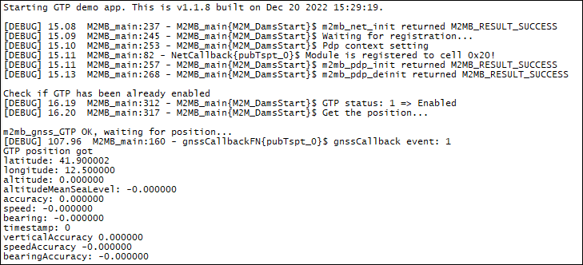

### GTP example 

Sample application that shows hot to get the position using GTP feature. Debug prints on **AUX UART**

**Features**

- How to init and enable GTP feature
- How to get the position using GTP

**Application workflow**

**`M2MB_main.c`**

- Open USB/UART/UART_AUX
- Print welcome message
- Init NET functionality and wait for module to be registered
- Init PDP functionality and set APN on CID1
- Init GTP functionality
- Check if GTP is already enabled. If not enable it and reboot module
- If GTP is enabled, get position

---------------------

