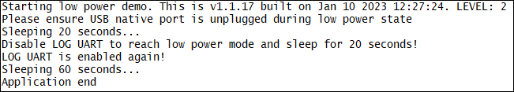

### Low power mode 

The application shows how to set the module in low power modes (by disabling UART and RF). Debug prints on **AUX UART** which it is enabled/disabled to reach low power mode, <ins>using AZX log example functions</ins>

**Features**

- How to enable/disable LOG UART interfaces by azx apis
- How to enable/disable UART interfaces by m2mb apis
- How to set radio operating mode
- How to put the modem in low power mode

**Application workflow**

**`M2MB_main.c`**

- Print welcome message 
- Print warning message about unplugging USB native port
- Init system events handler
- Sleep 20 seconds
- Disable RF
- Disable LOG UART
- Sleep 20 seconds
- Enable LOG UART
- Enable RF
- Sleep 60 seconds
- Deinit system events handler

---------------------

