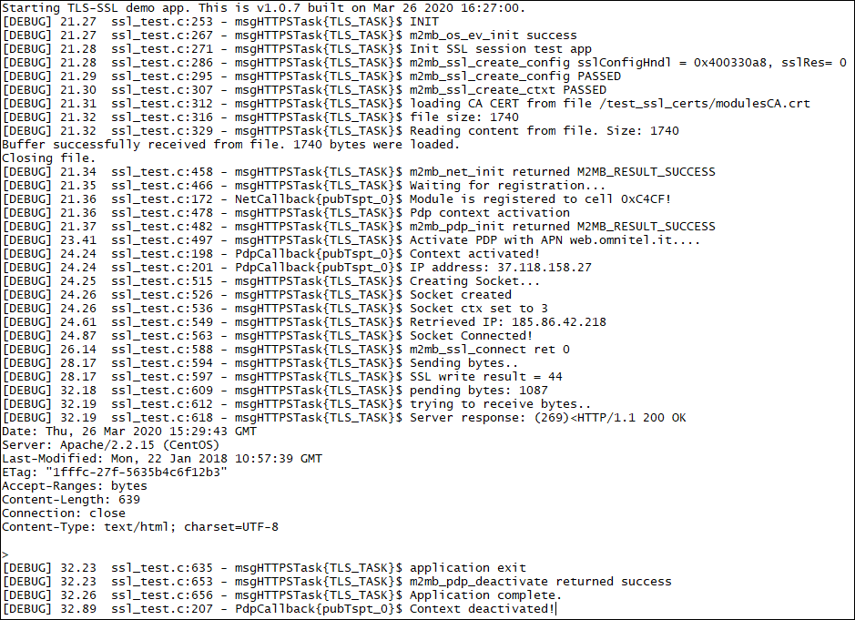

### TLS SSL Client

Sample application showcasing TLS/SSL with client certificates usage with M2MB API. Debug prints on **AUX UART**


**Features**


- How to check module registration and enable PDP context
- How to open a SSL client socket
- How to communicate over SSL socket


**Application workflow**

**`M2MB_main.c`**

- Open USB/UART/UART_AUX

- Create a task to manage the connection and start it

 

**`ssl_test.c`**

- Initialize Network structure and check registration

- Initialize PDP structure and start PDP context

- Create socket and link it to the PDP context id

- Connect to the server over TCP socket

- Initialize the TLS parameters (TLS1.2) andh auth mode (server+client auth in the example)

- Create SSL context

- Read certificates files and store them

- Create secure socket and connect to the server using SSL

- Send data and receive response

- Close secure socket

- Close socket

- Delete SSL context

- Disable PDP context


The application requires the certificates to be stored in `/mod/ssl_certs/` folder. It can be created with 

`AT#M2MMKDIR=/mod/ssl_certs`

Certificates can then be loaded with

`AT#M2MWRITE="/mod/ssl_certs/modulesCA.crt",1740`

and providing the file content in RAW mode (for example using the "Transfer Data" button in Telit AT Controller)

For client certificates (if required), the commands will be

```
AT#M2MWRITE="/mod/ssl_certs/modulesClient.crt",1651
AT#M2MWRITE="/mod/ssl_certs/modulesClient_pkcs1.key",1679
```

PLEASE NOTE: always verify the file sizes to be used in the commands above as they might change




---------------------

