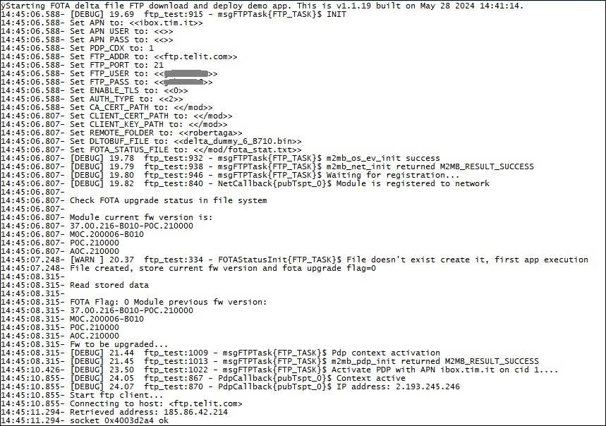

### FOTA_FTP_client example 

Sample application that shows how to download a delta file from an FTP server, stores it in the FOTA partition and deploys it. Debug prints on **MAIN UART**

**Features**

- How to download a delta file from FTP server using FTP client 
- How to store directly delta file in the FOTA partition 
- How to deploy delta file to upgrade mdoule fw.

**Application workflow**

**`M2MB_main.c`**

- Print welcome message
- Create a main task to manage connectivity, delta download and deployment

**`ftp_test.c`**

**msgFTPTask()**

- Initialize Network structure and check registration
- Initialize PDP structure and start PDP context. Event will be received on 
- Initialize FOTA system then reset parameters.
- After PDP context activation notified by PdPCallback() configure fota client parameters as FTP server url, username and password and SSL
- Get delta filefrom server and store it directly in the FOTA partition 
- If delta download went fine, check it (m2mb_fota_update_package_check_setup) and if it's correct apply it (m2mb_fota_start).
- Once completed restart module.

 
**PdpCallback()**

- When PDP context is enabled, send a message to fotaTask to start the download

**buf_data_cb_OTA()**

- Handles data reception and writing in the FOTA partition (one block size at a time) 

---------------------

