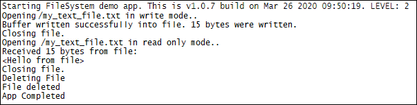

###File System example 

Sample application showcasing M2MB File system API usage. Debug prints on **MAIN UART**

**Features**

- How to open a file in write mode and write data in it
- How to reopen the file in read mode and read data from it

**Application workflow**

**`M2MB_main.c`**

- Open USB/UART/UART_AUX

- Print welcome message

- Open file in write mode

- Write data in file

- Close file

- Reopen file in read mode

- Read data from file and print it

- Close file and delete it

---------------------

