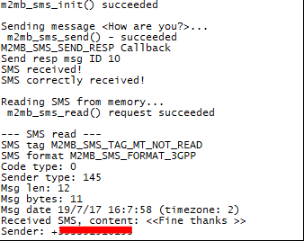

### SMS PDU

Sample application showcasing how to create and decode PDUs to be used with m2mb_sms_* API set. A SIM card and antenna must be present. Debug prints on **MAIN UART**

**Features**

- How to enable SMS functionality
- How to use encode an SMS PDU to be sent with m2mb_api
- How to decode a received SMS response from PDU to ASCII mode.

#### Application workflow

**`M2MB_main.c`**

- Open USB/UART/UART_AUX
- Init sms functionality
- Create PDU from text message
- Send message to destination number
- Wait for response
- When SMS PDU response is received, decode it and print information about it, plus the message content

---------------------

