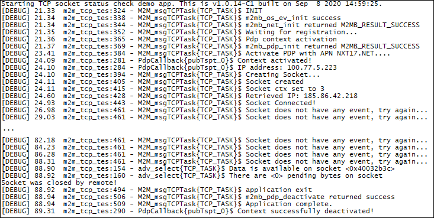

### TCP Socket status

Sample application showcasing how to check a TPC connected socket current status. Debug prints on **MAIN UART**

**Features**

- How to check module registration and activate PDP context
- How to open a TCP client socket 
- How to check if the TCP socket is still valid

**Application workflow**

**`M2MB_main.c`**

- Open USB/UART/UART_AUX

- Print welcome message

- Create a task to manage socket and start it

**`m2m_tcp_test.c`**

- Initialize Network structure and check registration

- Initialize PDP structure and start PDP context

- Create socket and link it to the PDP context id

- Connect to the server

- Check in a loop the current socket status using the adv_select function with a 2 seconds timeout

- Close socket when the remote host closes it

- Disable PDP context

---------------------

