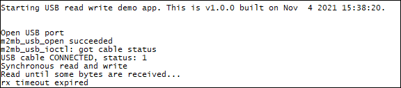

### Basic USB read/write example 

Sample application that shows how to use the basic read/write USB apis. Synchronous or asynchronous mode is available setting SYNC to 1 or 0. Debug prints on **MAIN UART**

**Features**

- Read and write on USB (synchoronous mode)
- Read and write on USB (asynchronous mode)

**Application workflow**

**`M2MB_main.c`**

- Open USB port (USB0)
- Set rx and tx timeouts
- **SYNC**
   - read until some data are availableon USB
   - as soon as some data are available on USB read them and write on USB data received

- **ASYNC**
  - set the USB callback
  - write some data on USB and wait for data to be read
  - as soon as some data are available on USB M2MB_USB_RX_EVENT is generated and handled by callback. Data are read and printed on serial com port.
   

---------------------

