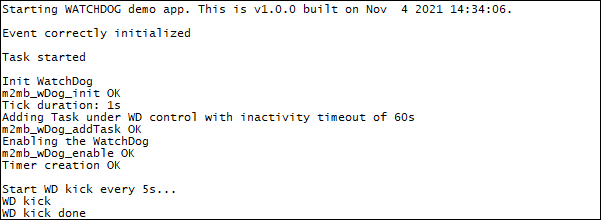

### Watchdog example 

Sample application that shows how to set and implement a watchdog. Task has been locked waitng for an event with a timeout longer than wd inactivity timeout. If no wd kick or no actions

**Features**

- Enable watchdog on Task_1
- Handle watchdog kicks with a timer

#### Application workflow

**`M2MB_main.c`**

- Create Task_1 that will be put under watchdog control
- In Task_1 watchdog is ebnabled on it and a timer created to handle watchdog kicks. Then task enters in a loop where kicks are sent. After 5 kicks a task lock is simulated waiting for an event release (with a timeout longer that task watchdog inactivity timeout)
- As soon as watchdog inactivity timeout expired M2MB_WDOG_TIMEOUT_IND is generated and handled in WDcallback (in this case the event is released, no further actions are done)
- No further actions are performed by Task_1 (no kicks are sent) so after watchdog system timeout expiration app is rebooted.

---------------------

