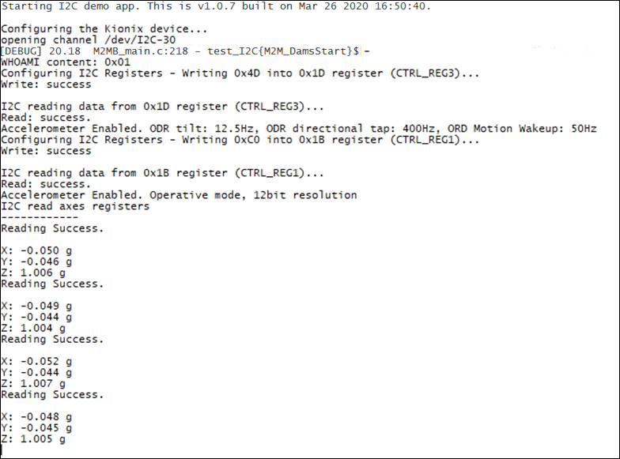

### I2C example 

Sample application showing how to communicate with an I2C slave device. Debug prints on **USB0**

**Features**

- How to open a communication channel with an I2C slave device
- How to send and receive data to/from the slave device

**Setup**

- Connect sensor VDD to 1v8 supply (e.g. Vaux/PwrMon pin of the module)
- Connect sensor GND to a GND pin of the module
- Connect sensor SDA to module GPIO2
- Connect sensor SCL to module GPIO3

#### Application workflow

**`M2MB_main.c`**

- Open USB/UART/UART_AUX
- Open I2C bus, setting SDA an SCL pins as 2 and 3 respectively
- Set registers to configure accelerometer
-Read in a loop the 6 registers carrying the 3 axes values and show the g value for each of them

---------------------

