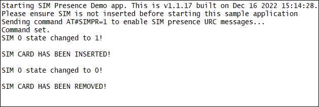

### SIM event handler example 

Sim Event Demo application. Debug prints on **USB0**, <ins>using AZX log example functions</ins>

**Features**

- How to use ATI function for asynchronous management 
- How to cath URC from an AppZone application
- How to catch SIM related events and handle them

**Application workflow**

**`M2MB_main.c`**

- Print welcome message 
- Initialize AT interface
- Initialize AT URC manager task
- Initialize SIM event manager task
- Send 'AT#SIMPR=1' to activate SIM URCs
- Insert SIM in SIM slot 1 and receive SIM inserted message
- Remove SIM from SIM slot 1 and receive SIM removed message

---------------------

