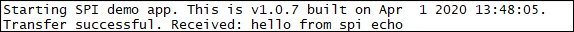

###SPI Echo

Sample application showing how to communicate over SPI with m2mb API. Debug prints on **USB0**

**Features**

- How to open an SPI bus. MOSI and MISO will be shorted, to have an echo.
- How to communicate over SPI bus

**Application workflow**

**`M2MB_main.c`**

- Open USB/UART/UART_AUX

- Open SPI bus, set parameters

- Send data on MOSI and read the same in MISO

---------------------

