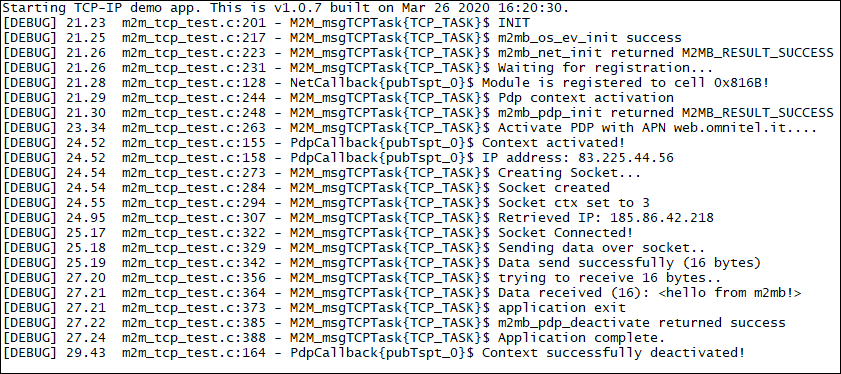

### TCP IP 

Sample application showcasing TCP echo demo with M2MB API. Debug prints on **USB0**

**Features**

- How to check module registration and activate PDP context
- How to open a TCP client socket 
- How to communicate over the socket

**Application workflow**

**`M2MB_main.c`**

- Open USB/UART/UART_AUX

- Print welcome message

- Create a task to manage socket and start it

 

**`m2m_tcp_test.c`**

- Initialize Network structure and check registration

- Initialize PDP structure and start PDP context

- Create socket and link it to the PDP context id

- Connect to the server

- Send data and receive response

- Close socket

- Disable PDP context

---------------------

