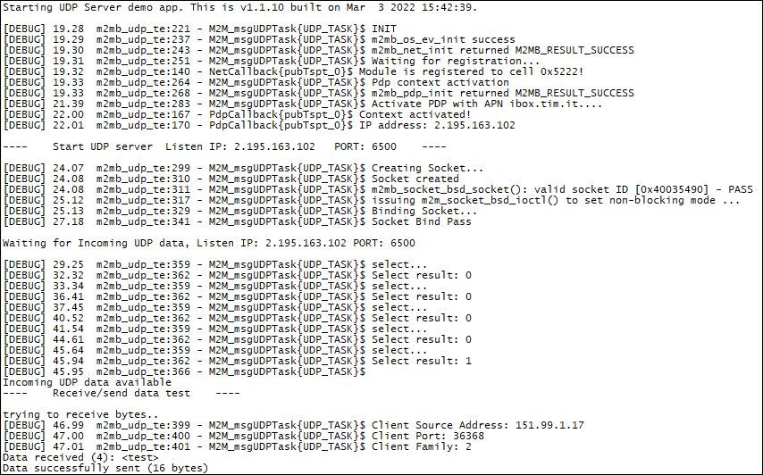

### UDP_Server example 

Sample application that shows UDP listening socket demo with m2mb apis. Debug prints on **USB0**

**Features**

- How to configure an UDP socket into listen mode 
- How to receive data using m2mb_socket_bsd_select  
- How to read data received and send data to client

**Application workflow**

**`M2MB_main.c`**

- Print welcome message
- Init task apis and create M2M_msgUDPTask to handle UDP socket

**`m2mb_udp_test.c`**

**`M2M_msgUDPTask`**

- Wait for module registration
- Activate PDP context
- Create UDP listen socket
- Wait for incoming data from client using m2mb_socket_bsd_select
- When there are data on socket, read them and send some data back to client

---------------------

