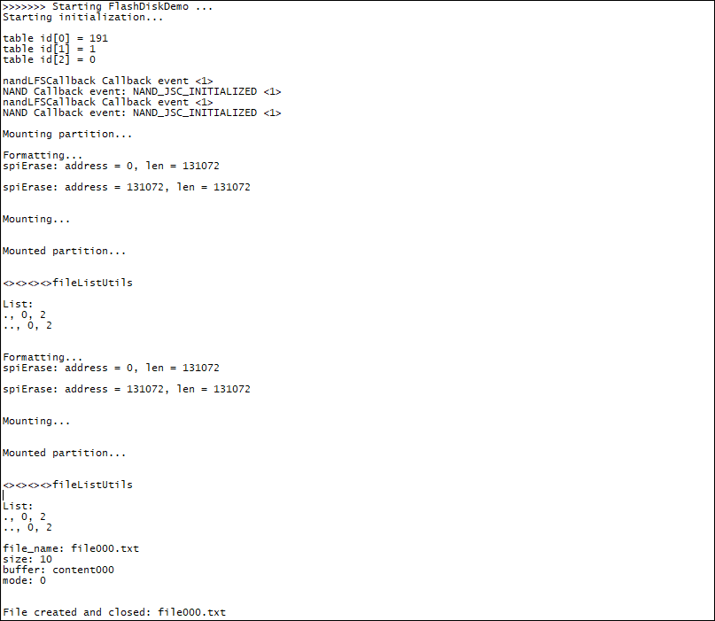
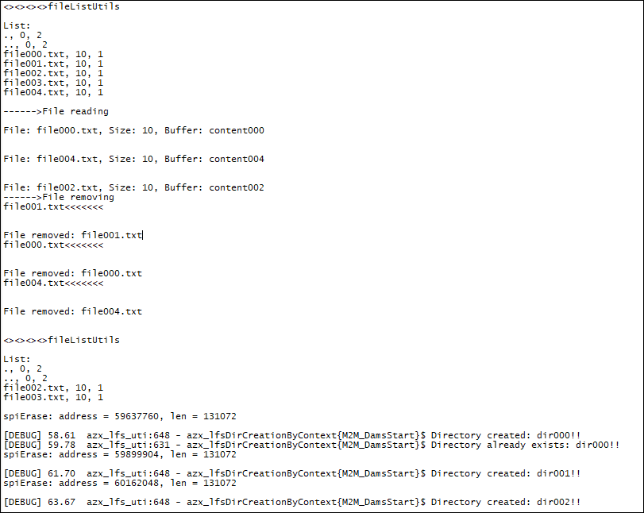
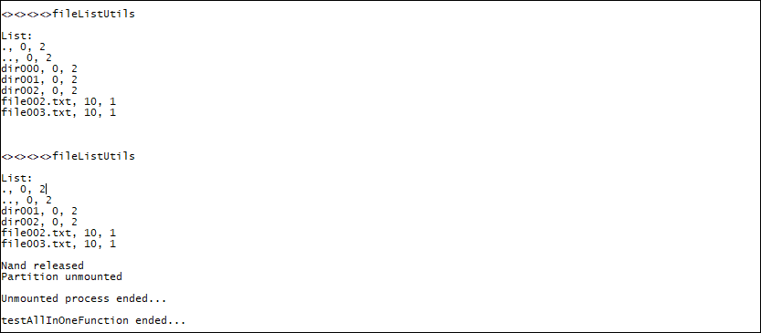

### Little fs2 

Sample application showing how use lfs2 porting with RAM disk and SPI data flash. Debug prints on **USB0**

**Features**

- How to create and manage Ram Disk
- How to manage file-system in Ram disk partition
- How to create and manage SPI Flash memory partition
- How to manage file-system in SPI Flash memory partition

**Application workflow**

**`M2MB_main.c`**

- Init logging system
- Call Ram Disk tests
- Call Flash memory tests

**`ram_utils_usage.c`**

- Initialize Ram Disk
- Format and Mount partition
- List files 
- Files creation and write content
- List files 
- Read files 
- Unmount and Release resources

**`spi_utils_usage.c`**
- Initialize SPI Flash chip
- Initialize SPI Flash Disk
- Format and Mount partition
- List files 
- Files creation and write content
- List files 
- Read files 
- Delete files
- Directories creation and deletion
- Unmount and Release resources

**Notes:**
For SPI Flash a JSC memory is used with chip select pin connected to module GPIO2 pin.
For better performances, a 33kOhm pull-down resistor on SPI clock is suggested.
Please refer to SPI_echo sample app for SPI connection details.

---------------------

